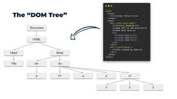

# JS DOM (Document Object Model)



bhai dekho b aap k pass koi b website show hoti hy tho sub se pehly browser oss ka DOM banane lag jata hy jaise pehly wo html ko load krtha hy pore html ko download kr k phir css ko download krtha hy phir javascript ko or issi trha aap k pass pori aik website jo hy ban kr show hojati hy etc simple.

The **Document Object Model (DOM)** in JavaScript is a programming interface for web documents. It represents the structure of an HTML or XML document as a tree of objects, where each node is an element, attribute, or piece of text. Using the DOM, you can dynamically interact with and manipulate a webpage's content, structure, and style.

I'll explain everything you need to know about the DOM in a comprehensive, beginner-to-advanced manner, covering its workings, key concepts, methods, properties, events, and practical examples. By the end, you won't need to refer to external resources for DOM basics.

---

### **Table of Contents**
1. **What is the DOM?**
2. **How the DOM Works**
3. **DOM Tree Structure**
4. **Accessing the DOM**
5. **Manipulating the DOM**
6. **DOM Events**
7. **Common DOM Methods and Properties**
8. **Practical Examples**
9. **Performance Tips for DOM Manipulation**
10. **Common Mistakes and Best Practices**
11. **Conclusion**

---

### **1. What is the DOM?**
- The DOM is a **W3C (World Wide Web Consortium)** standard that defines how browsers represent a webpage in memory.
- It acts as a bridge between JavaScript and the webpage, allowing you to read, modify, or create HTML elements dynamically.
- Think of the DOM as a **tree-like structure** where each HTML tag, attribute, and text is a node you can interact with.

**Example**: For this HTML:
```html
<!DOCTYPE html>
<html>
  <head>
    <title>My Page</title>
  </head>
  <body>
    <h1>Welcome</h1>
    <p id="intro">Hello, World!</p>
  </body>
</html>
```
The DOM creates a tree structure representing this document, which JavaScript can manipulate.

---

### **2. How the DOM Works**
- When a browser loads an HTML page, it **parses** the HTML and creates a DOM tree.
- The browser provides a global object, `document`, which is the entry point to the DOM.
- Using `document`, you can:
  - Access elements (e.g., `<div>`, `<p>`).
  - Modify their content, attributes, or styles.
  - Add or remove elements.
  - Listen for user interactions (e.g., clicks, keypresses).

**Key Points**:
- The DOM is **not the HTML source code**; it’s a live representation in memory.
- Changes to the DOM are reflected in the browser instantly (e.g., updating text or adding elements).
- The DOM is **language-agnostic** but is most commonly used with JavaScript in browsers.

---

### **3. DOM Tree Structure**
The DOM represents HTML as a hierarchical tree of nodes. There are different types of nodes:

- **Document Node**: The root node (`document` object).
- **Element Nodes**: HTML tags like `<div>`, `<p>`, `<h1>`.
- **Text Nodes**: The text inside elements (e.g., "Hello, World!").
- **Attribute Nodes**: Attributes like `id`, `class`, `src`.
- **Comment Nodes**: HTML comments (e.g., `<!-- comment -->`).

**Example DOM Tree** for the HTML above:
```
Document
  └── html
       ├── head
       │    └── title
       │         └── "My Page" (Text)
       └── body
            ├── h1
            │    └── "Welcome" (Text)
            └── p (id="intro")
                 └── "Hello, World!" (Text)
```

- **Parent-Child Relationships**: `<html>` is the parent of `<head>` and `<body>`. `<h1>` and `<p>` are children of `<body>`.
- **Siblings**: `<h1>` and `<p>` are siblings because they share the same parent (`<body>`).

---

### **4. Accessing the DOM**
To manipulate the DOM, you first need to select elements. The `document` object provides methods to do this.

#### **Common Methods to Select Elements**
1. **`getElementById(id)`**: Selects a single element by its `id`.
   ```javascript
   const intro = document.getElementById("intro"); // Selects <p id="intro">
   ```
2. **`getElementsByClassName(className)`**: Returns a live HTMLCollection of elements with the specified class.
   ```javascript
   const items = document.getElementsByClassName("item");
   ```
3. **`getElementsByTagName(tagName)`**: Returns a live HTMLCollection of elements with the specified tag.
   ```javascript
   const paragraphs = document.getElementsByTagName("p");
   ```
4. **`querySelector(selector)`**: Selects the first element matching a CSS selector.
   ```javascript
   const intro = document.querySelector("#intro"); // Selects <p id="intro">
   const firstItem = document.querySelector(".item"); // Selects first element with class="item"
   ```
5. **`querySelectorAll(selector)`**: Returns a static NodeList of all elements matching a CSS selector.
   ```javascript
   const items = document.querySelectorAll(".item"); // Selects all elements with class="item"
   ```

#### **Differences**:
- `getElementById` is fastest for single elements with an `id`.
- `querySelector` and `querySelectorAll` are more flexible (use CSS selectors) but slower.
- `getElementsByClassName` and `getElementsByTagName` return **live** collections (updated automatically if the DOM changes).
- `querySelectorAll` returns a **static** NodeList (not updated if the DOM changes).

#### **Accessing Related Nodes**
- **Parent**: `element.parentNode` or `element.parentElement`.
- **Children**: `element.childNodes` (all nodes, including text) or `element.children` (only element nodes).
- **Siblings**: `element.nextSibling`, `element.previousSibling`, `element.nextElementSibling`, `element.previousElementSibling`.

**Example**:
```javascript
const intro = document.getElementById("intro");
console.log(intro.parentNode); // <body>
console.log(intro.nextElementSibling); // Next element after <p>
```

---

### **5. Manipulating the DOM**
Once you’ve selected an element, you can modify it in several ways.

#### **5.1 Changing Content**
- **`innerHTML`**: Gets or sets the HTML content of an element.
  ```javascript
  const intro = document.getElementById("intro");
  intro.innerHTML = "<strong>Hello, JavaScript!</strong>"; // Changes content to bold text
  ```
- **`textContent`**: Gets or sets the text content (no HTML tags).
  ```javascript
  intro.textContent = "Hello, JavaScript!"; // Plain text, no HTML
  ```
- **`innerText`**: Similar to `textContent` but respects CSS (e.g., ignores hidden elements).
  ```javascript
  intro.innerText = "Hello, JavaScript!";
  ```

**Note**: Use `textContent` over `innerHTML` when setting plain text to avoid security risks (e.g., XSS attacks from user input).

#### **5.2 Modifying Attributes**
- **`getAttribute(name)`**: Gets the value of an attribute.
  ```javascript
  const img = document.querySelector("img");
  console.log(img.getAttribute("src")); // e.g., "image.jpg"
  ```
- **`setAttribute(name, value)`**: Sets the value of an attribute.
  ```javascript
  img.setAttribute("src", "new-image.jpg");
  ```
- **`removeAttribute(name)`**: Removes an attribute.
  ```javascript
  img.removeAttribute("alt");
  ```
- **Direct Property Access**: Many attributes are accessible as properties.
  ```javascript
  img.src = "new-image.jpg"; // Same as setAttribute("src", ...)
  img.id = "myImage";
  ```

#### **5.3 Modifying Classes**
- **`className`**: Gets or sets the entire class string.
  ```javascript
  intro.className = "highlight active"; // Replaces all classes
  ```
- **`classList`**: A better way to manage classes.
  - `add(class)`: Adds a class.
  - `remove(class)`: Removes a class.
  - `toggle(class)`: Adds if not present, removes if present.
  - `contains(class)`: Checks if class exists.
  ```javascript
  intro.classList.add("highlight");
  intro.classList.remove("active");
  intro.classList.toggle("visible");
  console.log(intro.classList.contains("highlight")); // true
  ```

#### **5.4 Modifying Styles**
- **`style`**: Access the inline CSS of an element.
  ```javascript
  intro.style.color = "blue";
  intro.style.fontSize = "20px";
  ```
- **CSS Properties in CamelCase**: Use `fontSize` instead of `font-size`.
- **Limitations**: Only modifies inline styles, not styles from CSS files. Use `classList` to toggle CSS classes for external styles.

#### **5.5 Creating and Adding Elements**
- **`createElement(tagName)`**: Creates a new element.
  ```javascript
  const newDiv = document.createElement("div");
  ```
- **`appendChild(node)`**: Adds a node as the last child of an element.
  ```javascript
  document.body.appendChild(newDiv);
  ```
- **`append(...nodes)`**: Adds multiple nodes or text.
  ```javascript
  newDiv.append("Hello!", document.createElement("span"));
  ```
- **`prepend(...nodes)`**: Adds nodes at the start.
- **`insertBefore(newNode, referenceNode)`**: Inserts a node before another.
  ```javascript
  document.body.insertBefore(newDiv, intro);
  ```
- **`removeChild(node)`**: Removes a child node.
  ```javascript
  document.body.removeChild(intro);
  ```
- **`remove()`**: Removes an element directly (modern browsers).
  ```javascript
  intro.remove();
  ```

#### **5.6 Replacing Elements**
- **`replaceChild(newNode, oldNode)`**: Replaces a child node.
  ```javascript
  const newP = document.createElement("p");
  document.body.replaceChild(newP, intro);
  ```
- **`replaceWith(...nodes)`**: Replaces an element with nodes or text.
  ```javascript
  intro.replaceWith(newP);
  ```

---

### **6. DOM Events**
Events allow you to respond to user interactions (e.g., clicks, keypresses) or browser actions (e.g., page load).

#### **6.1 Adding Event Listeners**
- **`addEventListener(event, callback)`**: Attaches an event handler to an element.
  ```javascript
  const button = document.querySelector("button");
  button.addEventListener("click", () => {
    alert("Button clicked!");
  });
  ```
- **Multiple Listeners**: You can add multiple listeners for the same event.
- **Event Object**: The callback receives an `event` object with details about the event.
  ```javascript
  button.addEventListener("click", (event) => {
    console.log(event.target); // The clicked element
    console.log(event.type); // "click"
  });
  ```

#### **6.2 Common Events**
- **Mouse Events**: `click`, `dblclick`, `mouseover`, `mouseout`, `mousemove`.
- **Keyboard Events**: `keydown`, `keyup`, `keypress`.
- **Form Events**: `submit`, `change`, `input`, `focus`, `blur`.
- **Window Events**: `load`, `resize`, `scroll`.
- **Touch Events**: `touchstart`, `touchmove`, `touchend`.

#### **6.3 Removing Event Listeners**
- **`removeEventListener(event, callback)`**: Removes a specific listener. The callback must be the same function reference.
  ```javascript
  const handleClick = () => alert("Clicked!");
  button.addEventListener("click", handleClick);
  button.removeEventListener("click", handleClick);
  ```

#### **6.4 Event Bubbling and Capturing**
- **Bubbling**: Events propagate from the target element up to the root (`document`).
- **Capturing**: Events propagate from the root down to the target (less common).
- **Default**: Event listeners use bubbling unless specified.
- **Control**: Use the third argument in `addEventListener`.
  ```javascript
  button.addEventListener("click", () => {}, { capture: true }); // Capturing phase
  ```
- **Stop Propagation**: Prevent further bubbling/capturing.
  ```javascript
  button.addEventListener("click", (event) => {
    event.stopPropagation(); // Stops bubbling
  });
  ```
- **Prevent Default**: Stop default browser behavior (e.g., form submission).
  ```javascript
  document.querySelector("form").addEventListener("submit", (event) => {
    event.preventDefault(); // Prevents form submission
  });
  ```

---

### **7. Common DOM Methods and Properties**
Here’s a quick reference for commonly used DOM methods and properties:

#### **Properties**
- `document.body`: The `<body>` element.
- `document.head`: The `<head>` element.
- `element.id`: The element’s ID.
- `element.className`: The element’s class string.
- `element.classList`: The element’s class list.
- `element.innerHTML`: The HTML content.
- `element.textContent`: The text content.
- `element.style`: Inline CSS styles.
- `element.parentNode`: The parent node.
- `element.children`: Child elements.
- `element.firstChild` / `element.lastChild`: First/last child node.
- `element.firstElementChild` / `element.lastElementChild`: First/last child element.

#### **Methods**
- `document.createElement(tag)`: Creates a new element.
- `document.createTextNode(text)`: Creates a text node.
- `element.appendChild(node)`: Adds a child node.
- `element.removeChild(node)`: Removes a child node.
- `element.remove()`: Removes the element.
- `element.getAttribute(name)`: Gets an attribute.
- `element.setAttribute(name, value)`: Sets an attribute.
- `element.querySelector(selector)`: Selects the first matching element.
- `element.querySelectorAll(selector)`: Selects all matching elements.
- `element.addEventListener(event, callback)`: Adds an event listener.
- `element.removeEventListener(event, callback)`: Removes an event listener.

---

### **8. Practical Examples**
Here are some real-world examples to solidify your understanding.

#### **Example 1: Create a Dynamic List**
```html
<ul id="list"></ul>
<button onclick="addItem()">Add Item</button>
```
```javascript
function addItem() {
  const li = document.createElement("li");
  li.textContent = `Item ${document.querySelectorAll("#list li").length + 1}`;
  document.getElementById("list").appendChild(li);
}
```

#### **Example 2: Toggle Visibility**
```html
<p id="toggleText">Hello, World!</p>
<button onclick="toggleVisibility()">Toggle</button>
```
```javascript
function toggleVisibility() {
  const text = document.getElementById("toggleText");
  text.style.display = text.style.display === "none" ? "block" : "none";
}
```

#### **Example 3: Form Submission with Validation**
```html
<form id="myForm">
  <input type="text" id="name" placeholder="Enter name" />
  <button type="submit">Submit</button>
</form>
```
```javascript
document.getElementById("myForm").addEventListener("submit", (event) => {
  event.preventDefault();
  const name = document.getElementById("name").value;
  if (name.trim() === "") {
    alert("Name is required!");
  } else {
    alert(`Hello, ${name}!`);
  }
});
```

#### **Example 4: Dynamic Style Change**
```html
<div id="box" style="width: 100px; height: 100px; background: blue;"></div>
<button onclick="changeColor()">Change Color</button>
```
```javascript
function changeColor() {
  const box = document.getElementById("box");
  box.style.backgroundColor = `#${Math.floor(Math.random() * 16777215).toString(16)}`;
}
```

---

### **9. Performance Tips for DOM Manipulation**
- **Minimize DOM Access**: Accessing the DOM is slow. Cache elements in variables.
  ```javascript
  // Bad
  document.getElementById("intro").textContent = "Hello";
  document.getElementById("intro").style.color = "blue";

  // Good
  const intro = document.getElementById("intro");
  intro.textContent = "Hello";
  intro.style.color = "blue";
  ```
- **Batch Updates**: Use `DocumentFragment` for multiple changes to avoid reflows.
  ```javascript
  const fragment = document.createDocumentFragment();
  for (let i = 0; i < 100; i++) {
    const li = document.createElement("li");
    li.textContent = `Item ${i}`;
    fragment.appendChild(li);
  }
  document.getElementById("list").appendChild(fragment);
  ```
- **Avoid `innerHTML` for Large Updates**: It’s slow and can cause security issues.
- **Use Event Delegation**: Attach a single event listener to a parent instead of many listeners on children.
  ```javascript
  document.getElementById("list").addEventListener("click", (event) => {
    if (event.target.tagName === "LI") {
      alert(`Clicked ${event.target.textContent}`);
    }
  });
  ```
- **Debounce/Throttle Events**: For frequent events like `scroll` or `resize`, limit how often the handler runs.
  ```javascript
  function debounce(fn, delay) {
    let timeout;
    return function (...args) {
      clearTimeout(timeout);
      timeout = setTimeout(() => fn(...args), delay);
    };
  }

  window.addEventListener("resize", debounce(() => console.log("Resized"), 200));
  ```

---

### **10. Common Mistakes and Best Practices**
- **Mistake**: Using `innerHTML` with user input (risks XSS attacks).
  - **Fix**: Use `textContent` or sanitize input.
- **Mistake**: Adding event listeners without removing them (causes memory leaks).
  - **Fix**: Remove listeners when no longer needed.
- **Mistake**: Overusing `querySelector` for simple tasks.
  - **Fix**: Use `getElementById` for IDs; it’s faster.
- **Mistake**: Modifying the DOM in a loop (causes reflows).
  - **Fix**: Batch changes or use `DocumentFragment`.
- **Best Practice**: Always check if an element exists before manipulating it.
  ```javascript
  const element = document.getElementById("nonexistent");
  if (element) {
    element.textContent = "Found!";
  }
  ```
- **Best Practice**: Use semantic HTML and ARIA for accessibility.

---

### **11. Conclusion**
The DOM is a powerful interface for building dynamic, interactive web applications. By understanding its structure, methods, properties, and events, you can manipulate webpages with ease. Key takeaways:
- Use `document` to access and manipulate the DOM.
- Select elements efficiently with `getElementById`, `querySelector`, etc.
- Modify content, attributes, styles, and structure using DOM methods.
- Handle user interactions with event listeners.
- Optimize performance by minimizing DOM access and batching updates.

With the examples and tips provided, you should be able to work with the DOM confidently without needing external resources. If you have specific questions or want to dive deeper into a topic (e.g., advanced event handling, specific use cases), let me know!

--- 

# JavaScript DOM (Document Object Model) - Medium

- DOM is a programming interface that a web browser uses to represent an HTML or XML document. By using DOM with JavaScript, we can change the page content, add new elements, remove existing elements, and do many more operations. Let’s dive deep into the DOM now!🫧


## 1. What is DOM? ✨

DOM is a programming interface that transforms a web page into an object model that the browser can understand. When the browser loads a web page, it analyzes the content of the page and creates this content in memory in the form of a DOM tree. This tree structure contains all the elements of the page (e.g., title, paragraph, image, links), and these elements are related to each other.

## 2. Why is it important?

DOM offers web developers the ability to create dynamic and interactive content for user interactions. When the user clicks a button or submits a form, page content can be dynamically updated using the JavaScript DOM. This forms the basis of modern websites and applications.

## 3. DOM Elements✨

DOM methods are used to access and manipulate HTML elements on web pages using JavaScript. These methods are used to select and make changes to certain types of elements

### getElementById():
This method selects based on the id attribute of an element on the page.
```bash
var element = document.getElementById("myElementId");
```