## JavaScript Operators
Javascript operators are used to perform different types of mathematical and logical computations.

Examples:

- The Assignment Operator = assigns values
- The Addition Operator + adds values
- The Multiplication Operator * multiplies values
- The Comparison Operator > compares values

### JavaScript Have Cool Operators

- Arithmetic Operators
- Assignment Operators
- Comparison Operators
- Logical Operators
- Unary Operators
- Bitwise Operators
- String Operators
- Conditional (Ternary) Operator

ab hum log aik aik kr k inn sare operators samjhty hy.
### Arithmetic Operators

- + (Addition)
- - (Subtraction -)
- * (Multiplication)
- / (Division)
- % (Modulus)
- ** (Exponentiation)

Example:
```bash
let x = 10;
let y = 5;
/**
 * first hum ne two variables ko liya howa hy jiss k upar hum log operatios apply karenge
 * 
 */

console.log(x + y); // Output: 15 yaha pr simple addtion ho rha hy like 2 + 2
console.log(x - y); // Output: 5 yaha pr simple subraction ho rha hy like 2 - 2
console.log(x * y); // Output: 50 yaha pr simple multiplication ho rha hy like 2 * 2
console.log(x / y); // Output: 2 yaha pr simple division ho rha hy like 2 / 2
console.log(x % y); // Output: 0 yaha pr aap k pass modulus apply ho rha hy jo k aap ko kisi b value ka reminder deta hy.
console.log(x ** y); // Output: 100000 // yaha pr aap k pass Exponential ho rha hy jaise do ki power do etc wo wala simple. like y=2^x


```

### Assignment Operators

- = (Assignment)
- += (Addition assignment)
- -= (Subtraction assignment)
- *= (Multiplication assignment)
- /= (Division assignment)
- %= (Modulus assignment)

Example:

```bash
let x = 10;
// 1. yaha pr simply hamare pass x k andar 10 store ho rha hy with the help of = to assignment operator jiss ko hum ne pehly b samjha tha.
console.log(x); // Output: 10


x += 5;
// yaha pr aap k pass ye += ye krtha hy k ye value ko pehly plus kr k oss variable me add krtha hy or phir assign krdeta hy
// jaise yaha pr x += 5; tho aap k pass 10 jo k pehly x ki value hy oss me 5 plus ho rha hy.
console.log(x); // Output: 15

x -= 3;
// or yaha pr hamare pass assignment ho rha hy magr aap k pass jo 15 tha q k hum ne apne x ki variable ko 10 se 15 me update krdiya tha.
// tho oss me se hamare pass minus subtract ho rha hy 3 simple 
console.log(x); // Output: 12

x *= 2;
// or ye aap k pass pehly multiply kr rha hy or phir value ko assign kr rha hy.
console.log(x); // Output: 24

x /= 4;
// or yaha pr aap k pass pehly division ho rhi hy or phir assignment
console.log(x); // Output: 6

x %= 5;
// or yaha pr b aap k pass simply pehly modulus ho rha hy or phir assignment.
console.log(x); // Output: 1
```

### Comparison Operators

- == (Equal to) This operator is a comparison operator that checks whether two values are equal.
- === (Strict equal to) This operator, also known as the strict equality operator, checks whether two values are equal and of the same type
- != (Not equal to)
- !== (Strict not equal to)
- > (Greater than)
- < (Less than)
- >= (Greater than or equal to)
- <= (Less than or equal to)
```bash
let c = 5;
let d = "5";
/**
 * aap iss comparison operators ko zyda thar loop ya phir if me use karoge.
 * iss aap k pass condition k sahi ya phir ghalat hone pr console me aap k pass true and false print hoga simple.
 */

//(==)
console.log(c == d); // Output: true 
console.log(5 == "5"); // Output: true 
console.log(0 == false); // Output: true

//(===)
console.log(c === d); // Output: false
console.log(5 === "5"); // Output: false
console.log(0 === false); // Output: false

console.log(c != d); // Output: false
console.log(c !== d); // Output: true
console.log(c > d); // Output: false
console.log(c < d); // Output: false
console.log(c >= d); // Output: true
console.log(c <= d); // Output: true
```

### Logical Operators

- && (Logical AND)
- || (Logical OR)
- ! (Logical NOT)
- iss operator ki madad se aap aik line me multiple condition ko check kr sakty hy.
- && AND operator: ye AND operator aap ko ye bolta hy k bhai me tub hi run honga jub dono taraf k condition true ho or agr aik b false ho tho me run nhi karoga.
- || OR Operator: -> ye OR operator aap ko bolta hy k bhai aap k pass agr dono taraf me se aik b condition true hojaye tho me run krjaonga koi masla nhi hy.
- ! Logical Operator: -> ye logical not operator aap k pass true ko false or false ko true krdeta hy simple.

Example:
```bash
let c = 5;
let d = "5";
/**
 * aap iss comparison operators ko zyda thar loop ya phir if me use karoge.
 * iss aap k pass condition k sahi ya phir ghalat hone pr console me aap k pass true and false print hoga simple.
 */

//(==)
console.log(c == d); // Output: true 
console.log(5 == "5"); // Output: true 
console.log(0 == false); // Output: true

//(===)
console.log(c === d); // Output: false
console.log(5 === "5"); // Output: false
console.log(0 === false); // Output: false

console.log(c != d); // Output: false
console.log(c !== d); // Output: true
console.log(c > d); // Output: false
console.log(c < d); // Output: false
console.log(c >= d); // Output: true
console.log(c <= d); // Output: true
```

### Unary Operators

- + (Unary plus)
- - (Unary minus -)
- ++ (Increment)
- -- (Decrement)
- typeof (Typeof)
- delete (Delete)
- void (Void)
- ! (Logical NOT)
- Unary operator ka b simple sa funda hy k ye aap k value ko increase or decrease krtha hy matlab aap k value ko increment or dercrement krtha hy simply.
```bash
let g = 10;
// yaha pr simple sa hum logo ne aik variable ko liya howa hy jiss me  10 store hy
console.log(-g); // Output: -10
console.log(++g); // Output: 11
console.log(typeof g); // Output: "number"
console.log(delete g); // Output: true
```
### Bitwise Operators
- & (Bitwise AND)
- | (Bitwise OR)
- ^ (Bitwise XOR)
- ~ (Bitwise NOT)
- << (Left shift)
- >> (Sign-propagating right shift)
- >>> (Zero-fill right shift)
- ye bitwise operator aap k pass bit k level pr kaam krtha hy or ye aap k hardware k kaafi nazdeeq hotay hy.

Example:
```bash
let h = 5; // Binary: 101
let i = 3; // Binary: 011

console.log(h & i); // Output: 1 (Bitwise AND)
console.log(h | i); // Output: 7 (Bitwise OR)
console.log(h ^ i); // Output: 6 (Bitwise XOR)
console.log(~h); // Output: -6 (Bitwise NOT)
console.log(h << 1); // Output: 10 (Left shift)
console.log(h >> 1); // Output: 2 (Sign-propagating right shift)
console.log(h >>> 1); // Output: 2 (Zero-fill right shift)
```

### String Operators

- + (Concatenation +)
- string ka aik hi operator hota hy jo k concatenation kehlata hy ye do string jhorne ka kaam krtha hy simply.
```bash
// jaise yaha pr aap k pass hello alag variable me save hy or world alag magr hum ne issko console.log() me + k sign k sath concatenate kiya howa hy etc.
let str1 = "Hello, ";
let str2 = "World!";

console.log(str1 + str2); // Output: "Hello, World!"
// yaha pr aap k pass concatenation ho rhi hy.
```

### Conditional (Ternary) Operator

- condition ? expr1 : expr2
```bash
let age = 20;
let status = (age >= 18) ? "adult" : "minor";

console.log(status); // Output: "adult"
```
- aap iss me logical operators ko b use kr sakty ho or b complex or better condition banane k liye.
Great question! You **can use logical operators** inside a ternary operator to make your condition more complex. Logical operators like `&&` (AND), `||` (OR), and `!` (NOT) help you create more detailed conditions.

Here’s an example of using logical operators inside a ternary operator:

### Example 1: Using `&&` (AND)
```javascript
let age = 20;
let hasID = true;

let status = (age >= 18 && hasID) ? "adult with ID" : "not allowed";
console.log(status); // Output: "adult with ID"
```

### Example 2: Using `||` (OR)
```javascript
let age = 16;
let withParent = true;

let status = (age >= 18 || withParent) ? "allowed" : "not allowed";
console.log(status); // Output: "allowed"
```

### Example 3: Using `!` (NOT)
```javascript
let isBanned = false;

let status = (!isBanned) ? "access granted" : "access denied";
console.log(status); // Output: "access granted"
```

You can also combine multiple logical operators:
```javascript
let age = 17;
let hasID = false;
let withParent = true;

let status = (age >= 18 && hasID || withParent) ? "can enter" : "cannot enter";
console.log(status); // Output: "can enter"
```
### Operators
Operators play a crucial role in programming by enabling us to perform various operations on data. In JavaScript, operators are symbols or keywords that allow us to manipulate and combine values. They provide the foundation for performing arithmetic calculations, making comparisons, assigning values, and more. 
- operators aap k pass simple symbols hotay hy jo k perform krthy hy kuch specific tasks on data k upar or har operator ko different categories me dala gaya hy jo k different tarikay se work krtha hy.
- jaise building banane wale k pass different types k tools hotay hy issi trha programming me Operators hotay hy jiss ki madad se aap data k upar operations ko apply krthy hy etc.
- Operators are essential for performing computations, making decisions, and manipulating data in programming. 
- By mastering these operators, you’ll have the ability to manipulate data, perform calculations, make decisions, and create powerful programs. 
- aap ko operators ya koi or topics ka ana zaroori tho hy magr sub se zyda important ye hota hy k aap oss operators ko sahis se use kr sakoi combinely jaise hackathon etc me.
- Because confidence is everything tho aap confidently kisi b cheez ko use karo daro mat. or sharmao mat. apnie productivity or skills ko show krwao.

- One Question niche code ka ouput kiya hoga
```bash
Consider the following code:
let x = 5;
let y = '8';
let z = x + y; // 58 
// tho aap k pass 58 iss wja se a rha hy q k 8 jo hy string me jo k + k sath 5 k sath simply concatenate ho rha hy etc.
```
# JavaScript Arithmetic
- Arithmetic operators perform arithmetic on numbers (literals or variables).
A typical arithmetic operation operates on two numbers.

The two numbers can be literals:
```bash
let x = 100 + 50;

// or variables:

let x = a + b;

// or expressions:

let x = (100 + 50) * a;


```
### Operators and Operands
- The numbers (in an arithmetic operation) are called operands.
- The operation (to be performed between the two operands) is defined by an operator.

- Remainder
The modulus operator (%) returns the division remainder.

- NOTE: yaha thak hum logo ne deeply operators ko parh liya hy ab aap iss se koi b question etc solve kr sakty hy.

# JavaScript Data Types
Great question! 🙌  
Let’s break down **data types in JavaScript** in **simple English** with **real-life examples** so it’s super easy to understand.

---

### ✅ **What is a Data Type?**

A **data type** tells the computer **what kind of data** you're working with.

Just like in real life we have:
- Numbers (like money, age),
- Text (like your name),
- True/False (like yes or no),
- Boxes (that can hold other things),

JavaScript also has data types to store different types of information.

---

### 🧠 **Main JavaScript Data Types with Real-Life Examples**

| Data Type        | Description                         | Real-Life Example                      | Code Example                |
|------------------|-------------------------------------|----------------------------------------|-----------------------------|
| **Number**       | Any number (integer or decimal)     | Age: `20`, Price: `99.99`              | `let age = 20;`             |
| **String**       | Text (inside quotes)                | Name: `"Ali"`, City: `"Karachi"`       | `let name = "Ali";`         |
| **Boolean**      | Only `true` or `false`              | Light on? `true`, Logged in? `false`   | `let isOnline = true;`      |
| **Undefined**    | A variable declared but no value yet| Empty plate—it's there but nothing in it| `let x;`                    |
| **Null**         | No value on purpose                 | Like a cup with **intentionally** nothing | `let item = null;`       |
| **Object**       | A collection of key-value pairs     | A student with name, age, city         | `let student = {name: "Ali", age: 16}` |
| **Array**        | A list of items                     | Shopping list: `["milk", "bread"]`     | `let items = ["pen", "book"];` |

---

### 🧸 **Quick Real-Life Analogy**
Let’s say you have a **school bag** (like a variable), inside it you can put:
- **Books** (Strings)
- **Notebook pages with numbers** (Numbers)
- **Checklist: is homework done?** (Boolean)
- **An empty box** (Undefined or Null)
- **Multiple pens in a pencil case** (Array)
- **ID card with name, class, roll number** (Object)

---

## JavaScript has 8 Datatypes
- String
- Number
- Bigint
- Boolean
- Undefined
- Null
- Symbol
- Object
- Data types aap k computer ko batata hy k aap konse types k data ko store krne ja rhay hy apne computer me simple.

### The Object Datatype
- The object data type can contain both built-in objects, and user defined objects:
- Built-in object types can be:
- objects, arrays, dates, maps, sets, intarrays, floatarrays, promises, and more.
::::Note
A JavaScript variable can hold any type of data.

## The Concept of Data Types
- In programming, data types is an important concept.
- To be able to operate on variables, it is important to know something about the type.
- Without data types, a computer cannot safely solve this:
```bash
let x = 16 + "Volvo";
console.log(x);
// matlab iss me aisa hojata hy k aap k pass aik data type jo hy dosre me khud ba khud conver hojata hy.
// jaise yaha pr 16 number hy magr aap ne oss k sath String Volvo ko + concatenate kiya hy tho aap ka jo 16 hy ye b convert hojata hy string me or ye aik main concept hy jo k taqreeban har programming language me hota hy.
```
- Does it make any sense to add "Volvo" to sixteen? Will it produce an error or will it produce a result?
- JavaScript will treat the example above as:
```bash
let x = "16" + "Volvo";
// matlab ye aap k number ko string me convert krdeta hy.
```
:::::Note
- When adding a number and a string, JavaScript will treat the number as a string.
- matlab jub b aap number ko javaScript me + concatenate krthy hy number k sath tho ye number aap k pass khud ba khud convert hojata hy string. jub aap string ko number k sath concatenate krthy hy etc.

Example:
```bash
let x = 16 + "Ali";
console.log(x) // 16Ali

// OR

let x1 = "Ali" + 16;
console.log(x1); Ali16
```

- JavaScript evaluates expressions from left to right. Different sequences can produce different results:
- NOTE: javaSCript me expressions aap k pass left to right evaluates hota hy. Tho aap agr different sequence se data ko likhty hy tho aap ko result b different mil sakta hy. jaise upar wale example me hum ne 16 ko kabhi aghy rakha or kabhi piche tho result hamare pass different print ho rhy thy etc.
```bash
let x = 16 + 4 + "Volvo";
console.log(x);  // Output: 20Volvo
// ab yaha pr aap ne different sequence ko follow kiya hy jaise 16 + 4 kiya howa hy tho aap k pass pehly wo dono add ho rhy hy or phir oss k sath Volvo add + matlab concatenate kr rha hy or aap ko result 20Volvo ye mil rha hy simple.


```
```bash
// Like Another Example
let x2 = "Volvo" + 16 + 4;
console.log(x2); // Output: Volvo164
```
- In the first example, JavaScript treats 16 and 4 as numbers, until it reaches "Volvo".
- In the second example, since the first operand is a string, all operands are treated as strings.

## JavaScript Types are Dynamic
- JavaScript has dynamic types. This means that the same variable can be used to hold different data types:
- matlab aap apni marzi se kisi b data ko jub save krthy hy tho javaScript oss ko oss k related oss ko save krdeta hy. jaise string,int,float etc.
- matlab aap ko variable banatay time koi b data types dene ki zaroorat nhi parthi hy.bs aap data ko store kareo or javaScript oss ko phir apne hisab se save krdeta hy etc.

```bash
let x;       // Now x is undefined
x = 5;       // Now x is a Number
x = "John";  // Now x is a String
```

### JavaScript Strings
- A string (or a text string) is a series of characters like "John Doe".
- Strings are written with quotes. You can use single or double quotes:

Example:
```BASH
// Using double quotes:
let carName1 = "Volvo XC60";

// Using single quotes:
let carName2 = 'Volvo XC60';
```
- You can use quotes inside a string, as long as they don't match the quotes surrounding the string:
```bash
// Single quote inside double quotes:
let answer1 = "It's alright";

// Single quotes inside double quotes:
let answer2 = "He is called 'Johnny'";

// Double quotes inside single quotes:
let answer3 = 'He is called "Johnny"';
```
- magr aap double ya single ko do bar use nhi kr sakty hy. jaise ""ghalat"", "'sahid'".
- Number: javaScript me aap number ko without quotation b use kr sakty hy etc.

### Note
Most programming languages have many number types:

Whole numbers (integers):
byte (8-bit), short (16-bit), int (32-bit), long (64-bit)

Real numbers (floating-point):
float (32-bit), double (64-bit).

Javascript numbers are always one type:
double (64-bit floating point).

- typeof() --> iss typeof operator se aap variable k type ko maloom kr sakty hy.
### Undefined
In JavaScript, a variable without a value, has the value undefined. The type is also undefined.
- tho aap k pass undefined b aik data type hy.
```bash
let car;    // Value is undefined, type is undefined
```

### Empty Values
An empty value has nothing to do with undefined.

An empty string has both a legal value and a type.
```bash
let car = "";    // The value is "", the typeof is "string"
```
# Medium
- UNDEFINED:-> Closely related to null. The difference is that undefined is a type given to variable automatically by the broswer that have not yet been defined.
- In JavaScript, data types are broadly categorized into two categories — primitive types and non-primitive types.

- Primitive data types are basic data types that represent a single value, whereas non-primitive data types are complex data types that represent a collection of values.
Feature | Primitive | Non-Primitive
Simple or Complex? | Simple | Complex
Stored how? | By value | By reference
Mutable? | No (immutable) | Yes (mutable)
Examples | Number, String, etc. | Object, Array, etc.
- aap k pass primivite data type string,number etc hotay hy or non-primitive data type me object,array etc ata hy.
- aap k pass non-primitive data jo hy wo primitive data type se hi nikal k ayi hy.

### BigInt
BigInt is a relatively new data type introduced in ECMAScript 2020. It is used to represent integers larger than the maximum value that can be represented by the number data type. BigInts are represented by appending “n” to the end of an integer literal. For example:
```bash
let bigNum = 9007199254740991n;
```

### Null
The null data type represents the intentional absence of any object value. It is often used to signify that a variable has no value assigned to it. For example:
```bash
let y = null;
console.log(y); // Output: null
```

## Symbol Data Type In JavaScript
Great! Let's talk about **`Symbol`** in JavaScript in **very simple words** 😄

---

### 🟣 What is a Symbol?

A **Symbol** is a **unique and primitive data type** in JavaScript introduced in **ES6**.

Even if two symbols look the same, **they are always different**.

---

### ✅ Why use Symbol?

Symbols are mainly used to **create unique property keys** for objects, so there is **no conflict** with other keys.

---

### ✨ Simple Example:
```javascript
let id1 = Symbol("id");
let id2 = Symbol("id");

console.log(id1 === id2); // false (even though both say "id")
```

🔹 Even though both `id1` and `id2` look the same, they are **not equal** — each `Symbol()` creates a **unique value**.

---

### 🧰 Using Symbol as a unique object key:
```javascript
let student = {};
let id = Symbol("id");

student[id] = 101;

console.log(student); // { [Symbol(id)]: 101 }
console.log(student[id]); // 101
```

So the key `id` is a symbol, not a string like `"id"`. It's **hidden from normal loops** like `for...in`.

---

### 🔍 When would you use Symbol?
- To add **unique keys** to objects without risking key name conflict.
- To make **private-like properties** in objects.
- In some **built-in features** (like `Symbol.iterator` in loops).

---

### 🧠 Key Points to Remember:
- `Symbol()` always creates a unique value.
- You can add a **description** for debugging, like `Symbol("id")`.
- Symbols are **not shown in for...in** loops.
- Symbols are **primitive** types, like string or number.

---

### ⚠️ Bonus Tip: Symbols are not auto-converted to strings
```javascript
let id = Symbol("id");
console.log("ID is: " + id); // ❌ TypeError
```

To fix it, use:
```javascript
console.log("ID is: " + id.toString()); // ✅
```

---

Important Properties of JavaScript Datatype:
JavaScript Types are Dynamic
JavaScript is a dynamically typed language, which means that variables can hold values of any data type and can be assigned a new value of a different data type at any point in time during the execution of the program.

This is in contrast to the statically typed languages such as Java or C++, where the data type of a variable must be declared at the time of its creation and cannot be changed later.

In a dynamically typed language like JavaScript, the data type of a variable is inferred at runtime based on the value assigned to it. For example, consider the following code snippet:
```bash
let a = 5;
console.log(typeof a); // Output: "number"

a = "Hello World";
console.log(typeof a); // Output: "string"
```
### Benefits of Dynamic Data Types
Dynamic typing provides several benefits, such as increased flexibility and reduced development time. For example, in JavaScript, you do not need to worry about declaring variables with the correct data type or explicitly casting values from one type to another. This can make the code more concise and easier to read.

### Date
Dates are a built-in non-primitive data type in JavaScript. They are used to represent dates and times, and can be created using the Date constructor. Dates have many built-in methods for working with dates and times.
```bash
let today = new Date();
console.log(today.toLocaleString()); // outputs something like "3/4/2023, 2:25:30 PM"
console.log(today.toDateString()); // outputs something like "Sat Mar 04 2023"
```

# JavaScript Functions
- A JavaScript function is a block of code designed to perform a particular task.
- A JavaScript function is executed when "something" invokes it (calls it).
- javaScript me function aik specific task ko krne k liye banatay hy or aap iss ko multiple bar call kr sakty hy or function calling ko invokes b kaha jata hy.
- jaise agr aap ko apne program me do number ko plus krne wala program chaye hy tho tub aap aik function me oss ko bana kr rakh sakty hy or phir jub b aap ko zaroorat parhe tho bs sirf oss function ko call krna hy tho aap k pass wo program ajayega tho iss trha k kisi b specific tasks ko krne k liye function ka use kiya jata hy etc.

```bash
// Function to compute the product of p1 and p2
function myFunction(p1, p2) {
    return p1 * p2;
  }
// ye 4, 3 ye aap k pass argument kehlatay hy jo k function k parameter me ja kr save hota hy.
  let result = myFunction(4, 3);
  console.log(result); // output: 12
 // aap iss trha se function ko call kr sakty hy.
```
- function ko function k keyword se banaya jata hy or phir parenthesis or phir curly brackest se oss ka body banya jata hy etc.
- or iss me (p1, p2) --> iss me ye p1 or p2 jo hy ye aap k parameter kehlata hy.
### JavaScript Function Syntax
- A JavaScript function is defined with the function keyword, followed by a name, followed by parentheses ().
- Function names can contain letters, digits, underscores, and dollar signs (same rules as variables).
- The parentheses may include parameter names separated by commas:
(parameter1, parameter2, ...)
- The code to be executed, by the function, is placed inside curly brackets: {}
```bash
function name(parameter1, parameter2, parameter3) {
  // code to be executed
}
```
- Function parameters are listed inside the parentheses () in the function definition.
- Function arguments are the values received by the function when it is invoked.
- Inside the function, the arguments (the parameters) behave as local variables.

### Function Invocation
- The code inside the function will execute when "something" invokes (calls) the function:
- When an event occurs (when a user clicks a button)
- When it is invoked (called) from JavaScript code
- Automatically (self invoked)

### Function Invocation
- The code inside the function will execute when "something" invokes (calls) the function:
- When an event occurs (when a user clicks a button)
- When it is invoked (called) from JavaScript code
- Automatically (self invoked)
- aghy hum log iss k bare me b cover karenge k hum log kaise button k onclick pr kaise function ko call kr sakty hy etc.

::::: Example:
```bash
<!DOCTYPE html>
<html>
<body>

<h1>JavaScript Functions</h1>

<p>Call a function which performs a calculation and returns the result:</p>

<p id="demo"></p>

<script>
let x = myFunction(4, 3);
document.getElementById("demo").innerHTML = x;

function myFunction(a, b) {
  return a * b;
}
</script>

</body>
</html>

```
### Why Functions?
- With functions you can reuse code
- You can write code that can be used many times.
- You can use the same code with different arguments, to produce different results.
- or ye aap k code ko Dry run hone se bachata hy - Dry means donot repeat yourself.

### The () Operator
- The () operator invokes (calls) the function:
- aap iss trha se parenthesis k sath apne function ko call kr sakty hy.
::::Example

- program: Convert Fahrenheit to Celsius: yaha pr hum log simple sa program fahrenheit se celsius me convert krne ka program bantay hy.
```bash
 // fahrenheit to celsius program
  function toCelsius(f) {
    return (5/9) * (f-32);
  }
  let value = toCelsius(77);
  console.log(value);
  // aap iss trha se fahrenheit se celsius me convert krne ka program bana sakty hy easily. with the help of function.
```
- Accessing a function with incorrect parameters can return an incorrect answer:
```bash
// parameter accessing with wrong parameter
  function toCelsius(fahrenheit) {
    return (5/9) * (fahrenheit-32);
  }
  
  let value1 = toCelsius();
  console.log(value1); // output: NaN 
  // aap k pass output NaN iss wja se a rha hy q k aap function ko call tho kr rhy hy magr aap ne oss me
  // parameter diya howa hy jiss ko aap function calling k time pr nhi de rhy hy tho oss wja se aap k pass ye NaN erro ata hy
```
- Accessing a function without () returns the function and not the function result:
```bash
 function toCelsius(fahrenheit) {
    return (5/9) * (fahrenheit-32);
  }
  
  // aap k pass ye output iss wja se a rha hy q k aap function ko without parenthesis call kr rhy hy
  let value2 = toCelsius;
  console.log(value2); // output: [Function: toCelsius]
```
- Note: -> As you see from the examples above, toCelsius refers to the function object, and toCelsius() refers to the function result.

### Functions Used as Variable Values
- Functions can be used the same way as you use variables, in all types of formulas, assignments, and calculations.
- aap function ko simply variable ki trha b use kr sakty hy. Matlab ye aap k pass variable b aap iss ko consider kr sakty hy.
- jaise aap variable banatay hy aap ossi trha function ko b use kr sakty hy etc.
- Instead of using a variable to store the return value of a function:
```bash
<!DOCTYPE html>
<html>
<body>

<h1>JavaScript Functions</h1>
<p>Using a function as a variable:</p>

<p id="demo"></p>

<script>
let text = "The temperature is " + toCelsius(77) + " Celsius.";
document.getElementById("demo").innerHTML = text;

function toCelsius(fahrenheit) {
  return (5/9) * (fahrenheit-32);
} 
</script>

</body>
</html>

```
### Local Variables
- Variables declared within a JavaScript function, become LOCAL to the function.
- Local variables can only be accessed from within the function.
```bash
function myFunction() {
    let carName = "Volvo";
    // code here CAN use carName
  }
  
  // code here can NOT use carName
  console.log(carName);
  // matlab jiss variable ko aap ne jiss function me banaya hy oss ko aap oss se bahir use nhi kr sakty hy.
  //Error: ReferenceError: carName is not defined --> kuch iss trha ka error aap ko milega.
```
- iss scoping k bare me hum ne already parh rakha hy upar k var,let,const ki kiya scoping hoti hy etc.
- Since local variables are only recognized inside their functions, variables with the same name can be used in different functions.
- Local variables are created when a function starts, and deleted when the function is completed.
- LOCAL VARIABLE: --> local variable wo hota hy jiss ko aap ossi hi function k andar use kr sakty hy oss se bahir agr aap use krne ki koshish krthy tho phir aap ko ye ReferenceError: carName is not defined wala error milega.
- GLOBAL VARIABLE: --> ye global variable aap apne program me kahi pr b use kr sakty ho. iss me koi scoping etc nhi hoti hy.

# Medium
- function aap k pass kuch input ko leta hy or phir oss input pr aap koi program banatay hy or aap ko phir output milta hy etc.

### The Complete Guid To JavaScript Function
- Functions can be flexible, reusable, and modular but if you don’t know their key features, you might miss out on using functions at their fullest potential.
### What is a function?
- In simple words, functions are actions or processes that receive an input and return an output. They can perform various tasks and calculations.
- For example, if I want to calculate something when the user clicks the button, I will write a function for that action.
- If I want to close the image modal, I will write a function.
- If I want to remove something from a shopping cart, I will write a function to achieve that.
- I can even write one function that can run another function. I can control functions with other functions.
### How to define a function?
To start using functions, you need to define (create) them. You can define functions in various ways.
##### Common ways to define a function:
- Function declaration
- Function expression
- IIFE (Immediately invoked function expression)
- Arrow function expression
- Function constructor
- Generator function
- Methods

We are going to go through each of these topics in more detail and expand on a lot of interesting features of JavaScript functions.

#### Function declaration
One of the ways to define a function is a function declaration. When you create a function with a name, it’s called a function declaration (aka function definition or function statement). This is the most standard, basic way of writing a function and what you will use very often as a beginner.

Here is an illustration of a function declaration:
```bash
// function declaration
function myFunction(msg) {
    console.log(msg);
}
let functioCalling = myFunction("this is simple msg"); // output: this is simple msg
// tho aap ko function ko directly call kr sakty without console.log() q k js me function direct pehly call hotay hy
console.log(functioCalling); // output: undefined
```
- The function declaration above consists of:

- A function keyword
- The name of this function
- A parenthesis that holds the parameter(s)
- The body of the function, enclosed in curly braces with statements that define the function


- Function keyword: To create and use functions you always need to use the keyword function as it’s a part of JavaScript syntax that helps JavaScript to identify what you are trying to create.
- Function name: A function name is a way to identify the function. When you have various functions you need to differentiate which one does what for later use.
- Function parameter: It’s the name of a potential value that we can pass to the function. Imagine, you have a function that console logs a name every time you click a button. I can pass inside the function the parameter that will have a value later. This function will receive this value and then log it to the console. Function parameters are not mandatory.
- Function body: This refers to the block of code inside curly braces ({}). This is a place where we can provide function instructions.
- Function statement: Inside the body, we can have function statements and expressions that are the tasks or processes we expect the function to perform.

### How to call a function?
Once you create a function you also need to call it. When you call the function, it performs the tasks you write in the function body. There are functions that don’t need to be called.

Functions can be also called differently but it’s a special function that we will cover later.

The basic that you need to understand right now is that to call a function you use its name followed by parenthesis. Just like with people. To call someone you use their name, so in the case of functions, it’s the same.

As an illustration, here is a function hello:
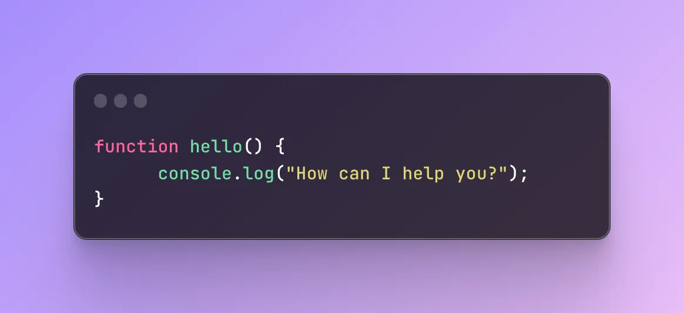

This function is not going to show us anything in the console right now because we didn’t call it.

That’s why we need to add one more line:
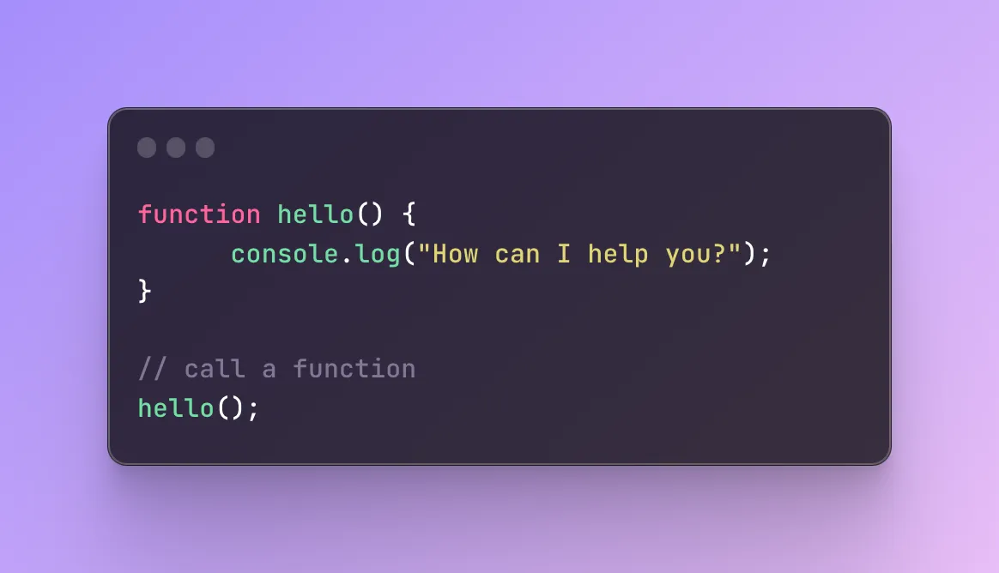
- tho aap iss trha se direct b apne function ko call kr sakty hy without using any consoe ya phir variable.
```bash
// Function Calling
function HelloFunction(Hello){
    console.log(Hello);
    console.log("Hello World without parameter");
}
HelloFunction("hello world");
// output: hello world
// Hello World without parameter
```

### What is a function parameter?
A function parameter is a name that we include when creating a function. This name will potentially be a value that the function receives and later performs some operations on/with it.

The name that you come up with can be any, it’s up to you what the name will be and doesn’t affect the result. The parameter names are needed to associate them with future values we plan to pass to the function.

#### There are several rules to remember when it comes to parameters:
- The names cannot be repetitive. If you use one name, the next one needs to be different.
- You don’t always have to use parameters. They are not required.
- The order matters. If you want to pass parameters of a name and surname, the values you plan to pass, need to match the order. If your second parameter is called last name but you pass a name as a second value, the value of the last name parameter will be the name value.
- You don’t define the data type of the possible value. JavaScript is a dynamically typed language meaning that you don’t have to write in advance what data type the parameter is going to be.
- Parameter names need to be descriptive and it’s recommended to use camelCase (lastName, firstName) but not a must.

The must-know along with parameters are arguments.

### What is a function argument?
A function argument is a value that we pass to the function. The value will be represented by the function parameter. When I use parameters like name and last name, the values that I will pass, will be called arguments.

Here is some visualization:
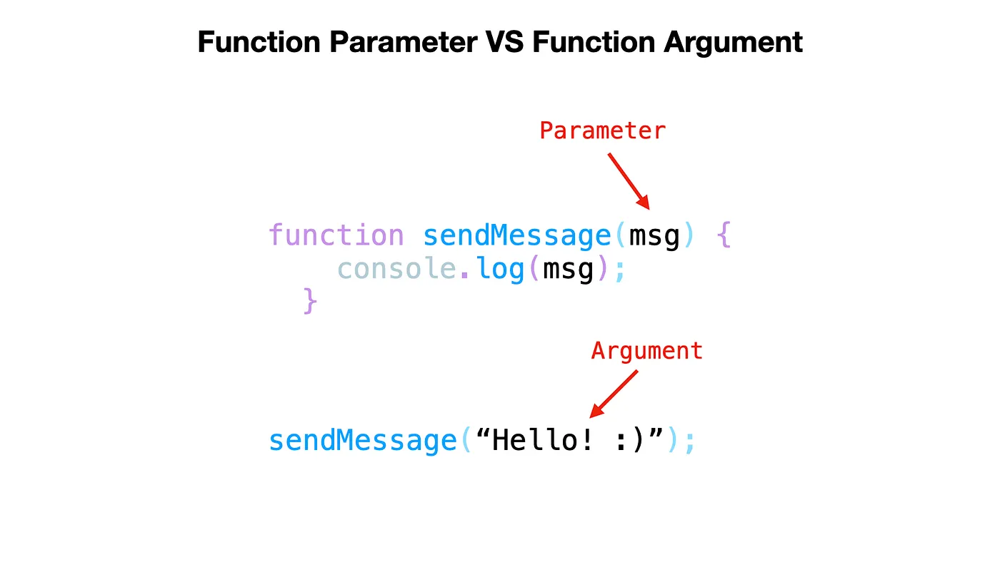
According to the image above, the name msg is the parameter but the actual value, “Hello! :)” is an argument.

### Arguments object
- An argument object is a built-in object available inside the body of the function. It represents all the arguments that we passed into the function. This object is more similar to an array but it’s not a regular array we know of.
- If you have 4 parameters in the function, for example, but you pass 5 arguments (values), the arguments object will read all the arguments you have passed, even if there is no parameter to read it.
- You can use an argument object and combine it with array index functionality.
- An index is the location in the array. The index of the very first item in an array is 0, so its position (index) is 0. The next one is at the index 1 and so on.

Here is an example:
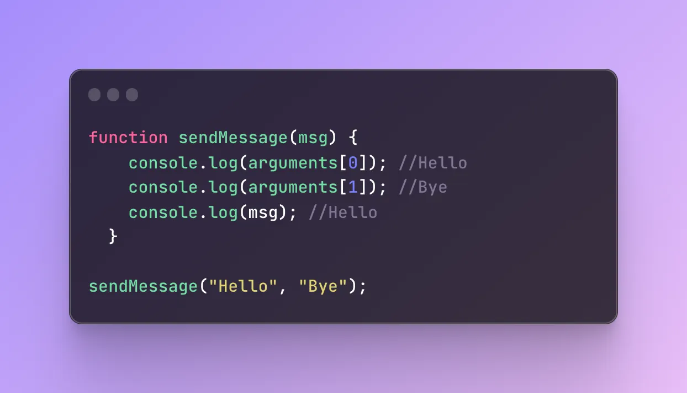
- iss image me agr aap dekhe tho aap k pass parameter aik hy magr aap argument jo hy do 2 pass kr rhy hy because of the indexing jo k array me hoti hy etc.
- but best cheez ye hy k aap rest parameter ko use kare q k ye iss trha se array indexing se aap k pass kuch functionality me gharh barh ho sakti hy etc.
- In this function, I used only one parameter but passed two arguments. With the help of the arguments object I targeted the argument at position 0, then at position 1 (the second one). Finally, I targeted the argument with the parameter name.
- The arguments object can be a powerful tool but considering that it lacks some functionalities, in the modern world you can simply replace the arguments object with the rest parameter.

### The rest parameter
Instead of using the arguments object, we can also use a rest parameter which treats one parameter as an array of several arguments.

For example, if I wrote one parameter name but passed several arguments, I can actually retrieve all these arguments by “spreading” my parameter. To “spread” the parameter name, you can use the three dots (…) before the parameter name. The name can be anything you wish as it is something created by you, all the other previous rules don’t change.

Here is an example based on the previous function:
```bash
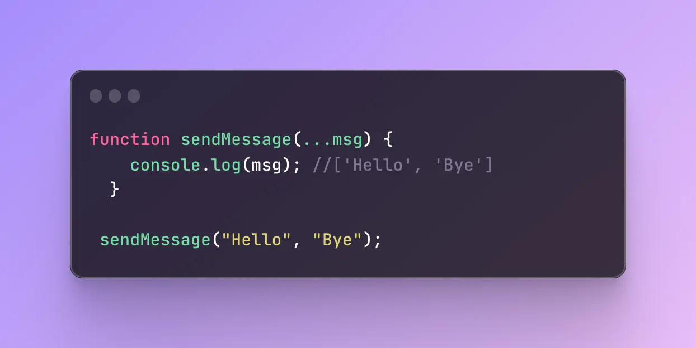
```

In this function, instead of writing one parameter name, I added three dots. These three dots will retrieve all the existing arguments and combine them into an array.

Here is another example if I pass one argument:
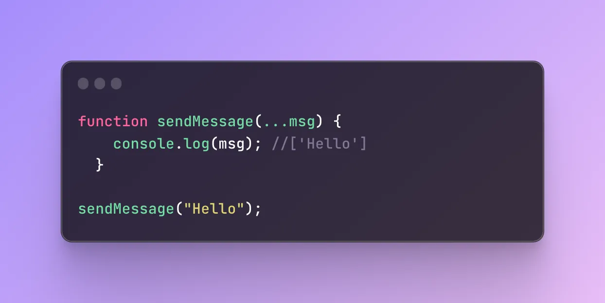
The result remains similar.

Let’s see what happens if I don’t pass any arguments:
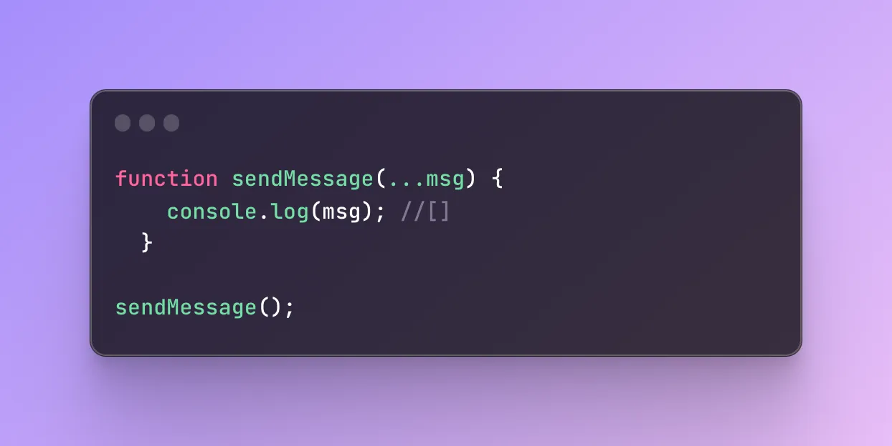

It will return an empty array because there is nothing to save in the array. As a result, this is a better way to access all arguments compared to the arguments object as we can manipulate it as a regular array.

### Default parameter value
Sometimes there can be a situation when your function has two parameters but doesn’t always receive two arguments.

First, let’s remember what happens when we pass both:
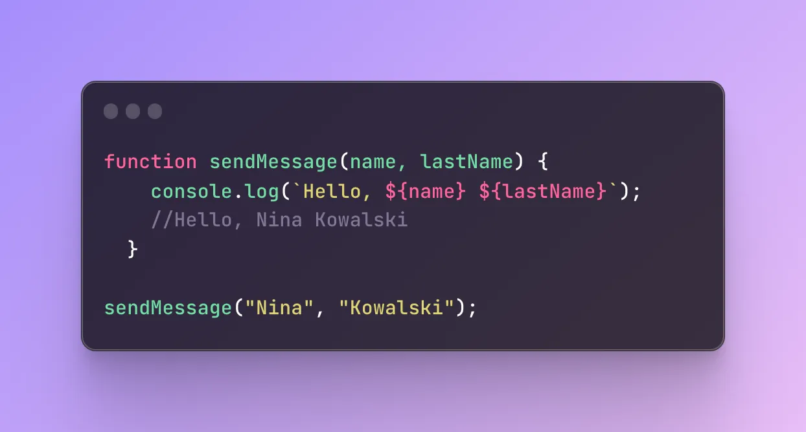

Next, let’s see what happens if we don’t:

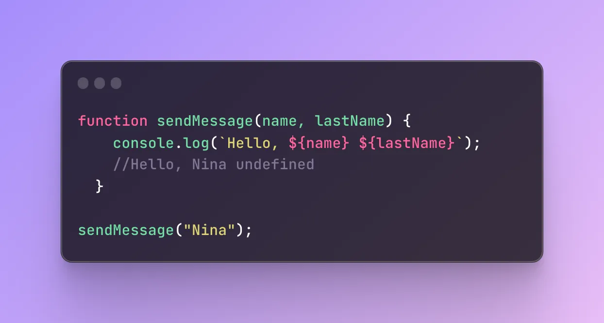

Instead of the last name, we see undefined because the parameter wasn’t given any value.

When you have a real website and users, it might be not very good if the user of your website saw something like this, right?

How to solve this? We use a default value!

As the name suggests, the default value is a value we can assign to the parameter that will be a default. If we don’t pass anything the starting value will be this default value.

What value can we give? Any value you like!

In this case, we can add a default value “Anonymous” which will be used in case we don’t have a last name:

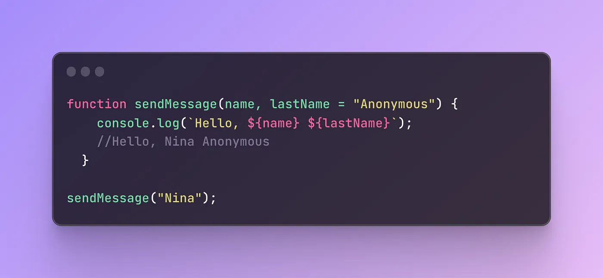
If the function doesn’t receive the last name value, the default value Anonymous will be used.

On the other hand, there are other ways around this.

You can check if the last name is undefined and show different results conditionally but I think the default value is more convenient.

A default value can be any parameter at any position and even several of them.
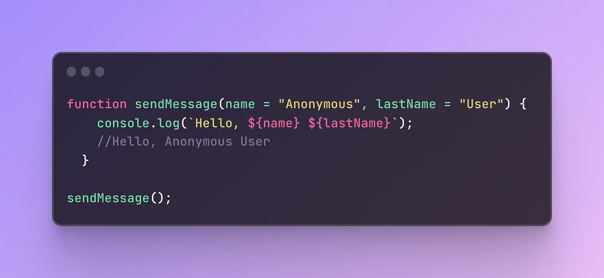

### Return statement in functions
In a function body, we often use a return statement. A return statement returns one specific value and stops the function execution. Any code you have after the return statement is not going to execute. That’s why the return statement should always be the last one.

The value returned can be any data type. It’s also not mandatory to write a value after the return statement. If you skip the value, the function will return undefined.
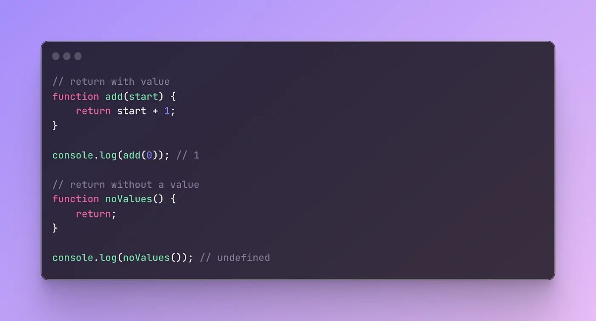
The value you want to return always needs to start from the same line where the return statement is located. If done otherwise, this line break will be automatically considered as a semicolon. JavaScript automatically inserts a semicolon after the return statement even if you don’t do it yourself and this new line will be closed.
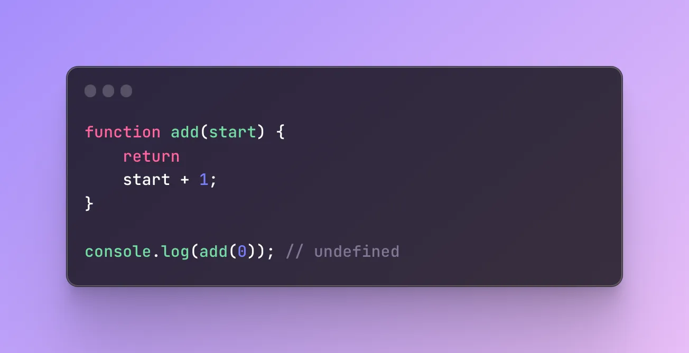
To avoid this issue but use a new line anyway you can simply wrap a parenthesis around the value you want to return:
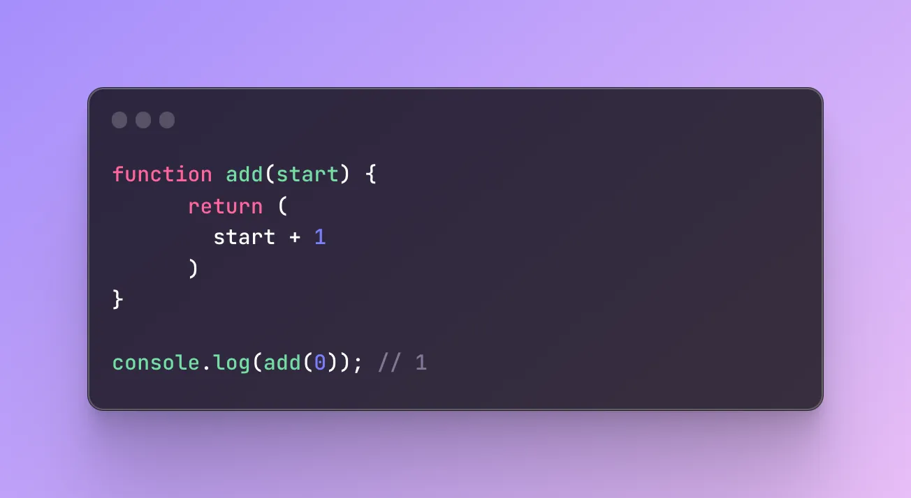
Now it should be working properly again.

#### What does the return statement do:
- In regular functions, the return says “ I am done, here is the answer”, stops doing anything and gives you the value you asked for from the place where you called the function.

Before we continue further, let’s remember the function declaration structure one more time and move to a function expression:

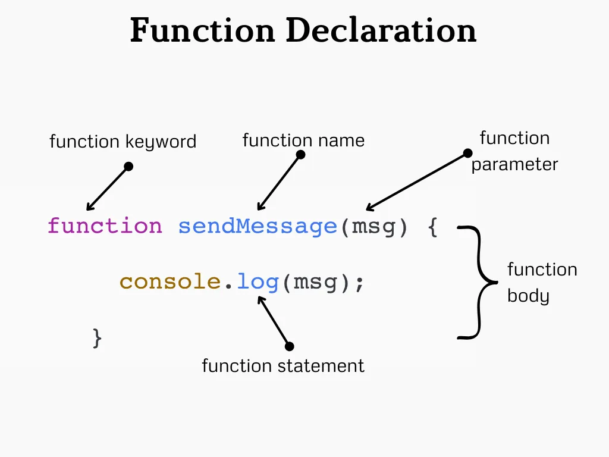

### Function expression
Another way to define a function is a function expression.

#### In function expressions, you have two options:

- You can create a function expression without a name (aka anonymous function) or
- You can create a named function expression

The main difference is that in function expressions you can have an additional perk of not naming the function. In a function declaration, you always name the function.
- matlab aap function jub expression se banatay hy tho phir aap ko function ka name rakhne ki zaroorat nhi hoti hy. magr without expression aap functiono ko declare krthy time function ka name rakthy thy simple.

##### Anonymous functions (unnamed function expression) vs. named function expressions
As the name suggests, the anonymous function is a function that doesn’t have a name, here is an example:
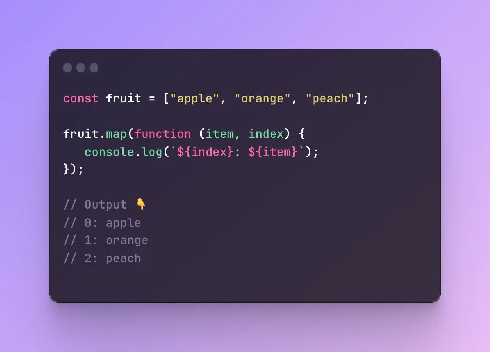
I am mapping through the array of fruit and I use a function without a name. This function is a function (specifically a callback function) that runs for every element in the array.

At the same time, you can optionally use a name for this function. BUT in this case, it will be a named function expression, not an anonymous function. As anonymous means that it doesn’t have a name, it’s anonymous.
- or issi ko call back function b kaha jata hy q k ye bar bar ja kr aap k array me se element ko print kr rha hota hy jaise aap b iss image k example me dekh sakty ho.

Let’s try this out:
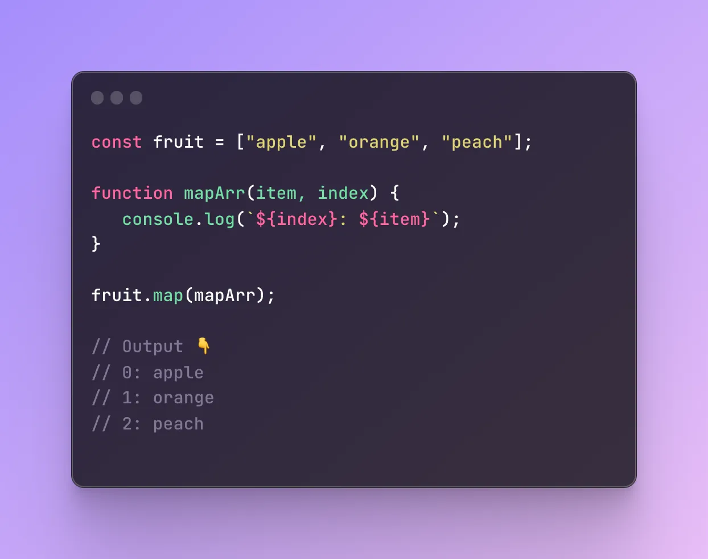
As you see, the result is the same. In this situation, we would not need to use any name because this function runs only once and we don’t use it outside of the code block.

We can take the function declaration we created earlier and transform it into an anonymous function:
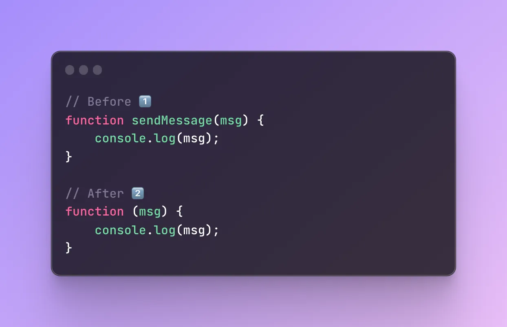
In this example, I created the exact same function however it does not have a name anymore. I omitted the name which was supposed to be written after the function keyword but there is nothing right now.

However, a function written in such a way is going to throw an error:

🚨 Function statements require a function name

This code will be treated as a function statement and that’s why it requires a name.

#### Function expression vs. function statement
- A function statement and a function expression are slightly different things in JavaScript.
- A function expression means that we are able to create functions in the middle of expressions, so that’s why it’s called a function expression.

What exactly is a function expression?

- Expression in JavaScipt is a block of code where you ask a question in a way that gives you a specific value.
- Let’s say you make a calculation and you want to check how much is 1 plus 1. The value given back will be a summary of 1 and 1. And this 1 plus 1 is an expression. Expressions usually produce specific values. While statements, that are very similar produce specific actions. For example, declaring a variable, or doing something with an if statement. So you are making a kind of statement.
- In JavaScript, you can use expressions when a statement is expected but you cannot use a statement when an expression is expected.

To avoid this error and make a function expression usable, we need to:

Save a function expression in a variable
Or use a function as an IIFE (Immediately Invoked Function Expression)

##### Recursion:
 recursion, which we will cover in more detail very soon is a technique when a function can call itself. It executes code and then calls itself again which can be stopped if it meets specific conditions. And to make a function call itself it needs to have a name, an identifier.

 ### What makes functions a value?
#### You can assign functions to variables and reuse them

We already covered this topic when it came to anonymous functions. Functions can be saved in variables and re-used as many times as you want.
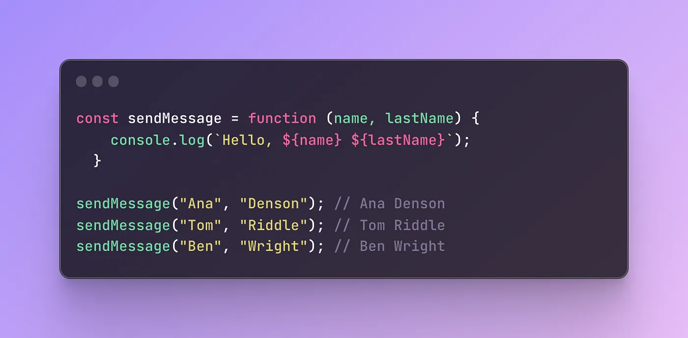

### Pass them as arguments

You can create a function that receives another function and performs additional. Such functions are known as callback functions which I will cover later in this post.
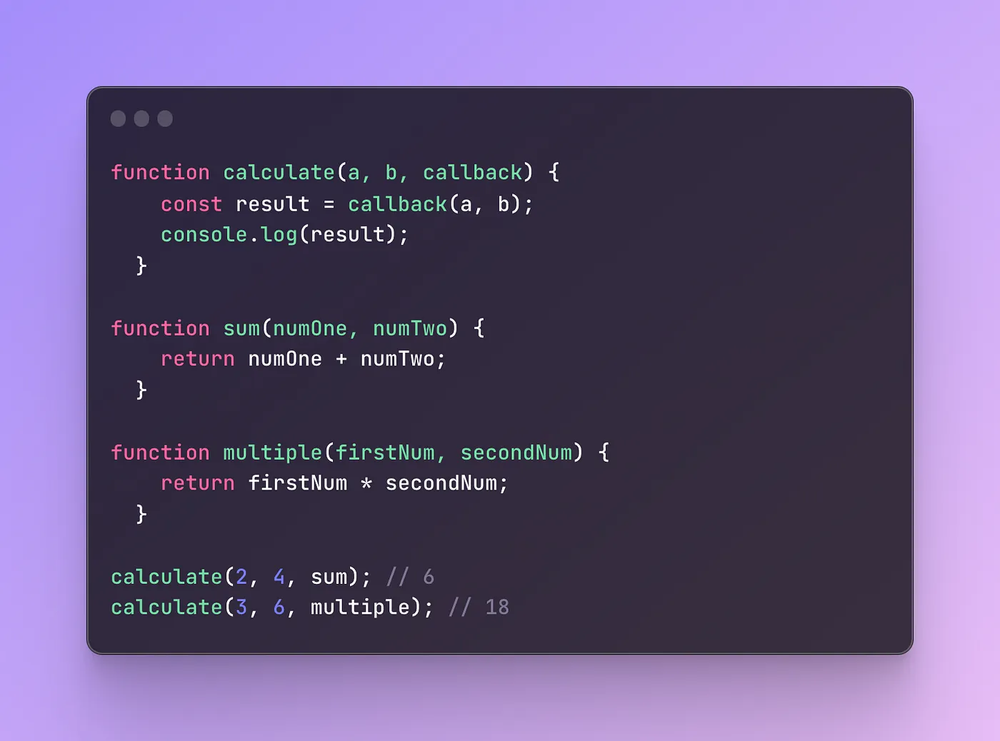
In the example above, I have a function called calculate that has three parameters. The third parameter is a callback which will be a function.

I have two various functions that I can potentially pass as an argument (value). It can be either a sum function or a multiple function. These functions on their own don’t do anything until I pass them.

Inside the calculate function I create a variable named result and there I will be saved the result of the callback function.

The callback is just a name but when I pass, let’s say the function named sum, it will be used as a value.

The sum function will receive a and b from the calculate function and return me the sum.

The same applies to another function, multiple.

### Return functions from functions
Function can not only use other functions but they can also return functions. This usually takes place when it comes to closures or factory functions which we will cover shortly.

Here is a simple example:
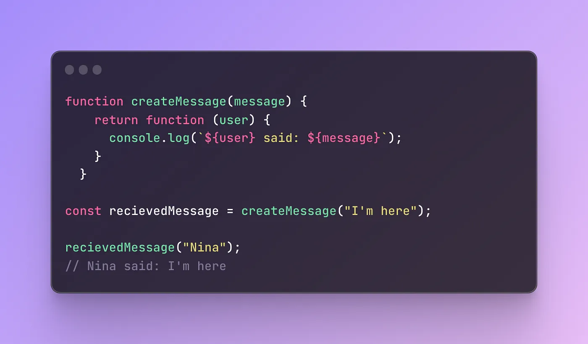
#1 First I create a reusable function that receives a message and returns a new function that will log the message along with its argument.

#2 Next, I save the result of the createMessage function in the variables receivedMessage. If you log this variable to the console, it will be a reference to the function. Try it out yourself!

#3 Next, I call this variable as if it’s a function, because it has a function value and I pass an argument “Nina”.

### Asynchronous JavaScript
In order to implement asynchronous flow, there are several ways:

- Callbacks
- Promises
- Async/await
- Timers
- Event loops
- Non-blocking I/O (input/output)
- Right now we are going to cover only callbacks.

### Callback function
The callback is a function that is an argument of another function.

Due to the nature of JavaScript, you cannot call all the functions at the same time. If you remember, for each function we have a separate function execution context and they are piled up on top of each other.

Functions do not execute at the same time. They execute depending on where and how we call them. Can you guess the result here?
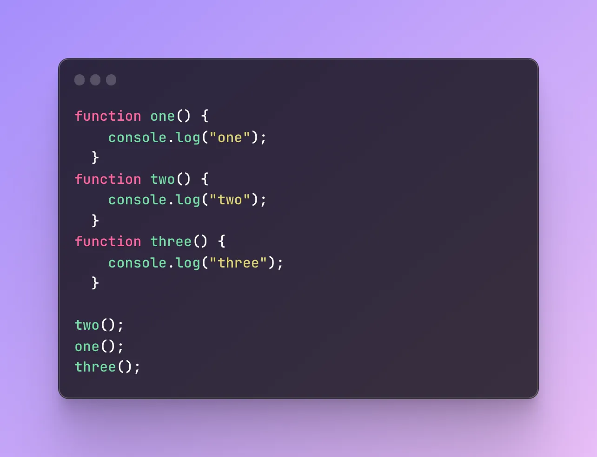
I created functions in one order but called them in a different one.

What is going to happen?

It will log to the console numbers two, one, and three because I call them in such order.

But what happens this time?
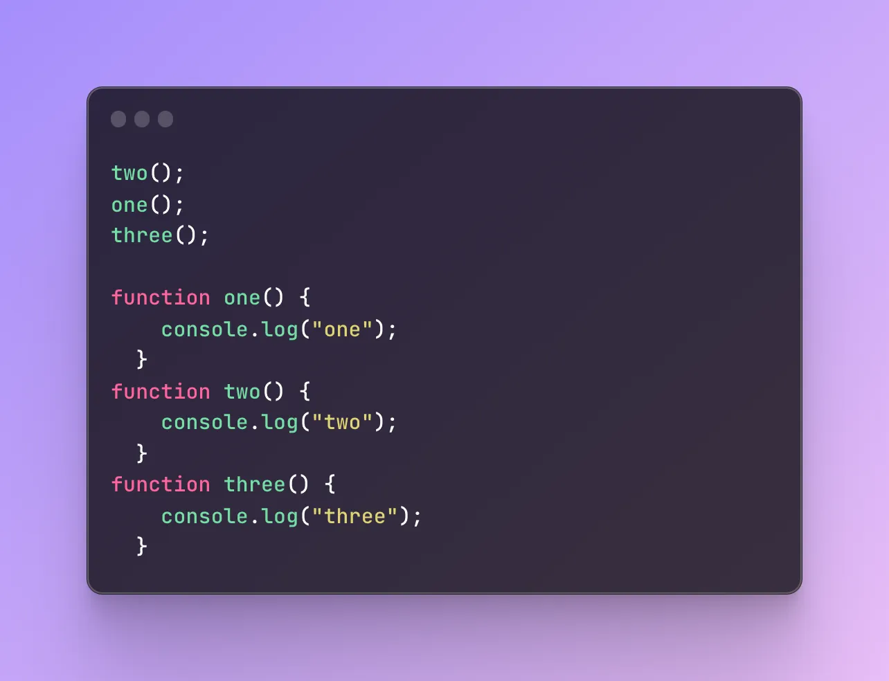

I call all the functions before I even create them.

Will this throw an error?

No, it will have the exact same result: two, one, and three.

If you don’t understand why, I recommend you go back to the execution context explanation.

The main takeaway here was not the execution context but the fact that the results are provided according to the order I called the functions.

But what if there is a situation when you want to call the function only when the previous function was triggered?

Imagine a real-life example, a restaurant.

#1 You go to the restaurant and the cashier takes your order

#2 After the cashier takes your order, you are given an order number

#3 You take a seat and wait for the order

#4 When the food is ready, the cashier calls you by your order number

Image all these actions are functions. For every customer, the cashier produces actions like taking an order, passing the order so it’s prepared, and calling you when the order is ready.

For the cashier to call you, they depend on another function, which is the preparation of the order. So they wait for another person.

While the food is being prepared and you are waiting at the table, this process is called asynchronous action. While you are waiting there is an order being prepared and this doesn’t prevent the other customer from placing the order.

If all these actions had to be synchronous then when you ordered, the order would need to prepare right away without you waiting, you would need to take the order you made and only then the next person would be able to place an order.

They cannot call you right after you make an order but while you are waiting they are preparing the order. On the other hand, they also need to know how to get back to you while you are waiting at your table. That’s why you have your order number, it’s a way to get back to you.

A callback is a way to call back. So, when the order is ready they use this callback to get back to you and tell you to take the order.

The food preparation function is executing and when it’s done it’s automatically ready to use your order number to get back to you and tell you to take your order.

In short, you are attaching one function to another function. Here is a minimalistic example:
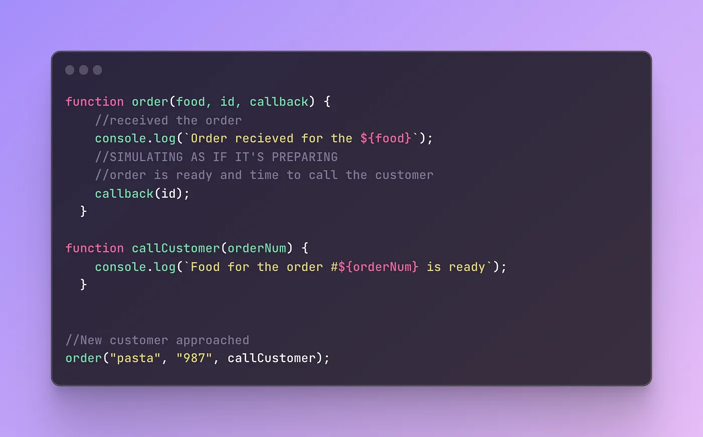

### What is a property?
Property is a key-value pair of an object, in other words, objects are collections of these properties.
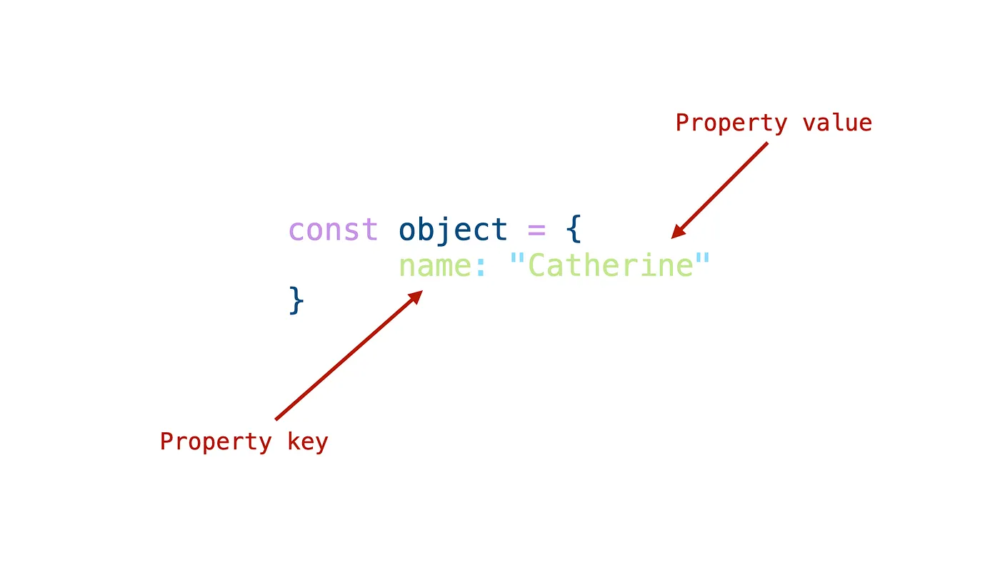

Another difference between a function and a method is that functions can exist on their own, they don’t have to be attached to something else. The only thing they are attached to is the global object.

Methods however cannot exist on their own and they need to be a property of something else, in this case, objects.

They define the behavior of the object they are located in and operate on the other properties within this object.

That’s why calling functions and calling methods are also different.

To call a function you simply use the name of the function however to call the method, you need to use the object name along with the dot notation.
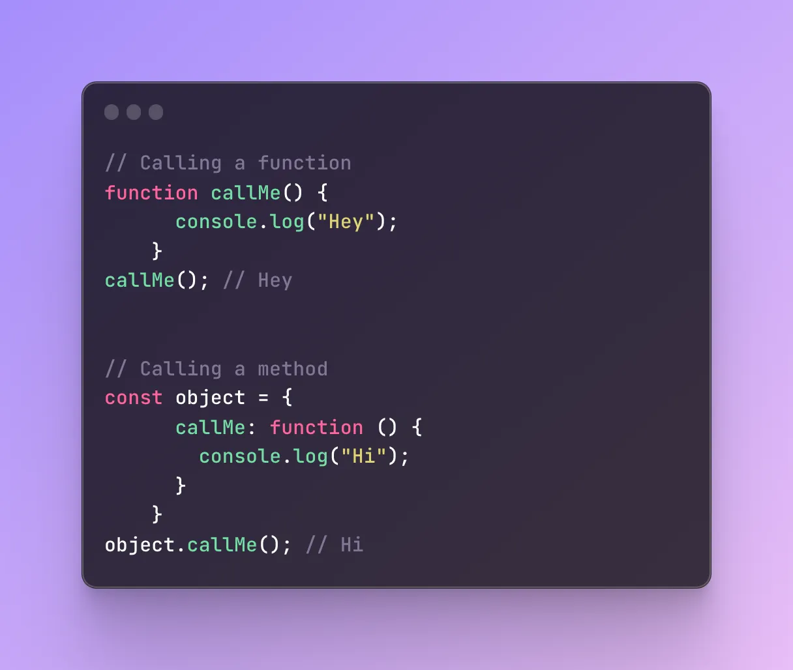

### Built-in Methods
Now, that we understand what methods are, time for built-in methods.

Built-in methods are pre-written methods that are part of JavaScript.

These methods perform regular tasks without the need to write everything from scratch.

Built-in methods save a lot of time and provide guaranteed functionality.

When you create a function yourself, you might miss out on something but the built-in methods are already there, ready to do the job for you.

On top of that, these methods are pre-compiled and optimized meaning that they have better performance. In JavaScript, there are various built-in objects that provide various functionalities and they also come along with their built-in methods.

### String built-in method
There are a lot of built-in string methods which have various purposes but let’s say we have a string and we want to find at what index a specific letter is located. Instead of creating a function ourselves, we can use a built-in method indexOf().

Here is an example:
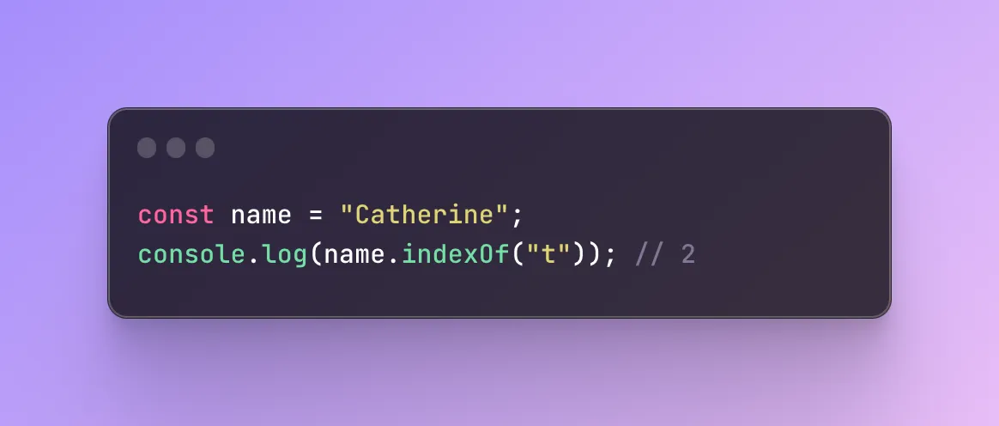
- or string k method k bare me aap or b parh sakty hy.

There you go, it’s so simple. We took the string name and with the dot, a notation used the method name as well as passed whatever we were searching for.

### Number built-in method
There are tons of useful methods that work with numbers.

One of them can receive a number and return a fixed amount of fractional part. So if I have 9.9 it should return 9, if 1.145 it should return 1.
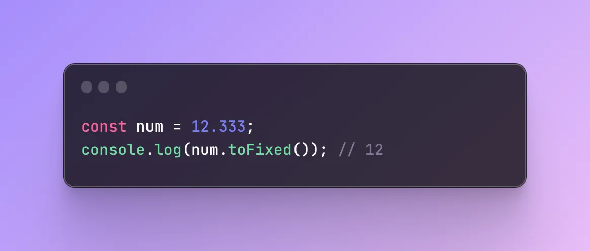

## Arrow function expressions
Now that we know what function expressions are, it will be much easier to understand what an arrow function is.

An arrow function is a more modern alternative to traditional function expressions.
#### The benefits of the arrow function are:

Readable, simple, one-liner syntax: You can omit the keyword function, braces, and even return.
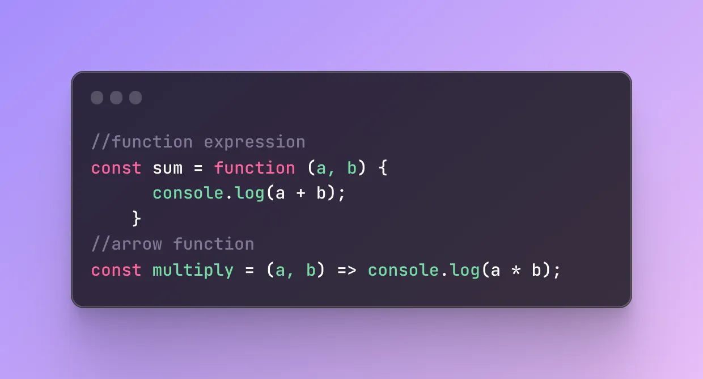
- aap k pass ye second wala arrow function hy or upar wala wo simple sa function hy.

It’s important to note that you cannot always avoid braces and it can be done only when you have one statement in the function body.

Otherwise, you have to use braces.
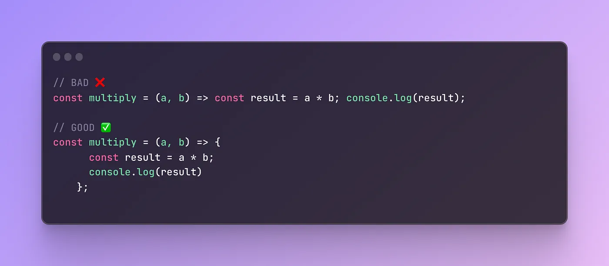

### const a = ["Hydrogen", "Helium", "Lithium", "Beryllium"];

const a2 = a.map(function (s) {
  return s.length;
});

console.log(a2); // [8, 6, 7, 9]

const a3 = a.map((s) => s.length);

console.log(a3); // [8, 6, 7, 9]
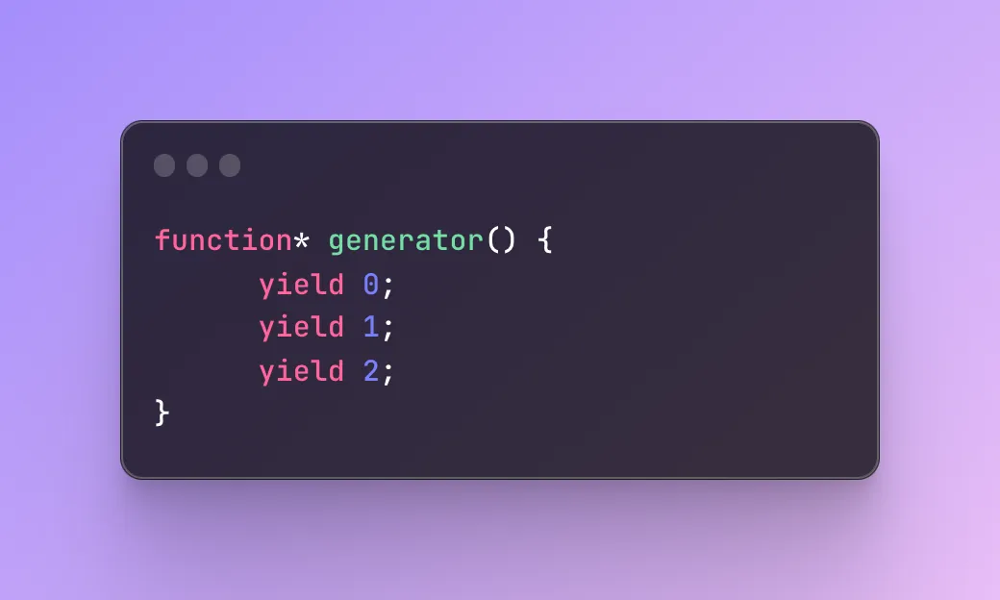

This doesn’t make sense much but let’s go further.

When you call the generator function it doesn’t execute right away like a regular function.

Instead, it creates an iterator object aka a generator object which is going to control the execution of our generator function.

Iterator is kind of a tool or feature in JavaScript that enables us to go through each value, one at a time, across various collections of data.

Iterator object has various methods that help us to control the execution process of the function.

Let’s save the generator function and inspect what it creates:
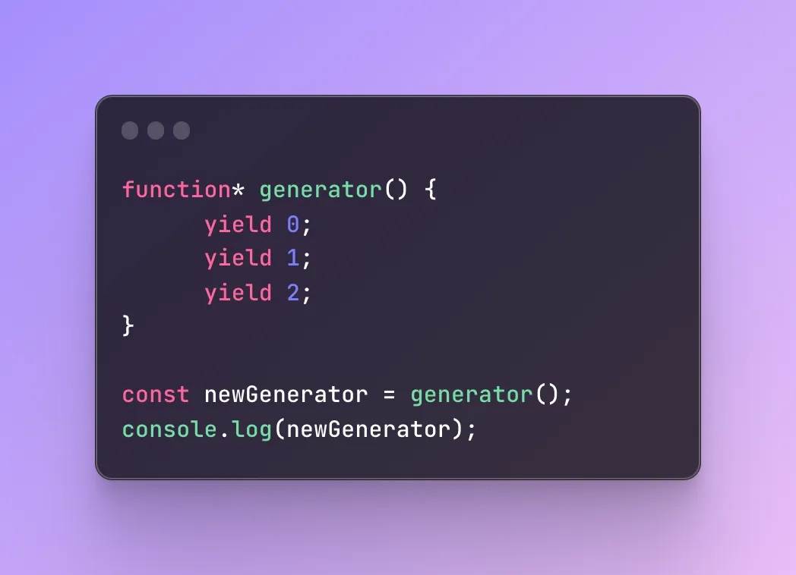
Once we check the console, this is what we get:
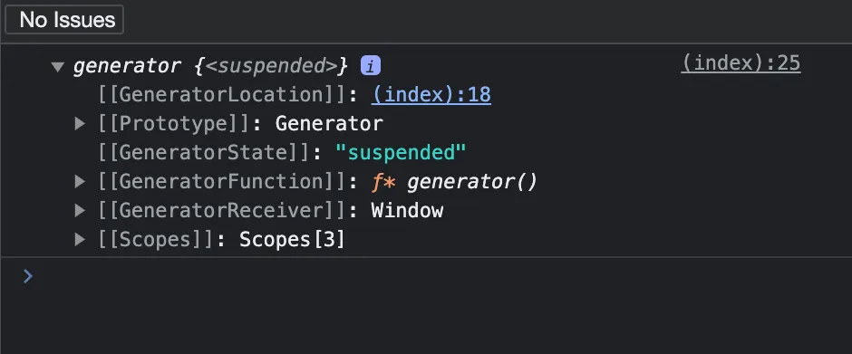

When we call the function it simply creates this generator object but we need to use methods to make the function do something.

So it doesn’t execute the function, it’s a tool to execute the function in the future.

### Unary functions
In JavaScript, an unary function is a function that takes only one argument and transforms its value.
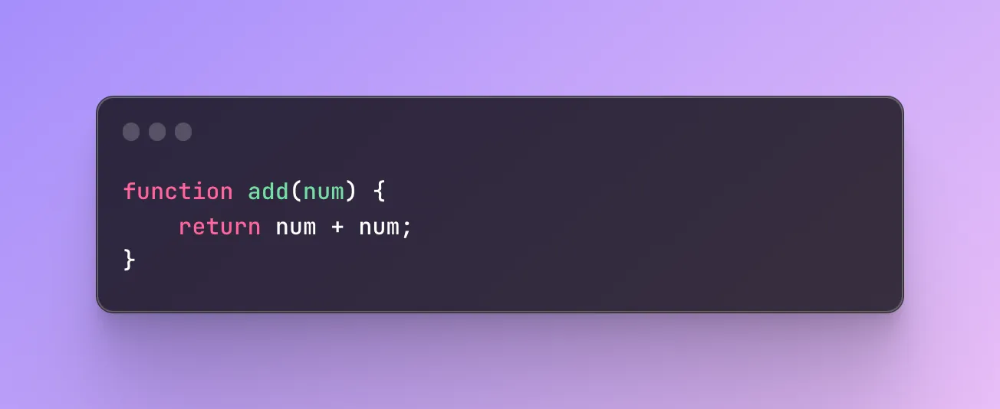
Though this is a very simple example, there are many various situations where we can use unary functions.

### Top-level functions
In JavaScript, you will, from time to time, hear a term top-level function. It’s not very popular but good to know. The top-level function is simply a function that is located in the global scope. It’s the topmost function. It’s not wrapped by other functions, it’s not located inside any objects, classes, or any “interface”. In other words, they are directly located in the global object aka window object.
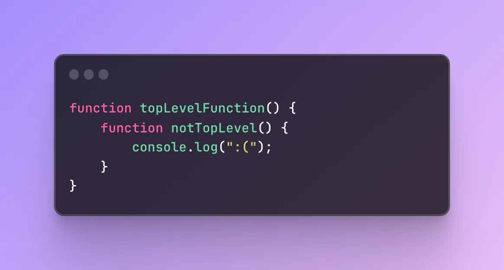
- or issi trha iss function k andar function ko nested function b kaha jata hy.

### Recursion
Recursion in Javascript is a technique where a function calls itself in order to perform a specific task.

The function might keep calling itself until we give an indication that it reached the endpoint. To avoid endless recursion we provide a so-called Base Case. Base Case is a condition(s) that stops the recursion.

Recursion is often used in more complex calculations that break down large problems into smaller ones.

Let’s create a simple recursive function to illustrate how it works. This is a simple example, as recursion is often used in more complex calculations.

Image, we want to calculate the sum of all positive numbers from one to the number we provided.

If the number provided is 4, I want the sum of 1, 2, 3, and 4.

To achieve this, we can pass the number to the function and calculate the sum by taking the number plus this number minus one, so it will be the previous number.

If we pass 4, we will take this 4 and to add the previous num, it will be 4–1 so it’s 3, then 3–1 makes it 2, and so on.

If it continues this way, we might go into minus. That is why, when creating recursion we need to think of a base case that will stop this recursion at some point.

As we decided to work with positive numbers, it means we simply need to stop the recursion when we reach the number 1. We don’t want 1 to go below one.
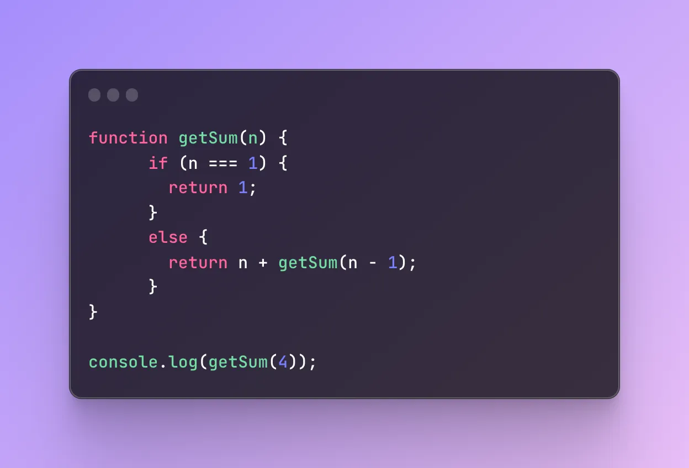
Let’s understand the process above.

-The function getSum receives a number 4. Checks if it equals 1 and if it doesn’t we move to the else block.

-The function returns 4 + a result received in the getSum where we pass 4–1.

-What will be the result of 4 + the result of getSum? It will be 4 + 3 + again the result of the getSum. The number in the if block is not 1 yet, so we still move to the else block.

-What will be the result of 4 + 3 + getSum result? It will be 4 + 3 + 2 + again the result of getSum.

-We finally reach the point where the passed “n” parameter equals 1 so the getSum returns 1 and ends there.

-As a result we have 4 + 3 + 2 + 1 which makes it 10.

The function keeps calling itself recursively until we reach the base case of 1.

# Cheat Sheeto Of Methods
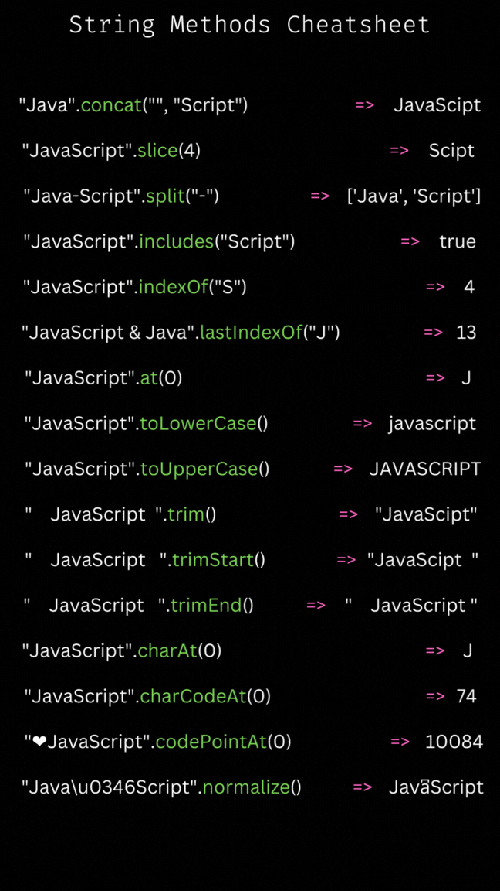
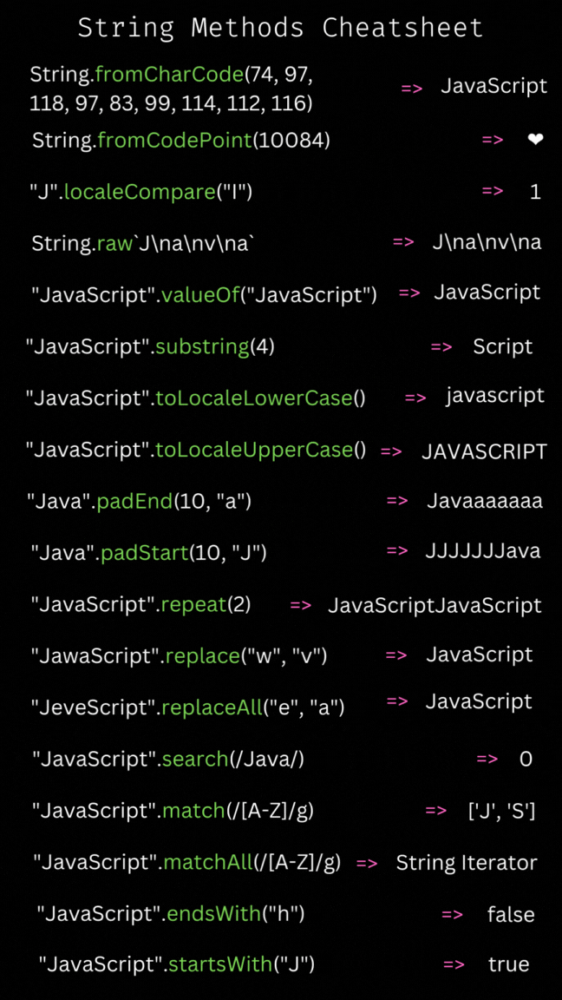
number
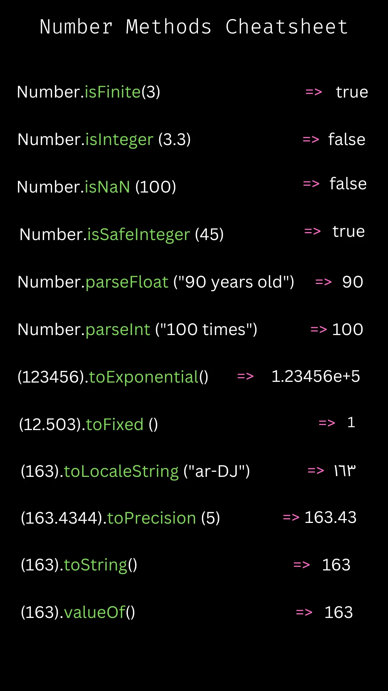