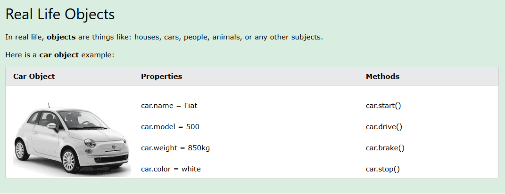
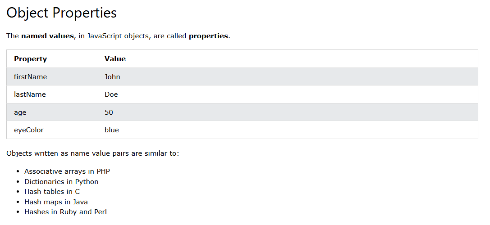
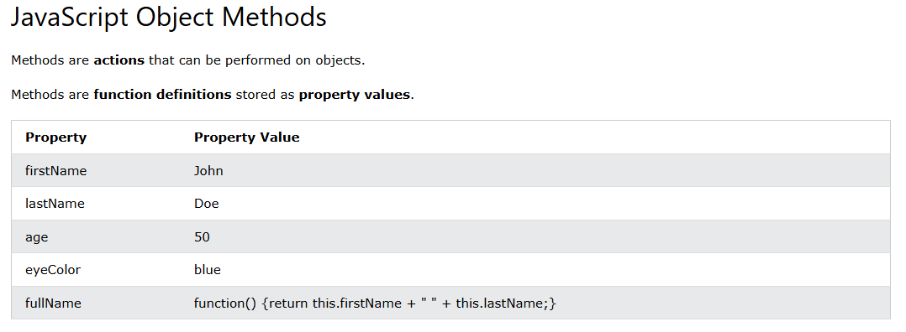
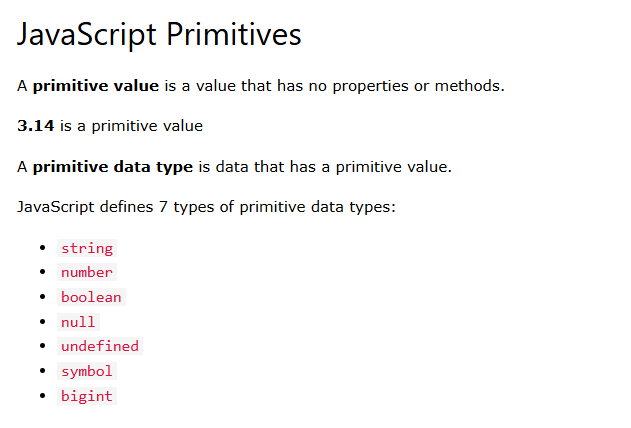
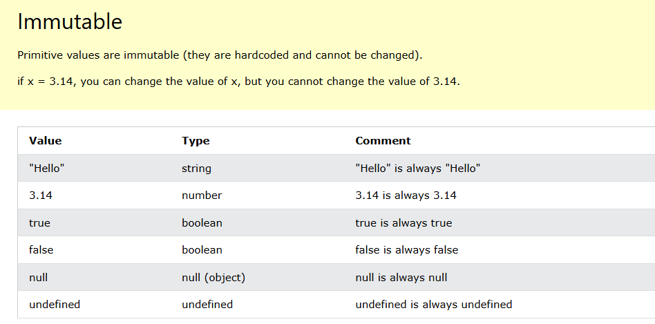
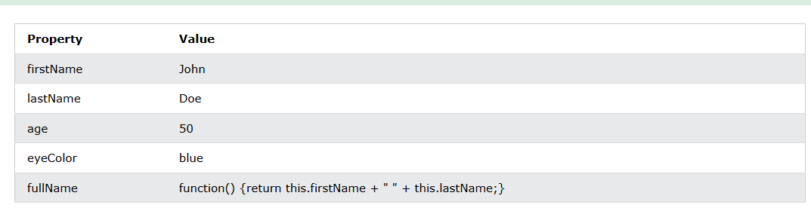
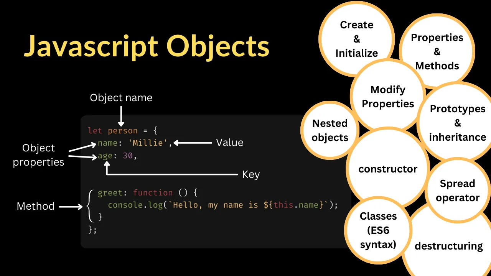

# JavaScript Objects
- Objects are containers for Properties and Methods.
- Properties are named Values.
- Methods are Functions stored as Properties.
- Properties can be primitive values, functions, or even other objects.

In JavaScript, almost "everything" is an object.

- Objects are objects
- Maths are objects
- Functions are objects
- Dates are objects
- Arrays are objects
- Maps are objects
- Sets are objects

All JavaScript values, except primitives, are objects.


### Object Properties
- A real life car has properties like weight and color:
- car.name = Fiat, car.model = 500, car.weight = 850kg, car.color = white.
- Car objects have the same properties, but the values differ from car to car.

### Object Methods
- A real life car has methods like start and stop:
- car.start(), car.drive(), car.brake(), car.stop().
- Car objects have the same methods, but the methods are performed at different times.

### JavaScript Variables
- JavaScript variables are containers for data values.
- This code assigns a simple value (Fiat) to a variable named car:
```bash
let car = "Fiat";
```
- aap k pass object b aik same like variable ki trha hota hy magr aap variable me aik time pr sirf aik hi value ko store kr sakty hy magr object me aap multiple values ko store kr sakty hy simple.

### JavaScript Objects
- Objects are variables too. But objects can contain many values.
- This code assigns many values (Fiat, 500, white) to an object named car:
```bash
//Example
const car = {type:"Fiat", model:"500", color:"white"};
```
*********************************************************
```bash
/**
 * aap k pass javascript me objects b variable ki trha hota hy
 * magr variable me aap aik time pr aik hi value ko store kr sakty hy magr objects me aap multiple store kr sakty hy.
*/
// Example: Variable
let name = "Majid Ali";
// Example: Objects
const Name = {
    name: "Majid Ali",
    age: 19,
    location: "karachi",
    city: "Karachi, Sindh",
    addres: "abc Karachi"
}
console.log(name); // variable printing
console.log(Name.name,Name.city, Name.location); // object printing // Output: Majid Ali Karachi, Sindh karachi
```
::::: Note:
It is a common practice to declare objects with the const keyword.

### JavaScript Object Definition
#### How to Define a JavaScript Object
- Using an Object Literal
- Using the new Keyword
- Using an Object Constructor
#### JavaScript Object Literal
- An object literal is a list of name:value pairs inside curly braces {}.
```bash
{firstName:"John", lastName:"Doe", age:50, eyeColor:"blue"}
```
- jo aap k pass name value pairs hotay hy curly brackets me tho oss ko javaScript ka literals kaha jata hy. Jaise variable me aap jiss b value ko store krthy tho oss ko value b kaha jata hy or lietrals b kaha ja sakta hy etc.
### Creating a JavaScript Object
- These examples create a JavaScript object with 4 properties:
```bash
// Create an Object
const person = {firstName:"John", lastName:"Doe", age:50, eyeColor:"blue"};
```
- Spaces and line breaks are not important. An object initializer can span multiple lines:

```bash
<!DOCTYPE html>
<html>
<body>
<h1>Creating JavaScript Objects</h1>
<h2>Using an Object Literal</h2>

<p id="demo"></p>

<script>
// Create an Object:
const person = {
  firstName: "John",
  lastName: "Doe",
  age: 50,
  eyeColor: "blue"
};

// Display Data from the Object:
document.getElementById("demo").innerHTML =
person.firstName + " is " + person.age + " years old.";
</script>

</body>
</html>

```
- iss niche wale object ko hum log empty bana rhy hy magr iss me hum log externally phir key pair dal rhy hy etc.
```bash
// Create an empty Object
const person = {};

// Add Properties
person.firstName = "John";
person.lastName = "Doe";
person.age = 50;
person.eyeColor = "blue"; 

const person2 = person.firstName + " is " + person.age + " years old.";
console.log(person2);
// tho agr aap iss example me dekhe tho object hamare pass empty hy magr oss me hum log kuch properties dal rhy hy matlab add kr rhy hy etc.
```
### Using the new Keyword
- This example create a new JavaScript object using new Object(), and then adds 4 properties:
- tho aap object ko new k keyword se b bna sakty ho koi problem nhi hy.
- new k keyword ko laga dene se aap k pass kuch b nhi hota hy ye optional hota hy k aap iss k sath object bana b sakty hy or nhi b. Matlab koi required cheez nhi hy ye bs agr aap ko lagana ho tho aap laga sakty hy warna na lgana ho tho na lagao etc.

```bash
// object create with new keyword
// Create an Object
const person = new Object();
person.firstName = "John";
person.lastName = "Doe";
person.age = 50;
person.eyeColor = "blue"; 

let persronn = person.firstName + " is " + person.age + " years old.";
console.log(persronn);
```
#### Note:
- The examples above do exactly the same.
- But, there is no need to use new Object().
- For readability, simplicity and execution speed, use the object literal method.


### Accessing Object Properties
You can access object properties in two ways:
```bash 
// 1. first way
// iss me aap ko apne object ka name or phir jiss cheez ko print krna ho oss k property ka naam simple.
objectName.propertyName
```
```bash
objectName["propertyName"]
```
- ye object accessing k bare me hum logo ne already parh liya hy upar access kr k b etc.

### JavaScript Object Methods


:::: Example:
```bash
const person = {
    firstName: "John",
    lastName: "Doe",
    id: 5566,
    fullName: function() {
      return this.firstName + " " + this.lastName;
    }
  };
  const result = person.fullName();
  console.log(result); // output: John Doe
```
- tho aap iss trha se object k andar function ko b bana sakty hy easily.
- or yaha pr hamare pass ye function me this.firstName jo hy ye hamare person k object ko refer kr rha hy matlab target kr rha hy etc. ya aap ye b keh sakty hy k oss k properties ko access kr rha hy etc.

- In the example above, this refers to the person object:
- this.firstName means the firstName property of person.
- this.lastName means the lastName property of person.

### In JavaScript, Objects are King.
#### If you Understand Objects, you Understand JavaScript.
- Objects are containers for Properties and Methods.
- Properties are named Values.
- Methods are Functions stored as Properties.
- Properties can be primitive values, functions, or even other objects.

### JavaScript Primitives

#### Immutable


### JavaScript Objects are Mutable
- Objects are mutable: They are addressed by reference, not by value.
- If person is an object, the following statement will not create a copy of person:
```bash
const x = person;
```
- tho aik achi practice yahi hy k aap object ko banatay waqt time const keyword ka use kare tha k aap k object ko koi change na kr saky etc. 
- The object x is not a copy of person. The object x is person.
- The object x and the object person share the same memory address.
- Any changes to x will also change person:
```bash

// Create an Object
const person = {
    firstName: "John",
    lastName: "Doe",
    age:50,
    eyeColor: "blue"
  };
  /**
   * tho agr aap iss example me dekhe tho mene person ki copy bana li hy const x = person ab ye x jo hy ye mere pass person ki copy agaye hy.
   * or me jo x.age = 10; kr rha ho ye mere pass person me data ko save kr rha hy jo age 50 ko age 10 kr rha hy.
   * tho yaha pr mere pass jo person hy ab oss ki copy ban k agaye hy x simple
   */

  // Try to create a Copy
const x = person;

// This will change age in person !!!
x.age = 10;

// access and print the object
let result = person.firstName + " is " + person.age + " years old.";
console.log(result);
```

- tho agr aap iss example me dekhe tho mene person ki copy bana li hy const x = person ab ye x jo hy ye mere pass person ki copy agaye hy.
- or me jo x.age = 10; kr rha ho ye mere pass person me data ko save kr rha hy jo age 50 ko age 10 kr rha hy.
- tho yaha pr mere pass jo person hy ab oss ki copy ban k agaye hy x simple

## JavaScript Object Properties
- An Object is an Unordered Collection of Properties
- Properties are the most important part of JavaScript objects.
- Properties can be changed, added, deleted, and some are read only.
- matlab aap javaScript ki properties ko deletek, add etc kr sakty ho.
### Accessing JavaScript Properties
- aap javaScript k propertis ko access krne k liye simply aap ko apne object ka naam likna hy or phir oss properties ka naam jiss ko aap access krna chahtay hy etc.
- The syntax for accessing the property of an object is:
```bash
// objectName.property
let age = person.age;
```
Another Example: 
```bash

const person = {
    name: "ali",
    age: 25,
    country: "pakistan",
    city: "karachi",
    address: "abc karachi",
    phone: 2121215,
    salary: 100000

}
// objectName.property
let age = person.age; // tho aap iss trha se objectName se properties ko access kr sakty hy.
console.log(age); // Output: 25

//objectName["property"]
let age1 = person["age"]; // aap iss trha se direct key ko likh kr b properties ko print kr sakty hy.
console.log(age1); // output: 25

```
```bash
// Another Example
const person1 = {
    firstname: "John",
    lastname: "Doe",
    age: 50,
    eyecolor: "blue"
  };
  let result = person1.firstname + " is " + person1.age + " years old.";
  console.log(result); // output: John is 50 years old.
```
::: below is the example with keys
```bash
// below we are accessing properties by using their key
  const person2 = {
    firstname: "John",
    lastname: "Doe",
    age: 50,
    eyecolor: "blue"
  };
  let personStore =  person2["firstname"] + " is " + person2["age"] + " years old.";
  console.log(personStore);
```

### Adding New Properties
- matlab hum log object k andar kaise properties ko add kr sakty hy ye krna b bohat hi asan hy.
- You can add new properties to an existing object by simply giving it a value:
```bash

//adding a properties in object
const person = {
    firstname: "John",
    lastname: "Doe",
    age: 50,
    eyecolor: "blue"
  };
  person.nationality = "pakistani"; // aap iss trha se object me kisi b properties or keys ko add kr sakty hy simple.
  let result = person.firstname + " is " + person.nationality + ".";
  console.log(result); // output: John is pakistani.
```
### Deleting Properties
- The delete keyword deletes a property from an object:
- aap simplye delete keyword ka use kr k delete kr sakty hy. see example below.
```bash
// Delete a object
  const person1 = {
    firstname: "John",
    lastname: "Doe",
    age: 50,
    eyecolor: "blue"
  };
  delete person1.age;
  let result1 = person1.firstname + " is " + person1.age + " years old.";
  console.log(result1); // output: John is undefined years old.
  // john aap k pass undefined iss wja se a rha hy q k hum ne delete person.age; age ko delete krdiya hy from person1
```
#### Note:
- The delete keyword deletes both the value of the property and the property itself.
- After deletion, the property cannot be used before it is added back again.

### Nested Objects
- tho aap baki cheezo ki trha object me b nested object ko bana sakty ho easily.
- Property values in an object can be other objects:

```bash
// Create nested Objects
const myObj = {
    name: "John",
    age: 30,
    myCars: {
      car1: "Ford",
      car2: "BMW",
      car3: "Fiat"
    }
  }
  let result = myObj.myCars.car2;;
  console.log(result); // Output: BMW
```
- tho agr aap iss example me dekhe tho hum ne myObj k andar dosra object myCars ka banaya hy or phir result k variable me oss me se myObj me se myCars me ja rha ho or phir car2 ko print kr rha ho etc.

:::: Some Another Example:
```bash
// Create nested Objects
const myObj = {
    name: "John",
    age: 30,
    myCars: {
      car1: "Ford",
      car2: "BMW",
      car3: "Fiat"
    }
  }
  let result = myObj.myCars.car2;;
  console.log(result); // Output: BMW
  let result2 = myObj.myCars["car1"]; // tho aap iss trha se direct key se b print kr sakty hy no problem.
  console.log(result2); // output: Ford
  let result22 = myObj["myCars"]["car2"]; // aap iss trha se b access kr sakty hy.
  console.log(result22); // output: BMW
```
- aap aik aik key jo propeties hoti hy object ki aap oss ko aik aik kr k varible me b store kr sakty hy for this see below.
```bash
// Create nested Objects
const myObj = {
  name: "John",
  age: 30,
  myCars: {
    car1: "Ford",
    car2: "BMW",
    car3: "Fiat"
  }
}

let p1 = "myCars";
let p2 = "car2";
let showResult = myObj[p1][p2];
console.log(showResult); // output: BMW
```

## JavaScript Object Methods
- Object methods are actions that can be performed on objects.
- A method is a function definition stored as a property value.


::::: Example:
```bash
// Object Method
// A method is a function definition stored as a property value.
const person = {
    firstName: "John",
    lastName: "Doe",
    id: 5566,
    fullName: function() {
      return this.firstName + " " + this.lastName;
    }
  };

  let result = person.fullName();
  console.log(result); // output: John Doe
```
- In the example above, this refers to the person object:
- jaise hum logo ne pehly b kaha tha k this ka jo keyword hy ye aap k pass object ko target krtha hy etc.
- this.firstName means the firstName property of person.
- this.lastName means the lastName property of person.

### Accessing Object Methods
- You access an object method with the following syntax:
```bash
objectName.methodName()
```
- If you invoke the fullName property with (), it will execute as a function:
```bash
// accessing object method
  const person1 = {
    firstName: "John",
    lastName: "Doe",
    id: 5566,
    fullName: function() {
      return this.firstName + " " + this.lastName;
    }
  };
  let result1 = person.fullName();
  console.log(result1); // output: John Doe
```
- If you access the fullName property without (), it will return the function definition:
```bash
name = person.fullName;
```

### Adding a Method to an Object
- Adding a new method to an object is easy:
```bash
<!DOCTYPE html>
<html>
<body>
<h1>JavaScript Objects</h1>
<h2>Adding a Method</h2>

<p id="demo"></p>

<script>
// Create an Object
const person = {
  firstName: "John",
  lastName: "Doe",
  id: 5566,
};

// Add a Method
person.name = function() {
  return this.firstName + " " + this.lastName;
};

// Display Object Data
document.getElementById("demo").innerHTML =
"My father is " + person.name(); 
</script>

</body>
</html>

```
### Using JavaScript Methods
- This example uses the JavaScript toUpperCase() method to convert a text to uppercase:
```bash
person.name = function () {
  return (this.firstName + " " + this.lastName).toUpperCase();
};
```

### JavaScript Display Objects
#### How to Display JavaScript Objects?
- Displaying a JavaScript object will output [object Object].
- javaScript display Objects ka matlab simple ye hy k hum ne jo object banaya hy oss ko kaise display kare. 
```bash
// Create an Object
const person = {
    name: "John",
    age: 30,
    city: "New York"
  };
  // Display Object
  let result = person;
  console.log(result); // { name: 'John', age: 30, city: 'New York' }
  document.write(result); // [object object]
  // ye resutl aap k IDE pr b depend krtha hy k aap konse ko use kr rhy hy online ya phir offline me etc tho iss wja se b aap k pass different anser atay hy.
```
- ye resutl aap k IDE pr b depend krtha hy k aap konse ko use kr rhy hy online ya phir offline me etc tho iss wja se b aap k pass different anser atay hy. Tho iss se confuse nhi hona hy etc.
- tho aap ko sahi IDE ko select krna chaye hy jaha pr aap ko sahi result mille etc.


##### Some solutions to display JavaScript objects are:

- Displaying the Object Properties by name
- Displaying the Object Properties in a Loop
- Displaying the Object using Object.values()
- Displaying the Object using JSON.stringify()
- tho Matlab aap ane object k properties ko different ways me print kr sakty hy etc.

#### Displaying Object Properties
- The properties of an object can be displayed as a string:
```bash
// Create an Object
const person1 = {
    name: "John",
    age: 30,
    city: "New York"
  };
  
  let result1 = person1.name + ", " + person1.age + ", " + person1.city;
  console.log(result); // { name: 'John', age: 30, city: 'New York' }
```

### Displaying Properties in a Loop
- Ab me loops ko me objects k properties ko print karonga.
- The properties of an object can be collected in a loop:
```bash
/**
 * yaha pr hum logo ne pehly simple aik object banaya hy person k name se.
 * or phir aik variable banaya hy let text = ""; k naam se jiss ko hum log use karenge loop me properties ko print krne k liye.
 * or phir me javaScript k in keyword ko use kr rha ho loop me. or phir simplye assignment += operator laga kr object ko print kr rha ho.
 */

// Create an Object
const person = {
    name: "John",
    age: 30,
    city: "New York"
  };
  // Build a Text
let text = "";
for (let x in person) {
  text += person[x] + " ";
};
let result = text;
console.log(result); // John 30 New York 
```
#### Note:
- You must use person[x] in the loop.
- person.x will not work (Because x is the loop variable).

### Using Object.values()
- ab hum object.values ki madad se loop ko print karenge.
- Object.values() creates an array from the property values:

```bash
// Create an Object
const person = {
    name: "John",
    age: 30,
    city: "New York"
  };

  // Create an Array
const myArray = Object.values(person); // aap ko first iss trha se array ko banana parhega.
const result = myArray;
console.log(result); // output: [ 'John', 30, 'New York' ]
```

### Using Object.entries()
- Object.entries() makes it simple to use objects in loops:
```bash
//Create Object of fruits
const fruits = {Bananas:300, Oranges:200, Apples:500}; 

let text = "";
for (let [fruit, amount] of Object.entries(fruits)) {
  text += fruit + ": " + amount + "<br>";
}

let result = text;
console.log(result);
// better screen pr print krne k liye document.write ka use kare jiss se kuch iss trha k result milega.
// Bananas: 300
// Oranges: 200
// Apples: 500
```

### Using JSON.stringify()
- JavaScript objects can be converted to a string with JSON method JSON.stringify().
- JSON.stringify() is included in JavaScript and supported in all major browsers.
#### Note:
- The result will be a string written in JSON notation:
- {"name":"John","age":50,"city":"New York"}
```bash
<!DOCTYPE html>
<html>
<body>
<h1>JavaScript Objects</h1>
<h2>Display Properties with JSON</h2>

<p id="demo"></p>

<script>
// Create an Object
const person = {
  name: "John",
  age: 30,
  city: "New York"
};

// Display JSON
document.getElementById("demo").innerHTML = JSON.stringify(person);
</script>

</body>
</html>

```
## JavaScript Object Constructors
### Object Constructor Functions
- Sometimes we need to create many objects of the same type.
- To create an object type we use an object constructor function.
- It is considered good practice to name constructor functions with an upper-case first letter.
```bash
// Constructor Function for Person objects
function Person(first, last, age, eye) {
    this.firstName = first;
    this.lastName = last;
    this.age = age;
    this.eyeColor = eye;
  }
  // Create a Person object
  // tho aap k pass object kuch iss trha se banaya jata hy.
const myFather = new Person("John", "Doe", 50, "blue");
// Display age
let result = "Ali is " + myFather.age + "."; 
console.log(result); // output: Ali is 50.

```
#### Note:
- In the constructor function, this has no value.
- The value of this will become the new object when a new object is created.

##### Now we can use new Person() to create many new Person objects:
```bash
// Constructor function for Person objects
function Person(first, last, age, eye) {
    this.firstName = first;
    this.lastName = last;
    this.age = age;
    this.eyeColor = eye;
  }

  // Create two Person objects
const myFather = new Person("John", "Doe", 50, "blue");
const myMother = new Person("Sally", "Rally", 48, "green");

// Display age
let result = "Ali is " + myFather.age + ". Uzair is " + myMother.age + "."; 
console.log(result);
```

### Property Default Values
- A value given to a property will be a default value for all objects created by the constructor:
```bash
// Constructor function for Person objects
function Person(first, last, age, eye) {
    this.firstName = first;
    this.lastName = last;
    this.age = age;
    this.eyeColor = eye;
    this.nationality = "English";
  }
  // Create 2 Person objects
const myFather = new Person("John", "Doe", 50, "blue");
const myMother = new Person("Sally", "Rally", 48, "green");

// Display nationality

let result = "My father is " + myFather.nationality + ". My mother is " + myMother.nationality;
console.log(result); // output: My father is English. My mother is English
```

### Adding a Property to an Object
- Adding a property to a created object is easy:
```bash
<!DOCTYPE html>
<html>
<body>
<h1>JavaScript Object Constructors</h1>

<p id="demo"></p>

<script>
// Constructor function for Person objects
function Person(first, last, age, eye) {
  this.firstName = first;
  this.lastName = last;
  this.age = age;
  this.eyeColor = eye;
}

// Create 2 Person objects
const myFather = new Person("John", "Doe", 50, "blue");
const myMother = new Person("Sally", "Rally", 48, "green");

// Add nationality to first object
myFather.nationality = "English";

// Display nationality 
document.getElementById("demo").innerHTML =
"My father is " + myFather.nationality; 
</script>

</body>
</html>

```

#### Note:
- The new property will be added to myFather. Not to any other Person Objects.

### Built-in JavaScript Constructors

JavaScript has built-in constructors for all native objects:
- new Object()   // A new Object object
- new Array()    // A new Array object
- new Map()      // A new Map object
- new Set()      // A new Set object
- new Date()     // A new Date object
- new RegExp()   // A new RegExp object
- new Function() // A new Function object

### Note:
The Math() object is not in the list. Math is a global object. The new keyword cannot be used on Math

::::: Complete JavaScript Built-in Constructor Example:
```bash
<!DOCTYPE html>
<html>
<body>
<h1>JavaScript Object Constructors</h1>

<p id="demo"></p>

<script>
// Display the Type
document.getElementById("demo").innerHTML =
"<p>The typeof new Object() is " + typeof new Object() + "</p>" +
"<p>The typeof new Array() is " + typeof new Array() + "</p>" +
"<p>The typeof new Map() is " + typeof new Map() + "</p>" +
"<p>The typeof new Set() is " + typeof new Set() + "</p>" +
"<p>The typeof new Date() is " + typeof new Date() + "</p>" +
"<p>The typeof new RegExp() is " + typeof new RegExp() + "</p>" +
"<p>The typeof new Function() is " + typeof new Function() + "</p>";
</script>

</body>
</html>

```
### Did You Know?
- Use object literals {} instead of new Object().
- Use array literals [] instead of new Array().
- Use pattern literals /()/ instead of new RegExp().
- Use function expressions () {} instead of new Function().

- "";           // primitive string
- 0;            // primitive number
- false;        // primitive boolean

- {};           // object object
- [];           // array object
- /()/          // regexp object
- function(){}; // function
```bash
<!DOCTYPE html>
<html>
<body>
<h1>JavaScript Object Constructors</h1>

<p id="demo"></p>

<script>
// Display the type of all
document.getElementById("demo").innerHTML =
'<p>The typeof "" is ' + typeof "" + '</p>' +
'<p>The typeof 10 is ' + typeof 10 + '</p>' +
'<p>The typeof false is ' + typeof false + '</p>' +
'<p>The typeof {} is ' + typeof {} + '</p>' +
'<p>The typeof [] is ' + typeof [] + '</p>' +
'<p>The typeof /()/ is ' + typeof /()/ + '</p>' +
'<p>The typeof function(){} is ' + typeof function(){} + '</p>';
</script>

</body>
</html>

```

## Medium Article
#### Mastering JavaScript Objects: A Comprehensive Guide to Object-Oriented Programming

- Objects are a fundamental data type in JavaScript, used to store collections of key-value pairs. They are versatile and can be used to represent complex data structures, model real-world entities, and encapsulate related data and behavior.
### Creating and initializing objects
There are several ways to create objects in JavaScript. The most common way is using object literal notation. Object literals are written in the form of key-value pairs, where each key is a string and each value can be any valid JavaScript data type.
```bash
// Object initialization
let person = {
    name: 'Millie',
    age: 30,
    greet: function () {
      console.log(`Hello, my name is ${this.name}`);
    }
  };
  ```
  - You can also create an empty object and add properties and methods later. Like we are adding make and model properties and start method, which is starting the car.
  - matlab aap empty object bana kr oss k andar phir properties ko add kr sakty hy.

```bash
// Empty Object
let car = {};
car.make = 'Toyota';
car.model = 'Camry';
car.start = function () {
  console.log('Starting the car....v-v-v-vroom....v-v-v-vroom!');
};
```
#### Object properties and methods
Properties are key-value pairs that store data, while methods are functions that define the behavior of an object.
```bash
console.log(person.name); //Access property: 'Millie'
person.greet(); // Call method: 'Hello, my name is Millie'
```
- Accessing and modifying object properties: You can access and modify object properties using dot notation or bracket notation.
```bash
person.age = 31; // Modify property using dot notation
person['age'] = 32; // Modify property using bracket notation
```

### Nested objects
Objects can contain other objects as properties, creating nested structures. Here we create objects having the properties of the other objects, this process is called as nesting of objects. Nesting helps in handling complex data in a much more structured and organized manner by creating a hierarchical structure.

```bash
let student = {
  name: 'Charles',
  age: 20,
  address: {
    street: '123 Main St',
    city: 'Los Angeles',
    state: 'CA'
  }
};
console.log(student.address.city); // Access nested property: 'Los Angeles'
```
### Object constructors
We can create objects using a constructor function, which acts as a blueprint for creating multiple objects with the same structure. It is considered good practice to name constructor functions with an upper-case first letter.

```bash
function Person(name, age) {
  this.name = name;
  this.age = age;
  this.greet = function () {
    console.log(`Hello, my name is ${this.name}`);
  }
}

let jeremy = new Person('Jeremy', 30);
let zara = new Person('Zara', 25);

jeremy.greet(); // 'Hello, my name is Jeremy'
zara.greet(); // 'Hello, my name is Zara'
```
- Here we have created an Object Type Person. Now, we can create many new Person objects. Jeremy and Zara are two Person objects. We can also call the greet method on the Jeremy and Zara objects, which will output the greeting message based on the input name while creating a constructor.

### Prototypes and inheritance
All objects in JavaScript inherit properties and methods from a prototype. We can add properties and methods to an object’s prototype, which all instances of that object will inherit. In our code, we are adding a new method called introduce to the Person constructor. Then we are calling the introduce method on the Jeremy and Zara objects, printing their names and ages to the console.

```bash
Person.prototype.introduce = function() {
  console.log(`My name is ${this.name}, and I'm ${this.age} years old.`);
};

jeremy.introduce(); // 'My name is Jeremy, and I'm 30 years old.'
zara.introduce(); // 'My name is Zara, and I'm 25 years old.'
```

### Classes (ES6 syntax)
JavaScript added a syntactical sugar for creating objects using a class-like syntax. It starts with the class keyword, followed by the class name Person. Inside the curly braces, the class body defines a constructor and a method called greet. Then we create a new object named olivia, and call the greet method on the olivia object.

```bash
class Person {
  constructor(name, age) {
    this.name = name;
    this.age = age;
  }

  greet() {
    console.log(`Hello, my name is ${this.name}`);
  }
}

let olivia = new Person('Olivia', 30);
olivia.greet(); // 'Hello, my name is Olivia'
```

### Object destructuring
You can extract values from objects and assign them to variables using restructuring. Our code defines an object named car using object literal notation with two properties. Then we are using object destructuring to assign the value of the object properties to the variables we listed. An equivalent way to achieve the same result without destructuring is to assign values to separate variables using dot notation.

```bash
let car = {model: 'Mustang', engine: 'V8'};
let { model, engine } = car;

// This is similar to
// const model = car.model;
// const engine = car.engine;

console.log(model); // 'Mustang'
console.log(engine); // 'V8'
```

### Spread operator with objects
The spread operator can be used to copy properties from one object to another or to combine multiple objects into a new object. Here we are defining two objects: car1 and car2, with properties: model and engine respectively. Then we created a new object named combined in which we merged two objects using the spread operator.

```bash
let car1 = {model: 'Mustang'};
let car2 = {engine: 'V8'};
let combined = { ...car1, ...car2 };

console.log(combined); // {model: 'Mustang', engine: 'V8'}
```

# Object Syntax:
In JavaScript, objects are defined using curly braces {}. Each key-value pair is separated by a colon : and multiple pairs are separated by commas , . The key is always a string (or a symbol), and the value can be of any data type, including numbers, strings, other objects, arrays, functions, etc.

### Object Iteration:
You can iterate over the properties of an object using loops like for…in or Object.keys(), Object.values(), or Object.entries() methods.
```bash
for (let key in person) {
 console.log(key, person[key]);
}
// Using Object.keys()
const keys = Object.keys(person);
keys.forEach(key => console.log(key, person[key]));

// Using Object.values()
const values = Object.values(person);
values.forEach(value => console.log(value));

// Using Object.entries()
const entries = Object.entries(person);
entries.forEach(([key, value]) => console.log(key, value));
```

##### Spread Operator (Object Cloning #3): It uses the spread operator ({...}) to create a new object R5 and spreads all properties of R1 into R5.
```bash
//that is called spread operator
let R5 = {...R};
```

### Creating Objects with Classes (ES6):
With the introduction of ES6, JavaScript also supports class syntax for creating objects. Classes are syntactical sugar over constructor functions and prototypes.

```bash
class Person {
 constructor(name, age) {
 this.name = name;
 this.age = age;
 }
sayHello() {
 console.log(`Hello, my name is ${this.name} and I'm ${this.age} years old.`);
 }
}
const person1 = new Person('Alice', 25);
const person2 = new Person('Bob', 30);
person1.sayHello(); // Output: "Hello, my name is Alice and I'm 25 years old."
person2.sayHello(); // Output: "Hello, my name is Bob and I'm 30 years old."
```

- Classes provide a more structured and intuitive way to create objects with constructors and methods.

### Object Destructuring:
ES6 introduced object destructuring, allowing you to extract properties from an object and assign them to variables:

```bash
const { name, age } = person;
console.log(name); // Output: "John Doe"
console.log(age); // Output: 31
```


