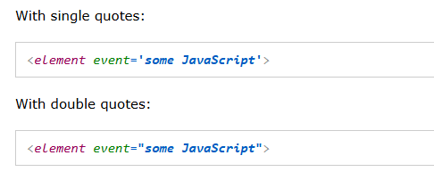
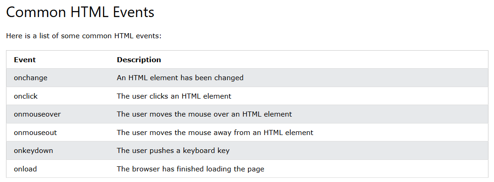

# JavaScript Events
- HTML events are "things" that happen to HTML elements.
- When JavaScript is used in HTML pages, JavaScript can "react" on these events.
- hamare pass js me events hotay hy jo k click hone pr aap ko kuch kuch kr k detay hy.

## HTML Events

An HTML event can be something the browser does, or something a user does.

Here are some examples of HTML events:

- An HTML web page has finished loading
- An HTML input field was changed
- An HTML button was clicked

Often, when events happen, you may want to do something.

JavaScript lets you execute code when events are detected.

HTML allows event handler attributes, with JavaScript code, to be added to HTML elements.

With single quotes:

- Tho aap iss trha se single or double dono quotes  ko use kr sakty hy.

#### onclick Event in JavaScript
- In the following example, an onclick attribute (with code), is added to a <button> element:
```bash
<!DOCTYPE html>
<html>
<body>
<h1>JavaScript HTML Events</h1>
<h2>The onclick Attribute</h2>

<button onclick="document.getElementById('demo').innerHTML=Date()">The time is?</button>

<p id="demo"></p>

</body>
</html>
// yaha pr button click hone k baad aap ko current date show hoga q k hum ne js ka Date() ka method use kiya howa hy etc.
```
- In the example above, the JavaScript code changes the content of the element with id="demo".
- In the next example, the code changes the content of its own element (using this.innerHTML):

##### The onclick Event
```bash
<button onclick="this.innerHTML=Date()">The time is?</button>
```
- yaha pr aap k pass onclick k upar aap k pass ossi hi button me date show hojayegi q k hum ne direct button k andar Date() js method ko use kiya howa hy etc.
- JavaScript code is often several lines long. It is more common to see event attributes calling functions:

#### Aap k pass aksar function ko event k click pr call kiya jata hy
```bash
<!DOCTYPE html>
<html>
<body>
<h1>JavaScript HTML Events</h1>
<h2>The onclick Attribute</h2>

<p>Click the button to display the date.</p>
<button onclick="displayDate()">The time is?</button>

<script>
function displayDate() {
  document.getElementById("demo").innerHTML = Date();
}
</script>

<p id="demo"></p>

</body>
</html> 
```
- jaise yaha pr hum ne function ko button k onclick pr call kiya howa hy jo k aap k pass kuch date print kr rha hy etc.

## Common HTML Events


### JavaScript Event Handlers
- javaScript k handlers ko or DOM ko jub hum log parhenge tho waha pr or b iss ko cover karenge yaha pr sirf overview hy.

Event handlers can be used to handle and verify user input, user actions, and browser actions:

- Things that should be done every time a page loads
- Things that should be done when the page is closed
- Action that should be performed when a user clicks a button
- Content that should be verified when a user inputs data
- And more ...

 Many different methods can be used to let JavaScript work with events:

- HTML event attributes can execute JavaScript code directly
- HTML event attributes can call JavaScript functions
- You can assign your own event handler functions to HTML elements
- You can prevent events from being sent or being handled
- And more ...

## Medium Article

### Introduction
- JavaScript event handling is a fundamental concept for creating interactive web applications. Understanding how to manage events efficiently is crucial for developers, especially those who are just starting out.

### Event Listeners
Event listeners are functions that wait for a specific event to occur on a particular element. When the event happens, the listener executes a predefined function. Event listeners are a fundamental part of interactive web development, enabling developers to respond to user actions. Let’s explore how to use event listeners in JavaScript, covering the basics and some advanced techniques.

# Grok A.i Complete Events Overview
JavaScript mein **events** woh actions ya occurrences hote hain jo user ya system ke interaction se trigger hote hain, jaise button click, mouse hover, key press, ya page load. Events ka use karke hum interactive web applications banate hain. Niche har point ko detail se explain kiya gaya hai, examples ke saath, taki aapko achhe se samajh aaye.

---

### 1. **Example of an Event**
Ek event ka simple example hai jab user ek button pe click karta hai, aur uske response mein kuch action hota hai, jaise alert dikhana.

**Code Example:**
```html
<!DOCTYPE html>
<html>
<body>
  <button onclick="showAlert()">Click Me</button>
  <script>
    function showAlert() {
      alert("Button was clicked!");
    }
  </script>
</body>
</html>
```
**Explanation:**
- Yahan `onclick` ek event hai jo button ke click hone par trigger hota hai.
- `showAlert` function call hota hai jab event fire hota hai.

---

### 2. **Event Listener**
**Event listener** ek function ya code hota hai jo kisi specific event (jaise click, hover) ke hone par execute hota hai. Yeh event ko "sunne" ka kaam karta hai.

**Syntax:**
```javascript
element.addEventListener(event, function, useCapture);
```
- `event`: Event ka naam, jaise `"click"`, `"mouseover"`.
- `function`: Wo function jo event trigger hone par chalega.
- `useCapture`: Optional boolean, event propagation ke liye (default: `false`).

**Example:**
```javascript
document.getElementById("myButton").addEventListener("click", function() {
  alert("Button clicked!");
});
```

---

### 3. **Adding Event Listeners**
Event listeners ko add karne ke liye `addEventListener` method ka use hota hai. Yeh flexible hai kyunki aap ek element pe multiple listeners add kar sakte ho.

**Example:**
```html
<button id="myButton">Click Me</button>
<script>
  const button = document.getElementById("myButton");

  // Event listener 1
  button.addEventListener("click", () => {
    console.log("Button was clicked!");
  });

  // Event listener 2
  button.addEventListener("mouseover", () => {
    console.log("Mouse is over the button!");
  });
</script>
```
**Explanation:**
- `addEventListener` se humne button pe `click` aur `mouseover` events ke liye alag-alag listeners add kiye.
- Har event trigger hone par corresponding function chalega.

---

### 4. **Handling Multiple Events**
Ek element pe multiple events ya ek hi event ke multiple listeners ho sakte hain. `addEventListener` is case mein kaam aata hai kyunki yeh overwrite nahi karta.

**Example:**
```html
<button id="myButton">Click or Hover</button>
<script>
  const button = document.getElementById("myButton");

  // Multiple listeners for 'click' event
  button.addEventListener("click", () => {
    console.log("Click event: Action 1");
  });
  button.addEventListener("click", () => {
    console.log("Click event: Action 2");
  });

  // Listener for 'mouseover' event
  button.addEventListener("mouseover", () => {
    console.log("Mouseover event triggered");
  });
</script>
```
**Output in Console (on click):**
```
Click event: Action 1
Click event: Action 2
```
**Explanation:**
- Ek hi button pe do `click` listeners aur ek `mouseover` listener add kiye.
- Sabhi listeners apne order mein execute hote hain.

---

### 5. **Event Object**
Jab koi event trigger hota hai, JavaScript ek **event object** pass karta hai listener function ko. Is object mein event ke baare mein details hote hain, jaise event ka type, target element, ya mouse coordinates.

**Example:**
```html
<button id="myButton">Click Me</button>
<script>
  const button = document.getElementById("myButton");

  button.addEventListener("click", (event) => {
    console.log("Event Type:", event.type); // Event ka type (e.g., "click")
    console.log("Target Element:", event.target); // Jis element pe event hua
    console.log("Mouse X Position:", event.clientX); // Mouse ka X-coordinate
  });
</script>
```
**Output in Console (on click):**
```
Event Type: click
Target Element: <button id="myButton">Click Me</button>
Mouse X Position: 150 (example value)
```
**Common Event Object Properties:**
- `event.type`: Event ka naam (e.g., `"click"`, `"keydown"`).
- `event.target`: Jis element pe event trigger hua.
- `event.clientX`, `event.clientY`: Mouse ke coordinates.
- `event.key`: Keypress ke liye pressed key.

---

### 6. **Event Propagation**
Event propagation woh process hai jisme event DOM tree mein travel karta hai. Yeh do phases mein hota hai:
1. **Capturing Phase**: Event document ke top se target element tak jata hai.
2. **Bubbling Phase**: Event target element se wapas document ke top tak jata hai.

**Default**: Bubbling phase mein event listeners trigger hote hain.

**Example:**
```html
<div id="parent">
  Parent Div
  <button id="child">Child Button</button>
</div>
<script>
  const parent = document.getElementById("parent");
  const child = document.getElementById("child");

  parent.addEventListener("click", () => {
    console.log("Parent clicked");
  });

  child.addEventListener("click", () => {
    console.log("Child clicked");
  });
</script>
```
**Output (on clicking the button):**
```
Child clicked
Parent clicked
```
**Explanation:**
- Button (child) click hone par event bubble up karta hai aur parent div ka listener bhi trigger hota hai.
- Agar aap capturing phase mein listen karna chahte hain, to `addEventListener` ke teesre parameter ko `true` set karein:
  ```javascript
  parent.addEventListener("click", () => {
    console.log("Parent clicked in capturing phase");
  }, true);
  ```

**Stopping Propagation:**
Agar aap chahte hain ki event bubble na kare, to `event.stopPropagation()` use kar sakte hain:
```javascript
child.addEventListener("click", (event) => {
  console.log("Child clicked");
  event.stopPropagation(); // Parent ka listener nahi chalega
});
```

---

### 7. **Event Delegation**
**Event delegation** ek technique hai jisme aap ek parent element pe event listener lagate hain, aur uske child elements ke events ko handle karte hain. Yeh bubbling ke concept pe kaam karta hai.

**Benefits:**
- Memory efficient: Har child element pe alag listener nahi lagana padta.
- Dynamic elements ke liye kaam karta hai (jo baad mein DOM mein add hote hain).

**Example:**
```html
<ul id="myList">
  <li>Item 1</li>
  <li>Item 2</li>
  <li>Item 3</li>
</ul>
<script>
  const list = document.getElementById("myList");

  list.addEventListener("click", (event) => {
    if (event.target.tagName === "LI") {
      console.log("Clicked item:", event.target.textContent);
    }
  });

  // Dynamically add new item
  const newItem = document.createElement("li");
  newItem.textContent = "Item 4";
  list.appendChild(newItem);
</script>
```
**Output (on clicking "Item 2"):**
```
Clicked item: Item 2
```
**Explanation:**
- Listener `<ul>` pe laga hai, lekin yeh `<li>` ke clicks ko handle karta hai.
- `event.target` se hum check karte hain ki click kahan hua.
- Naye `<li>` ke liye bhi listener kaam karta hai bina extra code ke.

---

### 8. **How Event Delegation Works**
Event delegation bubbling ke principle pe kaam karta hai:
1. Ek parent element pe event listener set kiya jata hai.
2. Jab koi child element pe event trigger hota hai, woh event bubble up karta hai parent tak.
3. Parent ke listener mein `event.target` ka use karke hum specific child element ko identify karte hain aur action perform karte hain.

**Key Points:**
- Yeh technique large lists ya dynamic content ke liye best hai.
- `event.target` ka use kar ke aap condition check kar sakte hain (e.g., `if (event.target.matches('.className'))`).

---

### 9. **Best Practices for Managing Events**
1. **Use Event Delegation for Efficiency**:
   - Har element pe alag-alag listeners lagane ke bajaye parent pe ek listener use karein, khaas kar lists ya tables ke liye.

2. **Remove Unused Event Listeners**:
   - Jab element DOM se remove ho jata hai, to uske listeners ko bhi remove karein using `removeEventListener`:
     ```javascript
     const handler = () => console.log("Clicked");
     button.addEventListener("click", handler);
     button.removeEventListener("click", handler);
     ```

3. **Avoid Inline Event Handlers**:
   - `<button onclick="myFunction()">` ke bajaye `addEventListener` use karein kyunki yeh cleaner aur maintainable hai.

4. **Prevent Default Behavior When Needed**:
   - Kuch events (jaise form submit ya link click) ke default behavior ko rokne ke liye `event.preventDefault()` use karein:
     ```javascript
     document.querySelector("a").addEventListener("click", (event) => {
       event.preventDefault();
       console.log("Link click prevented");
     });
     ```

5. **Debounce or Throttle Frequent Events**:
   - Events jaise `scroll` ya `resize` bahut frequently fire hote hain. Inhe control karne ke liye debounce ya throttle techniques use karein:
     ```javascript
     function debounce(func, wait) {
       let timeout;
       return function () {
         clearTimeout(timeout);
         timeout = setTimeout(() => func.apply(this, arguments), wait);
       };
     }

     window.addEventListener("scroll", debounce(() => {
       console.log("Scrolled!");
     }, 100));
     ```

6. **Use Descriptive Function Names**:
   - Event handlers ke liye meaningful names rakhein, jaise `handleButtonClick` instead of `myFunction`.

7. **Test Cross-Browser Compatibility**:
   - Alag browsers mein events ka behavior thoda different ho sakta hai. Code ko Chrome, Firefox, Safari pe test karein.

8. **Avoid Overloading Event Listeners**:
   - Ek element pe zarurat se zyada listeners na lagayein, kyunki yeh performance ko slow kar sakta hai.

---

### Summary
- **Events**: User actions jaise click, hover, keypress.
- **Event Listeners**: `addEventListener` se events ko handle karte hain.
- **Event Object**: Event ke details provide karta hai.
- **Event Propagation**: Capturing aur bubbling phases mein events travel karte hain.
- **Event Delegation**: Parent pe listener laga kar child events handle karna.
- **Best Practices**: Efficient, clean, aur maintainable code likhein.

# 


