# JavaScript Numbers
- JavaScript has only one type of number. Numbers can be written with or without decimals.

```bash
let x = 3.14;  // A number with decimals
let y = 3;     // A number without decimals

console.log(x); // output: 3.14
console.log(y); // output: 3
```
- Extra large or extra small numbers can be written with scientific (exponent) notation:
- Extrap small or extra large numbers ko aik scientific exponent notation me likha jata hy jiss k liye aap niche example ko dekh sakty ho.

```bash
// store extra large or extra small numbers in variable.
let x1 = 123e5;    // 12300000 --> extra large number ko store krne k liye.
let y1 = 123e-5;   // 0.00123  --> extra small number ko store krne k liye.

console.log(x1); // output: 12300000
console.log(y1); // 0.00123
```

## Adding Numbers and Strings
#### WARNING !!
- JavaScript uses the + operator for both addition and concatenation.
- Numbers are added. Strings are concatenated.

If you add two numbers, the result will be a number:

```bash
let x = 10; // x store a value  10
let y = 20; // y store a value  20
let z = x + y; // z store the result of plus x and y variable
console.log(z); // output: 30
```

##### If you add two strings, the result will be a string concatenation:

```bash
// Adding Two Strings
let x1 = "20"; // x1 store the string which is "20"
let y1 = "20"; // y1 is the string which is "20"
let z1 = x1 + y1; // result: "20" + "20" = 2020
console.log(z1); // output: 2020
/**
 * yaha pr aap k pass output me 2020 iss wja se print ho rha hy q k aap string ko bana rhy ho magr oss k andar value numbers hy.
 * magr javaScript me aap jiss b cheez ko double ya phir single quotatoions me likhty hy tho ye oss ko string consider krtha hy iss wja se.
 */
```

#### If you add a number and a string, the result will be a string concatenation:
- matlab agr aap string or numbers ko aik dosre k sath concatenate krthy hy tho aap k pass string concatenation ayega matlab plus etc nhi hoga q k aap string ko number k sath print kr rhy hy etc.

```bash
// adding string and numbers
let x2 = 10;
let y2 = "20";
let z2 = x2 + y2;
console.log(z2); // output: 1020
```

#### A common mistake is to expect this result to be 30:
- tho aap ko dekhna hy k kahi b agr string concatenate ho rha hy tho aap ne direct samjh jana hy k bhai yaha pr iss ka result b string k concatenations me hi ayega.

```bash
let x = 10;
let y = 20;
let z = "The result is: " + x + y;
console.log(z); // output: 1020
/**
 * yaha pr aap k pass output me 1020 iss waja se a rha hy q k aap jo z ka variable hy oss me iss k sath string ko plus kr rhy hy matlab concatenate kr rhy hy iss wja se resutl 1020 a rha hy.
 * let z = "The result is: " + x + y; --> yaha pr agr aap dekhe tho double quotation ko aap concatenate kr rhy hy numbers k sath etc.
 */
```

- The JavaScript interpreter works from left to right.
- First 10 + 20 is added because x and y are both numbers.
- Then 30 + "30" is concatenated because z is a string.


### JavaScript Number Methods

These number methods can be used on all JavaScript numbers:
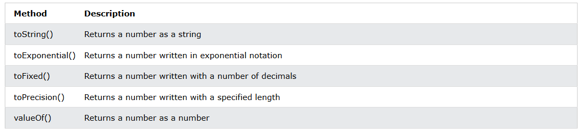

#### The toString() Method
- The toString() method returns a number as a string.
- All number methods can be used on any type of numbers (literals, variables, or expressions):

```bash

// JavaScript toString() Method

let x = 123;
x.toString();
(123).toString();
(100 + 23).toString();
console.log(x); // output: 123
console.log(typeof(x)); // output: number
/**
 * yaha pr aap k pass 123 Numbers hy magr with the help of toString method ye convert ho rha hy matlab aap k pass return ho rha hy as a string.
 * console.log(typeof(x)); // output: number --> iss ka matlab hy k ye aap k acutal variable k data ko damage nhi kr rha hy bal k aik copy bana kr oss ko string me return kr rha hy etc.
 */
```
- aap issi hi trha or b methods ko explore kr sakty hy from google & A.i 

# Grok A.i 
Haan, bilkul! Main tumhe JavaScript Numbers ke baare mein iss tarah se samjhaunga jaise tum khud likh rahe ho, simple aur clear language mein, Urdu-English mix ke saath, taaki tumhe bilkul natural lage. Tumne jo topics mange hain (Numbers, BigInt, Methods, Properties, etc.), unko ek ek karke cover karunga with examples, best practices, aur interview/project tips, taaki tumhe kahi aur se padhne ki zarurat na pade. Chalo shuru karte hain!

---

### JavaScript Numbers: Meri Apni Language Mein

JavaScript mein numbers ke saath kaam karna bohot zaroori hai, kyunki projects ho ya interviews, numerical operations hamesha aate hain. Main har topic ko detail mein samjhaunga, examples ke saath, aur yeh bhi bataunga ke kaise professional tareeke se use karna hai.

---

### 1. Numbers in JavaScript
JavaScript mein numbers ek hi type ke hote hain: `Number`. Yeh integers (1, 2, 3) ho sakte hain, decimals (3.14), ya scientific notation (5e3 = 5000). Yeh 64-bit floating-point format mein store hote hain.

**Example:**
```javascript
let meraNum = 42;        // Integer
let decimalNum = 3.14;   // Decimal
let sciNum = 5e3;        // 5000
console.log(meraNum, decimalNum, sciNum); // 42, 3.14, 5000
```

**Kya Samjha?**
- JavaScript mein integer aur float ke liye alag type nahi, sab `Number` hai.
- Floating-point ke wajah se precision issues aa sakte hain, jaise `0.1 + 0.2` exact 0.3 nahi hota.

**Best Practices:**
- Agar precise decimal calculations chahiye, toh `decimal.js` jaisi library use karo.
- Numbers compare karte waqt `Number.EPSILON` use karo, direct comparison avoid karo.
```javascript
console.log(0.1 + 0.2); // 0.30000000000000004
let result = 0.3;
if (Math.abs((0.1 + 0.2) - result) < Number.EPSILON) {
  console.log("Equal hai!"); // Yeh sahi tareeka hai
}
```

---

### 2. BigInt
`BigInt` bada number handle karne ke liye hai, jab `Number` ka limit (±2^53 - 1) cross ho jaye. Yeh bohot bade integers ke liye perfect hai, jaise IDs ya cryptography mein.

**Example:**
```javascript
let badaNum = 123456789012345678901234567890n; // BigInt
let dusraBadaNum = BigInt("123456789012345678901234567890");
console.log(badaNum + dusraBadaNum); // 246913578024691357802469135780n
```

**Kya Samjha?**
- `BigInt` banane ke liye number ke end mein `n` lagao ya `BigInt()` use karo.
- `BigInt` aur `Number` ko mix nahi kar sakte, warna error aayega.
- Arithmetic operations (`+`, `-`, `*`, `/`, `%`) `BigInt` ke saath kaam karte hain.

**Best Practices:**
- Jab number `Number.MAX_SAFE_INTEGER` se bada ho, `BigInt` use karo.
- `Number` ko `BigInt` mein convert karne ke liye `BigInt()` use karo.
```javascript
let chhotaNum = 123;
let bigNum = BigInt(chhotaNum);
console.log(bigNum + 100n); // 223n
```

---

### 3. Number Methods (Poora List)
JavaScript mein `Number` ke saath kaam karne ke liye bohot se methods hain. Main sabko examples ke saath samjhaunga.

#### Important Methods
1. **`toFixed(digits)`**: Decimal placestalks ke baad kitne digits tak number show karta hai (string return karta hai).
```javascript
let pi = 3.14159;
console.log(pi.toFixed(2)); // "3.14"
```

2. **`toPrecision(precision)`**: Number ko specified length tak format karta hai (string return).
```javascript
let num = 123.456;
console.log(num.toPrecision(4)); // "123.5"
```

3. **`toString([radix])`**: Number ko string mein convert karta hai, radix ke base mein (jaise 16 for hexadecimal).
```javascript
let num = 255;
console.log(num.toString(16)); // "ff"
```

4. **`toExponential(digits)`**: Exponential notation mein string return karta hai.
```javascript
let num = 1234;
console.log(num.toExponential(2)); // "1.23e+3"
```

5. **`parseInt(string, [radix])`**: String ko integer mein convert karta hai, specified base mein.
```javascript
console.log(parseInt("1010", 2)); // 10 (binary to decimal)
```

6. **`parseFloat(string)`**: String ko floating-point number mein convert karta hai.
```javascript
console.log(parseFloat("3.14")); // 3.14
```

7. **`isNaN(value)`**: Check karta hai ke value `NaN` hai ya nahi.
```javascript
console.log(isNaN("abc")); // true
console.log(isNaN(123)); // false
```

8. **`isFinite(value)`**: Check karta hai ke value finite number hai ya nahi.
```javascript
console.log(isFinite(123)); // true
console.log(isFinite(Infinity)); // false
```

9. **`isInteger(value)`**: Check karta hai ke value integer hai ya nahi.
```javascript
console.log(Number.isInteger(42)); // true
console.log(Number.isInteger(3.14)); // false
```

10. **`isSafeInteger(value)`**: Check karta hai ke value safe integer hai (±2^53 - 1 ke andar).
```javascript
console.log(Number.isSafeInteger(9007199254740991)); // true
console.log(Number.isSafeInteger(9007199254740992)); // false
```

**Best Practices:**
- `Number.parseInt` aur `Number.parseFloat` use karo, global `parseInt`/`parseFloat` se clarity zyada hai.
- `parseInt` mein hamesha radix specify karo, warna browsers alag behave kar sakte hain.
- `toFixed` aur `toPrecision` display ke liye theek hain, calculations ke liye avoid karo (string return karte hain).
```javascript
let str = "42.56";
console.log(Number.parseFloat(str) + 1); // 43.56
```

---

### 4. Number Properties
`Number` object ke static properties special values aur limits ko represent karte hain.

#### Properties List
1. **`Number.MAX_VALUE`**: Sabse bada number (~1.79E308).
```javascript
console.log(Number.MAX_VALUE); // 1.7976931348623157e+308
```

2. **`Number.MIN_VALUE`**: Sabse chhota positive number (> 0, ~5E-324).
```javascript
console.log(Number.MIN_VALUE); // 5e-324
```

3. **`Number.MAX_SAFE_INTEGER`**: Sabse bada safe integer (2^53 - 1).
```javascript
console.log(Number.MAX_SAFE_INTEGER); // 9007199254740991
```

4. **`Number.MIN_SAFE_INTEGER`**: Sabse chhota safe integer (-(2^53 - 1)).
```javascript
console.log(Number.MIN_SAFE_INTEGER); // -9007199254740991
```

5. **`Number.EPSILON`**: 1 aur uske agle number ke beech ka smallest difference (~2.22E-16).
```javascript
console.log(Number.EPSILON); // 2.220446049250313e-16
```

6. **`Number.POSITIVE_INFINITY`**: `Infinity` ko represent karta hai.
```javascript
console.log(Number.POSITIVE_INFINITY); // Infinity
```

7. **`Number.NEGATIVE_INFINITY`**: `-Infinity` ko represent karta hai.
```javascript
console.log(Number.NEGATIVE_INFINITY); // -Infinity
```

8. **`Number.NaN`**: `NaN` (Not a Number) ko represent karta hai.
```javascript
console.log(Number.NaN); // NaN
```

**Best Practices:**
- Calculations mein boundaries check karne ke liye in properties ka use karo.
- Hardcoded limits avoid karo, `Number.MAX_SAFE_INTEGER` ya `Number.EPSILON` use karo.
```javascript
function isSafe(num) {
  if (num <= Number.MAX_SAFE_INTEGER && num >= Number.MIN_SAFE_INTEGER) {
    return true;
  }
  return false;
}
console.log(isSafe(9007199254740991)); // true
```

---

### 5. Numeric Strings
Bohot baar numbers strings ke roop mein aate hain (jaise user input ya API se). Inhe `parseInt`, `parseFloat`, ya unary `+` operator se number mein convert kar sakte ho.

**Example:**
```javascript
let str = "123.45";
let num1 = parseFloat(str); // 123.45
let num2 = +str;           // 123.45
console.log(num1, num2);
```

**Kya Samjha?**
- `parseInt`/`parseFloat` leading/trailing whitespace ignore karte hain.
- Invalid string se `NaN` milta hai.
- Unary `+` operator quick hai, lekin thoda kam readable hai.

**Best Practices:**
- Input ko convert karne se pehle validate karo, taaki `NaN` na aaye.
- Decimals ke liye `Number()` ya `parseFloat`, integers ke liye `parseInt` use karo.
```javascript
function convertToNumber(str) {
  let num = Number(str);
  if (isNaN(num)) {
    return null;
  }
  return num;
}
console.log(convertToNumber("42.5")); // 42.5
console.log(convertToNumber("abc")); // null
```

---

### 6. NaN - Not a Number
`NaN` invalid ya undefined mathematical operations ke liye hota hai. Yeh `Number` type ka ek value hai.

**Example:**
```javascript
console.log(0 / 0); // NaN
console.log(parseInt("abc")); // NaN
console.log(NaN === NaN); // false (NaN khud se equal nahi hota)
```

**Kya Samjha?**
- `isNaN()` ya `Number.isNaN()` se check karo.
- `Number.isNaN()` zyada strict hai, sirf actual `NaN` ke liye `true` deta hai.
- `NaN` ke saath koi operation bhi `NaN` deta hai.

**Best Practices:**
- Precise checks ke liye `Number.isNaN()` use karo.
- Calculations mein `NaN` ko handle karo, taaki errors na aaye.
```javascript
function safeDivide(a, b) {
  let result = a / b;
  if (Number.isNaN(result)) {
    return "Invalid";
  }
  return result;
}
console.log(safeDivide(10, 0)); // Infinity
console.log(safeDivide(0, 0)); // "Invalid"
```

---

### 7. Infinity
`Infinity` (aur `-Infinity`) wo numbers hote hain jo `Number` ke range se bahar hote hain.

**Example:**
```javascript
console.log(1 / 0); // Infinity
console.log(-1 / 0); // -Infinity
console.log(Number.POSITIVE_INFINITY); // Infinity
```

**Kya Samjha?**
- `Number.MAX_VALUE` se bada operation `Infinity` deta hai.
- `isFinite()` se check karo ke number finite hai ya nahi.
- `Infinity` kisi bhi finite number se bada hota hai.

**Best Practices:**
- Calculations mein `Infinity` ko check karo, taaki unexpected behavior na ho.
- `Number.isFinite()` use karo robust checks ke liye.
```javascript
function isFiniteNumber(num) {
  if Number.isFinite(num) {
    return num;
  }
  return "Not finite";
}
console.log(isFiniteNumber(1 / 0)); // "Not finite"
console.log(isFiniteNumber(42)); // 42
```

---

### 8. Hexadecimal
JavaScript mein hexadecimal numbers (base-16) ko `0x` prefix ke saath likhte hain. Yeh colors, memory addresses, ya bitwise operations ke liye use hote hain.

**Example:**
```javascript
let hex = 0xFF; // 255 in decimal
console.log(hex); // 255
console.log(hex.toString(16)); // "ff"
```

**Kya Samjha?**
- `toString(16)` se number ko hexadecimal mein convert karo.
- `parseInt(string, 16)` se hexadecimal string ko number mein convert karo.
- Hexadecimal case-insensitive hai (`0xFF` = `0xff`).

**Best Practices:**
- Bitwise operations ya color codes ke liye hexadecimal use karo.
- Hexadecimal strings parse karte waqt validation karo.
```javascript
let color = "FF0000";
let red = parseInt(color, 16); // 16711680
console.log(red.toString(16)); // "ff0000"
```

---

### 9. JavaScript Numbers as Objects
Numbers ko `Number` constructor se object ke roop mein bhi bana sakte ho, lekin yeh kam use hota hai.

**Example:**
```javascript
let numObj = new Number(42);
console.log(numObj); // Number {42}
console.log(numObj.valueOf()); // 42
console.log(typeof numObj); // "object"
```

**Kya Samjha?**
- Primitive numbers (`42`) aur `Number` objects (`new Number(42)`) alag hain.
- `Number` objects slow aur memory-intensive hote hain.
- Objects ke saath `===` comparison fail karta hai, kyunki reference check hota hai.

**Best Practices:**
- `new Number()` avoid karo, primitive numbers use karo for performance.
- Agar object mila, toh `valueOf()` se primitive value nikalo.
```javascript
let num = 42;
let numObj = new Number(42);
console.log(num === numObj); // false
console.log(num === numObj.valueOf()); // true
```

---

### Best Practices for Interviews & Projects
1. **Precision**: Bade integers ke liye `BigInt`, decimals ke liye `decimal.js` use karo.
2. **Validation**: Numeric strings ko convert karne se pehle check karo, taaki `NaN` na aaye.
3. **Methods**: `Number.parseInt`, `Number.isNaN` jaisi methods use karo for clarity.
4. **Boundaries**: `Number.MAX_SAFE_INTEGER`, `Number.EPSILON` ka use karo safe calculations ke liye.
5. **Performance**: Primitive numbers use karo, `Number` objects avoid karo.
6. **Error Handling**: `NaN`, `Infinity`, aur invalid inputs ko handle karo.
7. **Code Clarity**: Complex operations ke liye clear variable names aur comments use karo.

---

### Project Example
Ek chhota sa function jo numeric input ko safely process karta hai, edge cases ke saath:

```javascript
function processNumber(input) {
  // Input ko number mein convert karo
  let num = typeof input === "string" ? Number(input) : input;

  // NaN check karo
  if (Number.isNaN(num)) {
    return "Error: Valid number nahi hai";
  }

  // Infinity check karo
  if (!Number.isFinite(num)) {
    return "Error: Number Infinity hai";
  }

  // Safe integer check karo
  if (!Number.isInteger(num) || !Number.isSafeInteger(num)) {
    return "Warning: Safe integer nahi hai";
  }

  // Operation karo (jaise square)
  return num * num;
}

console.log(processNumber("42")); // 1764
console.log(processNumber("abc")); // "Error: Valid number nahi hai"
console.log(processNumber(1 / 0)); // "Error: Number Infinity hai"
console.log(processNumber(9007199254740992)); // "Warning: Safe integer nahi hai"
```

---

### Interview Tips
1. **Common Questions**:
   - `Number` aur `BigInt` mein kya farq hai?
   - Floating-point precision issues kaise handle karte ho?
   - `NaN` kya hai, aur isse kaise detect karte ho?
   - `new Number()` kyun avoid karte hain?

2. **Knowledge Dikhana**:
   - `Number.MAX_SAFE_INTEGER` aur `Number.EPSILON` ka use samjhao.
   - Edge cases (`NaN`, `Infinity`, invalid strings) handle karne wala code likho.
   - `BigInt` ka use cases batao (jaise large IDs, cryptography).

3. **Practical Examples**:
   - Hexadecimal string ko decimal mein convert karne ka function likho.
   - Safe division function banao jo `NaN` aur `Infinity` handle kare.

---

# Grok A.i English Version

I'll explain JavaScript Numbers comprehensively, covering all your requested topics with examples, best practices, and clear explanations to help you understand thoroughly for interviews and projects. I'll ensure the explanation is detailed yet concise, so you won't need to refer elsewhere.

---

### JavaScript Numbers: Complete Guide

JavaScript provides robust support for numerical operations through the `Number` type, `BigInt`, and various methods and properties. Below, I’ll break down each topic with examples, explanations, and best practices.

---

### 1. Numbers in JavaScript
JavaScript represents numbers as 64-bit floating-point values (IEEE 754 standard). This includes integers, decimals, and special values like `Infinity` and `NaN`. Numbers can be written with or without decimals.

**Example:**
```javascript
let integer = 42;           // Integer
let decimal = 3.14;         // Decimal
let scientific = 5e3;       // Scientific notation (5000)
console.log(integer, decimal, scientific); // Output: 42, 3.14, 5000
```

**Key Points:**
- JavaScript uses a single `Number` type for both integers and floating-point numbers.
- Precision issues may arise with floating-point arithmetic (e.g., `0.1 + 0.2 !== 0.3` due to rounding errors).

**Best Practices:**
- For precise decimal calculations, use libraries like `decimal.js` or scale numbers to integers.
- Avoid direct floating-point comparisons; use a small epsilon value or `Number.EPSILON`.
```javascript
console.log(0.1 + 0.2); // Output: 0.30000000000000004
// Correct comparison
let result = 0.3;
console.log(Math.abs((0.1 + 0.2) - result) < Number.EPSILON); // true
```

---

### 2. BigInt
`BigInt` is a special numeric type introduced in ECMAScript 2020 to handle integers of arbitrary length, overcoming the limitations of the `Number` type (which is limited to ±2^53 - 1).

**Example:**
```javascript
let bigNum = 123456789012345678901234567890n; // BigInt literal
let anotherBigNum = BigInt("123456789012345678901234567890");
console.log(bigNum + anotherBigNum); // Output: 246913578024691357802469135780n
```

**Key Points:**
- Create `BigInt` by appending `n` to a number or using the `BigInt()` constructor.
- `BigInt` supports arithmetic operations (`+`, `-`, `*`, `/`, `%`), but you cannot mix `BigInt` and `Number` directly.
- `BigInt` is useful for cryptography, large IDs, or financial calculations requiring exact precision.

**Best Practices:**
- Always use `BigInt` for numbers exceeding `Number.MAX_SAFE_INTEGER` (9007199254740991).
- Convert `Number` to `BigInt` explicitly using `BigInt()` to avoid errors.
```javascript
let num = 123;
let big = BigInt(num);
console.log(big + 100n); // Output: 223n
```

---

### 3. Number Methods (Complete)
JavaScript provides several methods to manipulate numbers. Below is a complete list with examples.

#### Common Number Methods
1. **`toFixed(digits)`**: Formats a number to a fixed number of decimal places (returns a string).
```javascript
let num = 3.14159;
console.log(num.toFixed(2)); // "3.14"
```

2. **`toPrecision(precision)`**: Formats a number to a specified length (returns a string).
```javascript
let num = 123.456;
console.log(num.toPrecision(4)); // "123.5"
```

3. **`toString([radix])`**: Converts a number to a string, optionally in a specified base (e.g., 2 for binary, 16 for hexadecimal).
```javascript
let num = 255;
console.log(num.toString(16)); // "ff"
```

4. **`toExponential(digits)`**: Returns a string in exponential notation.
```javascript
let num = 1234;
console.log(num.toExponential(2)); // "1.23e+3"
```

5. **`parseInt(string, [radix])`**: Parses a string and returns an integer in the specified base.
```javascript
console.log(parseInt("1010", 2)); // 10 (binary to decimal)
```

6. **`parseFloat(string)`**: Parses a string and returns a floating-point number.
```javascript
console.log(parseFloat("3.14")); // 3.14
```

7. **`isNaN(value)`**: Checks if a value is `NaN`.
```javascript
console.log(isNaN("abc")); // true
console.log(isNaN(123)); // false
```

8. **`isFinite(value)`**: Checks if a value is a finite number.
```javascript
console.log(isFinite(123)); // true
console.log(isFinite(Infinity)); // false
```

9. **`isInteger(value)`**: Checks if a value is an integer.
```javascript
console.log(Number.isInteger(42)); // true
console.log(Number.isInteger(3.14)); // false
```

10. **`isSafeInteger(value)`**: Checks if a value is a safe integer (within ±2^53 - 1).
```javascript
console.log(Number.isSafeInteger(9007199254740991)); // true
console.log(Number.isSafeInteger(9007199254740992)); // false
```

**Best Practices:**
- Use `Number.parseInt` and `Number.parseFloat` instead of global `parseInt`/`parseFloat` for clarity.
- Always specify the radix in `parseInt` to avoid browser inconsistencies.
- Use `toFixed` or `toPrecision` for display purposes, but avoid them for calculations (they return strings).
```javascript
let num = "42.56";
console.log(Number.parseFloat(num) + 1); // 43.56
```

---

### 4. Number Properties
JavaScript provides static properties on the `Number` object to represent special values and limits.

#### List of Number Properties
1. **`Number.MAX_VALUE`**: Largest representable number (~1.79E308).
```javascript
console.log(Number.MAX_VALUE); // 1.7976931348623157e+308
```

2. **`Number.MIN_VALUE`**: Smallest positive number greater than 0 (~5E-324).
```javascript
console.log(Number.MIN_VALUE); // 5e-324
```

3. **`Number.MAX_SAFE_INTEGER`**: Largest safe integer (2^53 - 1).
```javascript
console.log(Number.MAX_SAFE_INTEGER); // 9007199254740991
```

4. **`Number.MIN_SAFE_INTEGER`**: Smallest safe integer (-(2^53 - 1)).
```javascript
console.log(Number.MIN_SAFE_INTEGER); // -9007199254740991
```

5. **`Number.EPSILON`**: Smallest difference between 1 and the next representable number (~2.22E-16).
```javascript
console.log(Number.EPSILON); // 2.220446049250313e-16
```

6. **`Number.POSITIVE_INFINITY`**: Represents `Infinity`.
```javascript
console.log(Number.POSITIVE_INFINITY); // Infinity
```

7. **`Number.NEGATIVE_INFINITY`**: Represents `-Infinity`.
```javascript
console.log(Number.NEGATIVE_INFINITY); // -Infinity
```

8. **`Number.NaN`**: Represents `NaN` (Not a Number).
```javascript
console.log(Number.NaN); // NaN
```

**Best Practices:**
- Use these properties for boundary checks in calculations.
- Avoid hardcoding limits; use `Number.MAX_SAFE_INTEGER` or `Number.EPSILON` for portability.
```javascript
function isSafe(num) {
  return num <= Number.MAX_SAFE_INTEGER && num >= Number.MIN_SAFE_INTEGER;
}
console.log(isSafe(9007199254740991)); // true
```

---

### 5. Numeric Strings
JavaScript often encounters numbers as strings (e.g., from user input or APIs). These can be converted to numbers using methods like `parseInt`, `parseFloat`, or the unary `+` operator.

**Example:**
```javascript
let str = "123.45";
let num1 = parseFloat(str); // 123.45
let num2 = +str;           // 123.45 (unary plus)
console.log(num1, num2);
```

**Key Points:**
- Leading/trailing whitespace is ignored by `parseInt`/`parseFloat`.
- Invalid strings return `NaN`.
- The unary `+` operator is a concise way to convert strings to numbers but may be less readable.

**Best Practices:**
- Always validate input before conversion to avoid `NaN`.
- Use `Number()` or `parseFloat` for decimal strings and `parseInt` for integers.
```javascript
function convertToNumber(str) {
  let num = Number(str);
  return isNaN(num) ? null : num;
}
console.log(convertToNumber("42.5")); // 42.5
console.log(convertToNumber("abc")); // null
```

---

### 6. NaN - Not a Number
`NaN` represents an invalid or undefined mathematical operation. It is a property of the `Number` object and a value of the `Number` type.

**Example:**
```javascript
console.log(0 / 0); // NaN
console.log(parseInt("abc")); // NaN
console.log(NaN === NaN); // false (NaN is not equal to itself)
```

**Key Points:**
- Use `isNaN()` or `Number.isNaN()` to check for `NaN`.
- `Number.isNaN()` is stricter and only returns `true` for the actual `NaN` value.
- Operations involving `NaN` typically return `NaN`.

**Best Practices:**
- Use `Number.isNaN()` for precise checks.
- Handle `NaN` in calculations to prevent errors.
```javascript
function safeDivide(a, b) {
  let result = a / b;
  return Number.isNaN(result) ? "Invalid" : result;
}
console.log(safeDivide(10, 0)); // Infinity
console.log(safeDivide(0, 0)); // "Invalid"
```

---

### 7. Infinity
`Infinity` (and `-Infinity`) represents numbers too large or small to be represented in JavaScript.

**Example:**
```javascript
console.log(1 / 0); // Infinity
console.log(-1 / 0); // -Infinity
console.log(Number.POSITIVE_INFINITY); // Infinity
```

**Key Points:**
- `Infinity` is returned for operations exceeding `Number.MAX_VALUE`.
- Use `isFinite()` to check if a number is finite.
- `Infinity` is greater than any finite number.

**Best Practices:**
- Check for `Infinity` in calculations to avoid unexpected behavior.
- Use `Number.isFinite()` for robust checks.
```javascript
function isFiniteNumber(num) {
  return Number.isFinite(num) ? num : "Not finite";
}
console.log(isFiniteNumber(1 / 0)); // "Not finite"
console.log(isFiniteNumber(42)); // 42
```

---

### 8. Hexadecimal
JavaScript supports hexadecimal numbers (base-16) using the `0x` prefix. They are often used for colors, memory addresses, or bitwise operations.

**Example:**
```javascript
let hex = 0xFF; // 255 in decimal
console.log(hex); // 255
console.log(hex.toString(16)); // "ff"
```

**Key Points:**
- Use `toString(16)` to convert numbers to hexadecimal.
- `parseInt(string, 16)` converts hexadecimal strings to numbers.
- Hexadecimal is case-insensitive (e.g., `0xFF` = `0xff`).

**Best Practices:**
- Use hexadecimal for bitwise operations or color codes.
- Ensure proper validation when parsing hexadecimal strings.
```javascript
let color = "FF0000";
let red = parseInt(color, 16); // 16711680
console.log(red.toString(16)); // "ff0000"
```

---

### 9. JavaScript Numbers as Objects
Numbers can be created as objects using the `Number` constructor, but this is rarely used in practice.

**Example:**
```javascript
let numObj = new Number(42);
console.log(numObj); // Number {42}
console.log(numObj.valueOf()); // 42
console.log(typeof numObj); // "object"
```

**Key Points:**
- Primitive numbers (`42`) are different from `Number` objects (`new Number(42)`).
- `Number` objects are slower and less memory-efficient.
- Comparison with `===` fails for objects due to reference equality.

**Best Practices:**
- Avoid using `new Number()`; use primitive numbers for performance.
- Use `valueOf()` to extract the primitive value if needed.
```javascript
let num = 42;
let numObj = new Number(42);
console.log(num === numObj); // false
console.log(num === numObj.valueOf()); // true
```

---

### Best Practices Summary for Interviews and Projects
1. **Precision Handling**: Use `BigInt` for large integers and libraries like `decimal.js` for precise decimals.
2. **Input Validation**: Always validate numeric strings before conversion to avoid `NaN` or errors.
3. **Method Usage**: Prefer `Number` methods (`Number.parseInt`, `Number.isNaN`) over global functions for clarity.
4. **Boundary Checks**: Use `Number.MAX_SAFE_INTEGER`, `Number.EPSILON`, etc., for safe calculations.
5. **Performance**: Stick to primitive numbers instead of `Number` objects.
6. **Error Handling**: Check for `NaN`, `Infinity`, and invalid inputs in mathematical operations.
7. **Code Readability**: Use descriptive variable names and comments for complex numerical operations.

---

### Example Project Snippet
Here’s a sample function that safely processes a numeric input, handling various edge cases:

```javascript
function processNumber(input) {
  // Convert input to number
  let num = typeof input === "string" ? Number(input) : input;

  // Check for NaN
  if (Number.isNaN(num)) {
    return "Error: Not a valid number";
  }

  // Check for Infinity
  if (!Number.isFinite(num)) {
    return "Error: Number is Infinity";
  }

  // Check if safe integer
  if (!Number.isInteger(num) || !Number.isSafeInteger(num)) {
    return "Warning: Not a safe integer";
  }

  // Perform operation (e.g., square the number)
  return num * num;
}

console.log(processNumber("42")); // 1764
console.log(processNumber("abc")); // "Error: Not a valid number"
console.log(processNumber(1 / 0)); // "Error: Number is Infinity"
console.log(processNumber(9007199254740992)); // "Warning: Not a safe integer"
```

---

### Interview Tips
1. **Common Questions**:
   - Explain the difference between `Number` and `BigInt`.
   - How do you handle floating-point precision issues?
   - What is `NaN`, and how do you detect it?
   - Why avoid `new Number()`?

2. **Demonstrate Knowledge**:
   - Show understanding of `Number.MAX_SAFE_INTEGER` and `Number.EPSILON`.
   - Write robust code to handle edge cases (`NaN`, `Infinity`, invalid strings).
   - Explain when to use `BigInt` (e.g., for large IDs or cryptography).

3. **Practical Examples**:
   - Write a function to convert a hexadecimal string to decimal.
   - Create a safe division function that handles `NaN` and `Infinity`.

---

This explanation covers everything you need to know about JavaScript Numbers for interviews and projects. If you have specific questions or need more examples, let me know!


# Medium
JavaScript Numbers
- JavaScript’s primary numeric type, Number, is used to represent integers and to approximate real numbers. JavaScript represents numbers using the 64-bit floating-point format defined by the IEEE 754 standard, which means it can represent numbers as large as ±1.7976931348623157 × 10^-324.

### Integer Literals
In a JavaScript program, a base-10 integer is written as a sequence of digits. For example:
```bash
0
3
1000000
```
- In addition to base-10 integer literals, JavaScript recognizes hexadecimal (base-16) values. A hexadecimal literal begins with 0x or 0X, followed by a string of hexadecimal digits. A hexadecimal digit is one of the digits 0 through 9 or letters a (or A) through f (or F), which represent values 10 thorugh 15. Here are examples of hexadecimal integer literals:

```bash
0xff    // 255: (15*16 + 15)
0xBADCAFE  // 195939070
```
### Floating-Point Literals
- Floating-point literals can have a decimal point; they use the traditional syntax for real numbers. A real value is represented as the integral part of the number, followed by a decimal point and the fractional part of the number.

### Arithmetic in JavaScript
JavaScript programs work with numbers using the arithmetic operators, that the language provides. These include + for addition, — for substraction, * for multiplication, / for division, and % for modulo (remainder after division). ES2016 adds ** for exponentiation.

In addition to these basic arithmetic operators, JavaScript supports more complex mathematical operations through a set of functions and constants defined as properties of the Math object:

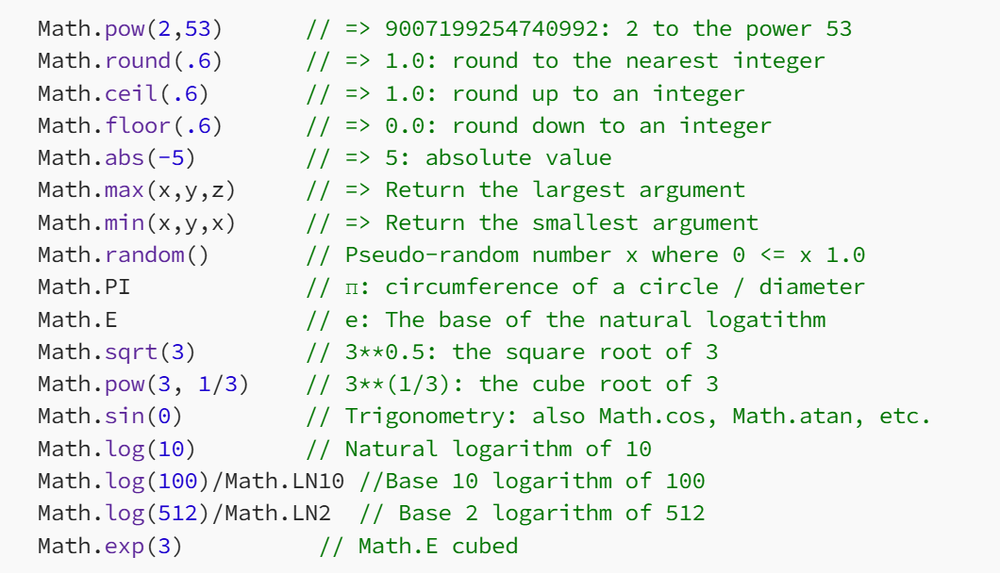

ES6 defines more functions on the Math object:

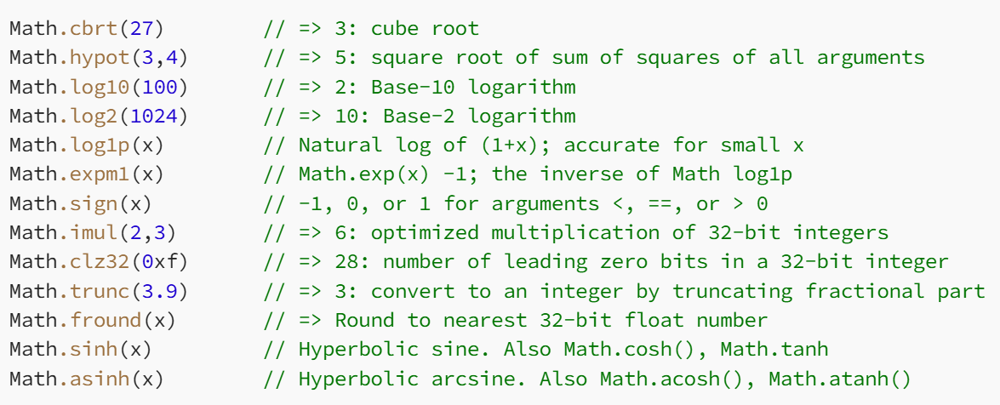

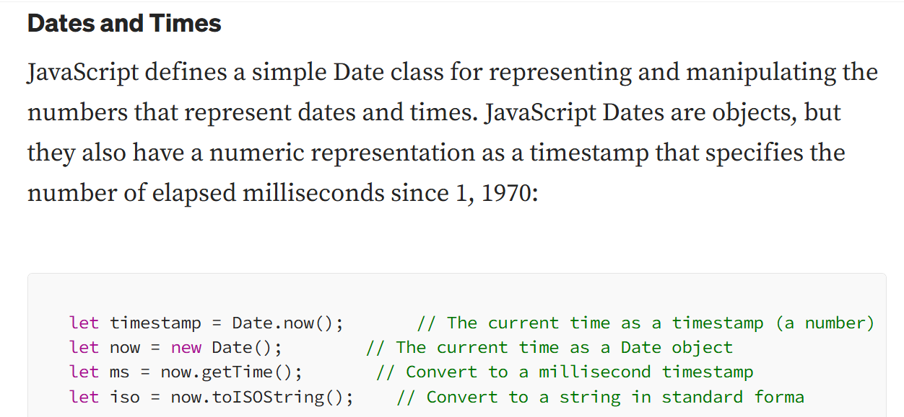


# JavaScript Arrays
- An array is a special variable, which can hold more than one value:
```bash

// creating Array in javaScript
const fruit = ["Apple", "Banana", "Orage", "Mango", 12, true, 3.14];
// to print array
console.log(fruit); // output: sara array aap k pass print hojayega. jitne b elements hy iss k andar.
// array ko [] iss square brackets se banaya jata hy iss [] square bracket ka matlab hota hy array'
// or iss curly {} brackets ka matlab hota hy k objects tho ye aap ko kahi pr b dekhe tho aap ne samjh lena hy k ye aik oject hoga etc.
```
## Why Use Arrays?
- jaise hum kisi b value ko store krne k liye variable ka use krthy hy. jaise for example mujhe 100 entries ko store krna hy tho mujhe iss k liye 100 variables banane parhenge magr iss ki jagah aap array ka b use kr sakty hy jaha pr aap aik hi array me sare 100 entries ko store krloge etc simple.
- If you have a list of items (a list of car names, for example), storing the cars in single variables could look like this:
```bash
// Example
let car1 = "Saab";
let car2 = "Volvo";
let car3 = "BMW";
```

- However, what if you want to loop through the cars and find a specific one? And what if you had not 3 cars, but 300?

#### The solution is an array!

An array can hold many values under a single name, and you can access the values by referring to an index number.

### Creating an Array
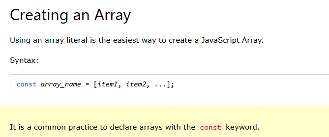
- Common practice hamare pass ye hoti hy k array ko const k keyword k sath banaya jata hy. Or Objects ko b etc.
```bash
// Example
const cars = ["Saab", "Volvo", "BMW"];
console.log(cars);
```

- Spaces and line breaks are not important. A declaration can span multiple lines:
```bash
// spacing is not required
const cars1 = [
    "Saab",
    "Volvo",
    "BMW"
  ];
  console.log(cars1);
  // tho aap array ko iss trha b bana sakty hy for readabiliyt etc.
  ```
  - You can also create an array, and then provide the elements:
  - aap pehly array ko bana sakty hy or baad me oss k andar items ko add kr sakty hy.

```bash
// creating empty array and then add items into array
  const cars2 = [];
cars2[0]= "Saab";
cars2[1]= "Volvo";
cars2[2]= "BMW";
// print array in console
console.log(cars2);
```

## Using the JavaScript Keyword new
The following example also creates an Array, and assigns values to it:

```bash
// Creating Array in js with new keyword
/**
 * simply aap ko new keyword ka use krna hy or phir Array ko likhna hy or phir parenthesis me apne items ko store krna hy etc.
 * Array or new k keyword laga howa hona chaye hy warna phir error milega etc.
 */
const cars = new Array("Saab", "Volvo", "BMW");
console.log(cars); // [ 'Saab', 'Volvo', 'BMW' ]
```

- Zaroori nhi hy k aap iss new Array() keword ko lagaye. aap iss k ilawa b bana sakty hy etc.
- The two examples above do exactly the same.
- There is no need to use new Array().
- For simplicity, readability and execution speed, use the array literal method.

## Accessing Array Elements
You access an array element by referring to the index number:

```bash
// Accessing Array Elements
/**
 * aap ko simply apne array k name likhna hy or phir square brackets [] me oss k jiss elemtns ko aap print krna chatay hy
 * oss index ko likhna hy.
 * hamare pass output me Volvo iss wja se a rha hy q k 1 index b volvo hy iss wja se jiss ko hum access kr rhy hy etc.
 */
const cars = ["Saab", "Volvo", "BMW"];
let car = cars[1]; // [0] = "Saab", [1] = "Volvo", [2] = "BMW"
console.log(car); // output: Volvo
```

#### Note:
- Array indexes start with 0.
- [0] is the first element. [1] is the second element.

### Changing an Array Element
- Aap array ki indexing ko use krthy howe array k items ko update matlab new items ko add kr sakty hy etc.
- This statement changes the value of the first element in cars:

```bash
// Syntax Example
cars[0] = "Opel";
```
:::::: Example:
```bash
// Changing an Array Element
/**
 * yaha pr aap k pass agr aap dekhe tho aap k pass uzair print hojana chaye hy tha magr oss ko hum ne change krliya hy.
 * cars[0] = "Majid"; krliya hy tho oss wja se uzair ki jagah Majid Print ho rha hy.
 * tho aap iss thra se array k elements ko change kr sakty hy etc.
 */
const cars = ["uzair", "Junaid", "Ali"];
cars[0] = "Majid";
console.log(cars); // output: [ 'Majid', 'Junaid', 'Ali' ]
```
### Converting an Array to a String
- aap issi trha or b methods ko try kr sakty hy.
- The JavaScript method toString() converts an array to a string of (comma separated) array values.

```bash
// Array converting into string
const fruits = ["Banana", "Orange", "Apple", "Mango"];
let change = fruits.toString();
console.log(change); // output: Banana,Orange,Apple,Mango
/**
 * tho agr aap dekhe jo output hy aap k pass wo array k form me print nhi hor rha hy q k iss ko hum ne string me covert kiya hy.
 * agr iss ko string me convert na krthy tho result me [] square brackets dikthy.
 * tho iss k output se pata chalta hy k bhai hamara array jo hy wo string me convert hogaya hy with the help of toString() Method.
 */
```

### Access the Full Array
- Full array ko access krne k liye bs aap ko kuch sorting, indexing etc nhi krni hy bs direct apne array ka naam likhna hy etc.
- With JavaScript, the full array can be accessed by referring to the array name:

```bash
//creating array of cars
const cars = ["Saab", "Volvo", "BMW"];
console.log(cars);
/**
 * aap ko iss trha se direct apne array ka naam likhna hy tho aap k pass pora array print hojayega.
 * aap iss cars k array ko first aik variable me store kr k phir oss variable se b array ko print kr sakty hy.
 * ye tho aap ko pata hoga jiss ko hum ne upar cover krliya hy.
 */
 ```
### Arrays are Objects
- Arrays are a special type of objects. The typeof operator in JavaScript returns "object" for arrays.
- But, JavaScript arrays are best described as arrays.
- Arrays use numbers to access its "elements". In this example, person[0] returns John:

```bash
// arrays are objects
const person = ["John", "Doe", 46];
const showResult = person[0];
console.log(showResult); // output: John
console.log(typeof(showResult)); // object
// bhia aaik baat ko yaad rakhna k aap loca IDE ko use kare q k online IDE me aap k pass different answers a sakty hy etc.
```
- Objects use names to access its "members". In this example, person.firstName returns John:

### Object:
```bash
//Creating Object
const person2 = {firstName:"John", lastName:"Doe", age:46};
console.log(person2.firstName); // output: John
```

## Array Elements Can Be Objects
- jaise hum ne upar jana b tha k js me everything is object aap k pass variable sub kuch js me object hota hy magr array aik special type of object hota hy etc.
- JavaScript variables can be objects. Arrays are special kinds of objects.
- Because of this, you can have variables of different types in the same Array.
- You can have objects in an Array. You can have functions in an Array. You can have arrays in an Array:
```bash
let myArray = [];

myArray[0] = Date.now;
myArray[1] = "myFunction";
myArray[2] = "MyCars";
console.log(myArray);

```
## Array Properties and Methods
The real strength of JavaScript arrays are the built-in array properties and methods:
```bash
cars.length   // Returns the number of elements
cars.sort()   // Sorts the array
// bs simply yaha pr ye cars ki jagah aap ko apne array ka name dena hy.
// or .length se aap k pass array ki length nikal k ajayegi.
// or .sort se aap k pass array sort hojayegi.
```
- or ye array k methods ko hum log aghy k chapter me cover krne wale hy.
- Array methods are covered in the next chapters.

## The length Property
The length property of an array returns the length of an array (the number of array elements).
```bash

//Array Length in js
const fruits = ["Banana", "Orange", "Apple", "Mango"];
let length = fruits.length;
console.log(length); // output: 4
// aap k pass output 4 iss wja se a rha hy q k array me items 4 hy.
```
- The length property is always one more than the highest array index.

## Accessing the First Array Element
- iss se aap k pass zero index pr jo hy wo print hojayega jo k banana hy etc.
```bash
const fruits = ["Banana", "Orange", "Apple", "Mango"];
let fruit = fruits[0];
```

## Accessing the Last Array Element

```bash
//array last element
const fruits1 = ["Banana", "Orange", "Apple", "Mango"];
let fruit1 = fruits[fruits.length - 1];
console.log(fruit1); // Mango
// Mango hamare pass iss wja se print ho rha hy q k agr aap right side se indexing start kare tho pehly Mango ata hy.
// q k hum ne -1 lagaya hy.
```
## Looping Array Elements
One way to loop through an array, is using a for loop:

```bash
<!DOCTYPE html>
<html>
<body>
<h1>JavaScript Arrays</h1>
<h2>Looping an Array</h2>

<p id="demo"></p>

<script>
const fruits = ["Banana", "Orange", "Apple", "Mango"];
let fLen = fruits.length;

let text = "<ul>";
for (let i = 0; i < fLen; i++) {
  text += "<li>" + fruits[i] + "</li>";
}
text += "</ul>";

document.getElementById("demo").innerHTML = text;
</script>

</body>
</html>

```
- aap iss loop ko without ul,li k direct b javaScript me run kr sakty hy etc.

- You can also use the Array.forEach() function:
```bash
<!DOCTYPE html>
<html>
<body>
<h1>JavaScript Arrays</h1>
<h2>The forEach() Method</h2>

<p>Call a function for each array element:</p>

<p id="demo"></p>

<script>
const fruits = ["Banana", "Orange", "Apple", "Mango"];

let text = "<ul>";
fruits.forEach(myFunction);
text += "</ul>";

document.getElementById("demo").innerHTML = text;

function myFunction(value) {
  text += "<li>" + value + "</li>";
} 
</script>

</body>
</html>

```

## Adding Array Elements
The easiest way to add a new element to an array is using the push() method:
```bash
<!DOCTYPE html>
<html>
<body>
<h1>JavaScript Arrays</h1>
<h2>The push() Method</h2>

<p>The push method appends a new element to an array.</p>

<button onclick="myFunction()">Try it</button>

<p id="demo"></p>

<script>
const fruits = ["Banana", "Orange", "Apple"];
document.getElementById("demo").innerHTML = fruits;

function myFunction() {
  fruits.push("Lemon");
  document.getElementById("demo").innerHTML = fruits;
}
</script>

</body>
</html>

```
- push() --> Method ko use kr k aap easily array me elements add kr sakty ho etc.

- New element can also be added to an array using the length property:

```bash
<!DOCTYPE html>
<html>
<body>
<h1>JavaScript Arrays</h1>

<p>The length property provides an easy way to append new elements to an array without using the push() method.</p>

<button onclick="myFunction()">Try it</button>

<p id="demo"></p>

<script>
const fruits = ["Banana", "Orange", "Apple"];
document.getElementById("demo").innerHTML = fruits;

function myFunction() {
  fruits[fruits.length] = "Lemon";
  document.getElementById("demo").innerHTML = fruits;
}
</script>

</body>
</html>

```

#### WARNING !

Adding elements with high indexes can create undefined "holes" in an array:
```bash
<!DOCTYPE html>
<html>
<body>
<h1>JavaScript Arrays</h1>

<p>Adding elements with high indexes can create undefined "holes" in an array.</p>

<p id="demo"></p>

<script>
const fruits = ["Banana", "Orange", "Apple"];
fruits[6] = "Lemon";

let fLen = fruits.length;
let text = "";
for (i = 0; i < fLen; i++) {
  text += fruits[i] + "<br>";
}

document.getElementById("demo").innerHTML = text;
</script>

</body>
</html>
```
## Associative Arrays
- Many programming languages support arrays with named indexes.
- Arrays with named indexes are called associative arrays (or hashes).
- JavaScript does not support arrays with named indexes.
- In JavaScript, arrays always use numbered indexes. 
```bash
<!DOCTYPE html>
<html>
<body>
<h1>JavaScript Arrays</h1>

<p id="demo"></p>

<script>
const person = [];
person[0] = "John";
person[1] = "Doe";
person[2] = 46; 
document.getElementById("demo").innerHTML =
person[0] + " " + person.length;
</script>

</body>
</html>

```
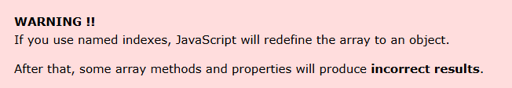

:::::Example:
```bash
const person = [];
person["firstName"] = "John";
person["lastName"] = "Doe";
person["age"] = 46;
person.length;     // Will return 0
person[0];         // Will return undefined
```

## The Difference Between Arrays and Objects
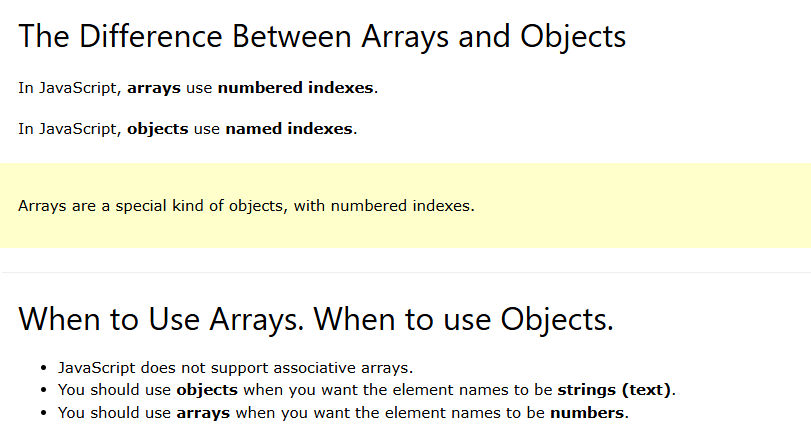
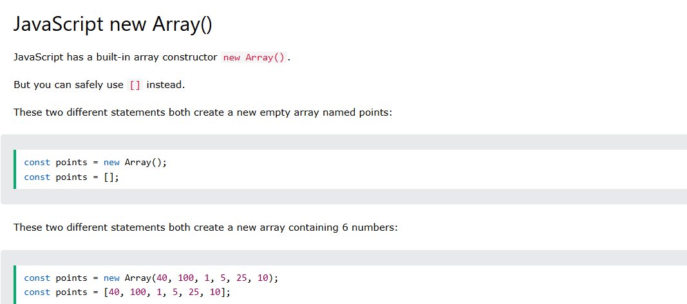
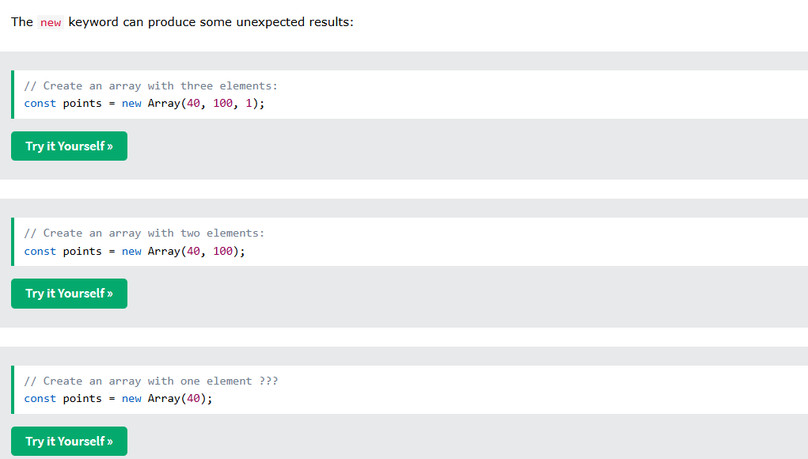
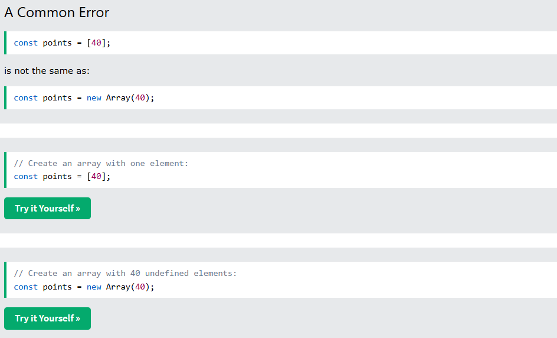
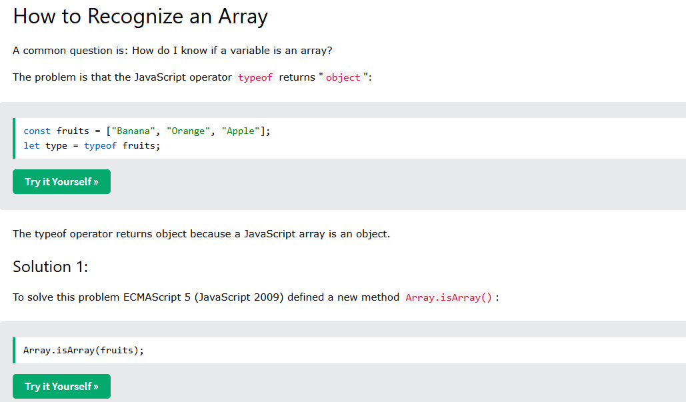
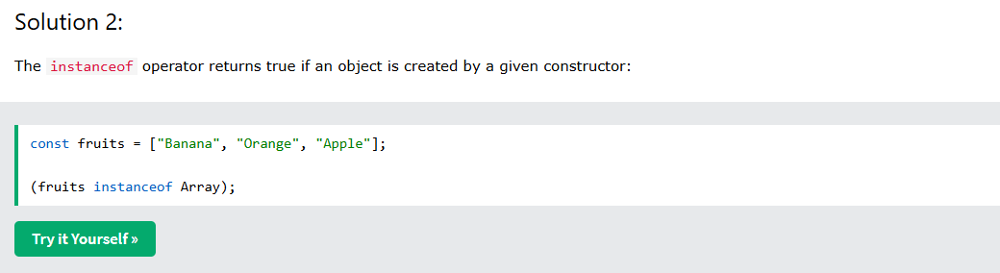
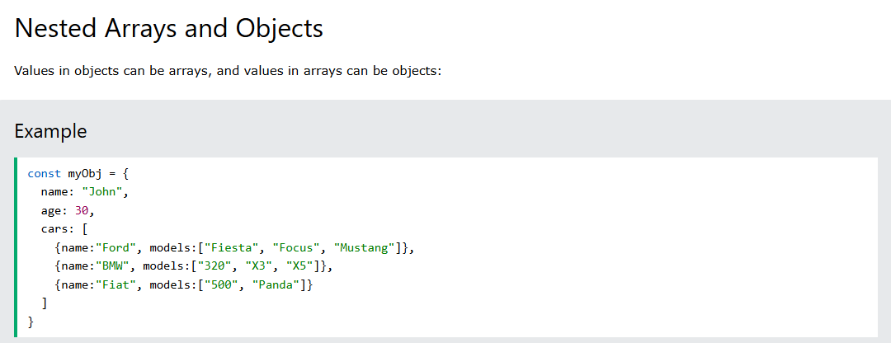
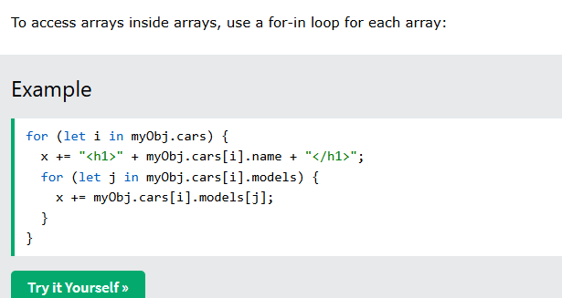

# Grok A.i JavaScript Arrays
JavaScript arrays ke baare mein main aapko ek comprehensive, beginner-friendly, aur practical guide deta hoon jo aapko interviews aur projects ke liye strong foundation dega. Main har point ko cover karunga jo aapne mention kiya, with examples, best practices, aur simple Urdu-English mix mein explanation. Yeh guide itni detailed hogi ke aapko kahi aur se padhne ki zarurat nahi padegi. Let’s dive in!

---

### **1. What are JavaScript Arrays?**
JavaScript arrays ek data structure hain jo multiple values ko ek single variable mein store karte hain. Yeh values koi bhi type ke ho sakte hain: numbers, strings, objects, ya even arrays ke andar arrays (nested arrays). Arrays ka use data ko organized aur manageable tareeke se store aur manipulate karne ke liye hota hai.

**Why Use Arrays?**
- **Organized Data**: Ek list ya collection ko store karne ka easy way.
- **Dynamic**: Aap arrays mein elements add ya remove kar sakte hain anytime.
- **Versatile**: Numbers, strings, objects, ya mixed data types store kar sakte hain.
- **Built-in Methods**: JavaScript arrays ke saath powerful methods dete hain (like `map`, `filter`, `sort`) jo data manipulation ko simple banate hain.

**Best Practice**: Arrays ka use tab karo jab aapko ordered data store karna ho aur operations like iteration, filtering, ya sorting perform karne hon. Agar key-value pairs chahiye, toh objects ka use karo.

---

### **2. Creating Arrays**
Arrays ko create karne ke do tareeke hain:
1. **Array Literal (Recommended)**: Square brackets `[]` ka use.
2. **Array Constructor**: `new Array()` ka use (kam common).

**Example**:
```javascript
// Array Literal
let fruits = ["Apple", "Banana", "Mango"];

// Array Constructor
let numbers = new Array(1, 2, 3, 4, 5);

// Empty Array
let emptyArray = [];
```

**Best Practice**:
- Hamesha array literal `[]` use karo kyunki yeh concise aur readable hai.
- `new Array()` se bachao kyunki yeh ambiguous ho sakta hai (e.g., `new Array(5)` ek array banata hai with 5 empty slots, na ke single element 5).

---

### **3. Accessing Array Elements**
Arrays zero-based indexing follow karte hain, yani pehla element index 0 pe hota hai.

**Example**:
```javascript
let fruits = ["Apple", "Banana", "Mango"];
console.log(fruits[0]); // Output: Apple
console.log(fruits[2]); // Output: Mango

// Update element
fruits[1] = "Orange";
console.log(fruits); // Output: ["Apple", "Orange", "Mango"]
```

**Best Practice**:
- Index out of bounds se bachne ke liye check karo ke index array ki length se kam hai: `if (index < fruits.length)`.
- Array ke end se elements access karne ke liye `array.length - 1` use karo.

---

### **4. Array Elements Can Be Objects**
Array ke elements koi bhi data type ho sakte hain, including objects, functions, ya doosre arrays.

**Example**:
```javascript
let mixedArray = [
  "Apple", // String
  42, // Number
  { name: "John", age: 30 }, // Object
  ["Banana", "Mango"], // Nested Array
  function() { console.log("Hello!"); } // Function
];

console.log(mixedArray[2].name); // Output: John
console.log(mixedArray[3][0]); // Output: Banana
mixedArray[4](); // Output: Hello!
```

**Best Practice**:
- Mixed data types ke arrays use karte waqt clear documentation rakho taake code readable rahe.
- Agar array ke elements specific type ke hain (e.g., sirf objects), toh type checking add karo (e.g., `typeof` ya `instanceof`).

---

### **5. Looping Array Elements**
Arrays ke elements ko iterate karne ke multiple tareeke hain:
1. **`for` Loop**: Traditional loop.
2. **`for...of` Loop**: Cleaner aur readable.
3. **`forEach` Method**: Functional programming style.
4. **Other Methods**: `map`, `filter`, etc. (neeche discuss karenge).

**Example**:
```javascript
let fruits = ["Apple", "Banana", "Mango"];

// for Loop
for (let i = 0; i < fruits.length; i++) {
  console.log(fruits[i]);
}

// for...of Loop
for (let fruit of fruits) {
  console.log(fruit);
}

// forEach Method
fruits.forEach(function(fruit, index) {
  console.log(`${index}: ${fruit}`);
});
```

**Best Practice**:
- Simple iteration ke liye `for...of` ya `forEach` use karo kyunki yeh readable hain.
- `for` loop tab use karo jab complex logic ya index manipulation chahiye.
- `forEach` ke saath arrow functions use karo for cleaner syntax: `fruits.forEach(fruit => console.log(fruit))`.

---

### **6. JS Array Methods (Complete with Examples)**
JavaScript arrays ke saath bohot se built-in methods hain jo data manipulation ko easy banate hain. Main har important method ko categorize karke explain karta hoon.

#### **a. Adding/Removing Elements**
1. **`push()`**: End mein element add karta hai.
2. **`pop()`**: End se element remove karta hai.
3. **`unshift()`**: Start mein element add karta hai.
4. **`shift()`**: Start se element remove karta hai.
5. **`splice()`**: Specific index pe elements add ya remove karta hai.

**Example**:
```javascript
let fruits = ["Apple", "Banana"];

// push
fruits.push("Mango");
console.log(fruits); // Output: ["Apple", "Banana", "Mango"]

// pop
fruits.pop();
console.log(fruits); // Output: ["Apple", "Banana"]

// unshift
fruits.unshift("Orange");
console.log(fruits); // Output: ["Orange", "Apple", "Banana"]

// shift
fruits.shift();
console.log(fruits); // Output: ["Apple", "Banana"]

// splice (index 1 se 1 element remove aur "Grape" add)
fruits.splice(1, 1, "Grape");
console.log(fruits); // Output: ["Apple", "Grape"]
```

#### **b. Transforming Arrays**
1. **`map()`**: Har element pe function apply karke naya array return karta hai.
2. **`filter()`**: Condition ke basis pe elements filter karta hai.
3. **`reduce()`**: Array ko single value mein reduce karta hai.

**Example**:
```javascript
let numbers = [1, 2, 3, 4];

// map
let doubled = numbers.map(num => num * 2);
console.log(doubled); // Output: [2, 4, 6, 8]

// filter
let evens = numbers.filter(num => num % 2 === 0);
console.log(evens); // Output: [2, 4]

// reduce
let sum = numbers.reduce((total, num) => total + num, 0);
console.log(sum); // Output: 10
```

#### **c. Other Useful Methods**
1. **`concat()`**: Do arrays ko merge karta hai.
2. **`slice()`**: Array ka part return karta hai without modifying original.
3. **`join()`**: Array elements ko string mein convert karta hai.
4. **`reverse()`**: Array ko reverse karta hai (modifies original).

**Example**:
```javascript
let fruits = ["Apple", "Banana", "Mango"];

// concat
let moreFruits = fruits.concat(["Orange", "Grape"]);
console.log(moreFruits); // Output: ["Apple", "Banana", "Mango", "Orange", "Grape"]

// slice
let sliced = fruits.slice(1, 3);
console.log(sliced); // Output: ["Banana", "Mango"]

// join
let fruitString = fruits.join(", ");
console.log(fruitString); // Output: "Apple, Banana, Mango"

// reverse
fruits.reverse();
console.log(fruits); // Output: ["Mango", "Banana", "Apple"]
```

**Best Practice**:
- Immutable operations (e.g., `map`, `filter`, `slice`) prefer karo taake original array na badle.
- `splice` aur `reverse` ka use carefully karo kyunki yeh original array modify karte hain.
- `reduce` ka use complex calculations ke liye karo, lekin readable code likho.

---

### **7. JS Array Search (Complete)**
Array mein elements search karne ke multiple methods hain:
1. **`indexOf()`**: Element ka first index return karta hai, nahi mila toh -1.
2. **`lastIndexOf()`**: Element ka last index return karta hai.
3. **`includes()`**: Check karta hai ke element exists karta hai ya nahi.
4. **`find()`**: Condition ke basis pe pehla matching element return karta hai.
5. **`findIndex()`**: Condition ke basis pe pehla matching index return karta hai.

**Example**:
```javascript
let fruits = ["Apple", "Banana", "Mango", "Banana"];

// indexOf
console.log(fruits.indexOf("Banana")); // Output: 1
console.log(fruits.indexOf("Orange")); // Output: -1

// lastIndexOf
console.log(fruits.lastIndexOf("Banana")); // Output: 3

// includes
console.log(fruits.includes("Mango")); // Output: true

// find
let found = fruits.find(fruit => fruit.startsWith("M"));
console.log(found); // Output: "Mango"

// findIndex
let index = fruits.findIndex(fruit => fruit.startsWith("B"));
console.log(index); // Output: 1
```

**Best Practice**:
- Simple existence check ke liye `includes()` use karo.
- Complex conditions ke liye `find()` ya `findIndex()` use karo.
- `indexOf()` aur `lastIndexOf()` tab use karo jab exact value ka index chahiye.

---

### **8. JS Array Sort (Complete)**
Array sorting ke liye `sort()` method use hota hai. Yeh original array ko modify karta hai.

#### **a. Alphabetic Sort**
By default, `sort()` elements ko strings ke roop mein sort karta hai.

**Example**:
```javascript
let fruits = ["Banana", "Apple", "Mango"];
fruits.sort();
console.log(fruits); // Output: ["Apple", "Banana", "Mango"]
```

#### **b. Numeric Sort**
Numbers ko sort karne ke liye comparison function dena padta hai.

**Example**:
```javascript
let numbers = [100, 5, 20, 10];
numbers.sort((a, b) => a - b); // Ascending
console.log(numbers); // Output: [5, 10, 20, 100]

numbers.sort((a, b) => b - a); // Descending
console.log(numbers); // Output: [100, 20, 10, 5]
```

#### **c. Sorting Objects**
Objects ko sort karne ke liye specific property ke basis pe compare karo.

**Example**:
```javascript
let people = [
  { name: "John", age: 30 },
  { name: "Alice", age: 25 },
  { name: "Bob", age: 35 }
];

// Sort by age
people.sort((a, b) => a.age - b.age);
console.log(people); // Output: [{name: "Alice", age: 25}, {name: "John", age: 30}, {name: "Bob", age: 35}]
```

**Best Practice**:
- Numeric sort ke liye hamesha comparison function use karo, warna `sort()` numbers ko strings ke roop mein treat karega.
- Immutable sorting ke liye pehle array ki copy banao: `[...array].sort()`.
- Complex sorting logic ke liye clear comparison functions likho.

---

### **9. JavaScript Array Iteration**
Array iteration ke liye multiple methods hain jo functional programming ko support karte hain:
1. **`forEach()`**: Har element pe function run karta hai (no return).
2. **`map()`**: Naya array banata hai transformed elements ke saath.
3. **`filter()`**: Condition ke basis pe filtered array return karta hai.
4. **`reduce()`**: Single value return karta hai.
5. **`some()`**: Check karta hai ke koi element condition satisfy karta hai.
6. **`every()`**: Check karta hai ke saare elements condition satisfy karte hain.

**Example**:
```javascript
let numbers = [1, 2, 3, 4, 5];

// forEach
numbers.forEach(num => console.log(num * 2)); // Output: 2, 4, 6, 8, 10

// some
let hasEven = numbers.some(num => num % 2 === 0);
console.log(hasEven); // Output: true

// every
let allPositive = numbers.every(num => num > 0);
console.log(allPositive); // Output: true
```

**Best Practice**:
- Iteration ke liye functional methods (`map`, `filter`, etc.) prefer karo kyunki yeh declarative aur readable hain.
- Side effects (e.g., logging) ke liye `forEach` use karo, transformations ke liye `map` ya `filter`.

---

### **10. JavaScript Array Const**
Arrays ko `const` ke saath declare karne se array reference constant rehta hai, lekin array ke elements modify kiye ja sakte hain.

**Example**:
```javascript
const fruits = ["Apple", "Banana"];
fruits.push("Mango"); // Allowed
fruits[0] = "Orange"; // Allowed
console.log(fruits); // Output: ["Orange", "Banana", "Mango"]

// Not allowed: Reassigning the array
fruits = ["Grape"]; // Error: Assignment to constant variable
```

**Best Practice**:
- `const` use karo arrays ke liye taake accidental reassignment se bacha ja sake.
- Agar array ko immutable rakhna hai, toh `Object.freeze()` use karo:
  ```javascript
  const frozenArray = Object.freeze(["Apple", "Banana"]);
  frozenArray.push("Mango"); // Error: Cannot add property
  ```

---

### **11. Best Example (Practical Project Scenario)**
Yeh ek real-world example hai jo arrays ke saare concepts ko combine karta hai. Maan lo aapko ek shopping cart bananahai jismein products ko manage karna hai.

```javascript
// Shopping cart array with objects
let cart = [
  { id: 1, name: "Laptop", price: 1000 },
  { id: 2, name: "Phone", price: 500 },
  { id: 3, name: "Headphones", price: 100 }
];

// Add item to cart
function addItem(item) {
  cart.push(item);
}
addItem({ id: 4, name: "Mouse", price: 50 });

// Remove item by id
function removeItem(id) {
  cart = cart.filter(item => item.id !== id);
}
removeItem(2);

// Calculate total price
let totalPrice = cart.reduce((total, item) => total + item.price, 0);
console.log("Total Price:", totalPrice); // Output: 1150

// Sort by price
cart.sort((a, b) => a.price - b.price);
console.log("Sorted Cart:", cart);

// Find item by name
let foundItem = cart.find(item => item.name === "Laptop");
console.log("Found Item:", foundItem);

// Display cart items
cart.forEach(item => console.log(`${item.name}: $${item.price}`));
```

**Why This Example is Best**:
- Real-world scenario (e-commerce).
- Covers creating, modifying, iterating, sorting, searching, and transforming arrays.
- Uses modern JavaScript (arrow functions, `const`, etc.).
- Follows best practices (immutable `filter`, clear function names).

---

### **12. Best Practices Summary**
1. **Use Array Literals**: `[]` over `new Array()`.
2. **Immutability**: Original array ko modify karne se bachne ke liye `[...array]` ya methods like `map`, `filter` use karo.
3. **Clear Code**: Descriptive variable names aur readable methods (`forEach`, `map`) use karo.
4. **Type Safety**: Mixed arrays mein type checking karo.
5. **Error Handling**: Index access ya loops mein boundary checks add karo.
6. **Modern Syntax**: Arrow functions aur ES6+ features use karo for concise code.
7. **Documentation**: Complex array operations ke liye comments ya documentation rakho.

---

### **Interview Preparation Tips**
1. **Common Questions**:
   - Difference between `map` aur `forEach`?
   - `sort` kaise kaam karta hai numbers ke liye?
   - `const` array ke saath kya limitations hain?
   - `reduce` ka use case kya hai?
2. **Practice**:
   - LeetCode ya HackerRank pe array-based problems solve karo (e.g., Two Sum, Merge Sorted Arrays).
   - Chhote projects banao jaise to-do list ya shopping cart.
3. **Explain Code**: Har method ka use case aur logic verbally explain karne ki practice karo.

---

### **Conclusion**
Is guide mein maine arrays ke har aspect ko cover kiya hai with practical examples aur best practices. Yeh aapko interviews ke liye confident banayega aur projects mein arrays ka effective use karne mein madad karega. Agar aapko koi specific part mein aur detail chahiye ya koi project banane mein help chahiye, toh batayein! Main aapko step-by-step guide karunga. 😊 Koi aur topic ya doubt ho toh zaroor poochhein!