# JavaScript Async and Await

JavaScript mein asynchronous programming ek critical concept hai jo modern web development mein extensively use hota hai. Main aapko **async JavaScript** ke complete concepts, professional tips, tricks aur best practices explain karunga, taki aapko kahi aur se padhne ki zarurat na pade. Yeh guide detailed, beginner-to-advanced level tak cover karegi, aur practical examples ke saath aapko professional banane mein help karegi.

---

## **JavaScript Async Programming: Complete Guide**

### **1. Asynchronous JavaScript Kya Hai?**
JavaScript ek single-threaded language hai, matlab ek time pe ek hi task execute hota hai. Lekin real-world applications (jaise API calls, file reading, ya database operations) mein tasks time-consuming hote hain. Async programming is tarah ke tasks ko handle karta hai bina main thread ko block kiye.

**Key Points:**
- **Synchronous Code**: Line-by-line execute hota hai, ek task complete hone ke baad hi agla task shuru hota hai.
- **Asynchronous Code**: Tasks concurrently run ho sakte hain, aur result baad mein handle hota hai (callbacks, promises, async/await ke through).

---

### **2. Async JavaScript ke Core Concepts**

#### **2.1 Event Loop**
JavaScript ka event loop async behavior ka backbone hai. Yeh ensure karta hai ki async tasks (jaise timers, API calls) complete hone ke baad unke callbacks ya promises execute ho.

- **Call Stack**: Synchronous code execute hota hai.
- **Web APIs**: Async tasks (setTimeout, fetch, etc.) browser ke Web APIs handle karte hain.
- **Callback Queue**: Async tasks complete hone ke baad unke callbacks queue mein aate hain.
- **Event Loop**: Jab call stack empty hota hai, event loop queue se callbacks ko stack mein push karta hai.

**Example**:
```javascript
console.log("Start");
setTimeout(() => console.log("Timeout"), 1000);
console.log("End");
// Output: Start -> End -> Timeout (1 second baad)
```

**Best Practice**: Event loop ko samajhna zaroori hai kyunki isse aapko pata chalega ki async code kab aur kaise execute hoga.

---

#### **2.2 Callbacks**
Callbacks functions hain jo async operations ke complete hone ke baad call hote hain.

**Example**:
```javascript
function fetchData(callback) {
  setTimeout(() => {
    callback("Data fetched!");
  }, 1000);
}

fetchData((data) => console.log(data)); // Output: Data fetched! (1s baad)
```

**Problems with Callbacks**:
- **Callback Hell**: Nested callbacks code ko complex aur unreadable banate hain.
- **Error Handling**: Errors ko manually handle karna padta hai.

**Best Practice**:
- Avoid deep nesting of callbacks.
- Use named functions instead of anonymous functions for better readability.
- Always handle errors in callbacks.

```javascript
// Better way
function handleData(error, data) {
  if (error) return console.error(error);
  console.log(data);
}

fetchData(handleData);
```

---

#### **2.3 Promises**
Promises ek modern approach hai async code ko handle karne ka. Ek Promise teen states mein ho sakta hai:
- **Pending**: Operation abhi chal raha hai.
- **Fulfilled**: Operation successfully complete hua.
- **Rejected**: Operation fail hua.

**Syntax**:
```javascript
const myPromise = new Promise((resolve, reject) => {
  setTimeout(() => {
    const success = true;
    if (success) resolve("Operation successful!");
    else reject("Operation failed!");
  }, 1000);
});

myPromise
  .then((result) => console.log(result)) // Operation successful!
  .catch((error) => console.error(error));
```

**Chaining Promises**:
```javascript
fetchData()
  .then((data) => processData(data))
  .then((processedData) => saveData(processedData))
  .catch((error) => console.error(error));
```

**Best Practices for Promises**:
1. **Always Return Promises**: Har function jo async hai, usse ek Promise return karna chahiye.
2. **Handle Errors**: `.catch()` ya `try-catch` se errors ko handle karo.
3. **Avoid Nested Promises**: Chaining ka use karo instead of nesting.
4. **Use Promise.all**: Multiple promises ko parallel mein run karne ke liye.

```javascript
// Promise.all Example
const promise1 = Promise.resolve("First");
const promise2 = new Promise((resolve) => setTimeout(() => resolve("Second"), 1000));
const promise3 = fetch("https://api.example.com/data").then((res) => res.json());

Promise.all([promise1, promise2, promise3])
  .then((results) => console.log(results)) // ["First", "Second", fetchedData]
  .catch((error) => console.error(error));
```

---

#### **2.4 Async/Await**
Async/await promises ka syntactic sugar hai, jo code ko synchronous jaisa readable banata hai.

- yaha pr mene dummy api ko call kiya howa hy for practice etc. https://jsonplaceholder.typicode.com/users iss wale ko etc.

**Syntax**:
```javascript
async function fetchData() {
    try {
      const response = await fetch("https://jsonplaceholder.typicode.com/users");
      const data = await response.json();
      console.log(data);
    } catch (error) {
      console.error("Error:", error);
    }
  }
  
  fetchData();
```

**How It Works**:
- `async` keyword ek function ko async banata hai aur usse Promise return karne ke liye force karta hai.
- `await` keyword sirf async functions ke andar kaam karta hai aur Promise resolve hone ka wait karta hai.

**Best Practices for Async/Await**:
1. **Always Use Try-Catch**: Errors ko handle karne ke liye try-catch use karo.
2. **Avoid Unnecessary Await**: Agar ek hi await hai, to usse directly return karo.
3. **Parallel Execution**: Multiple independent awaits ko `Promise.all` ke saath parallel mein run karo.

```javascript
// Parallel Execution
async function fetchMultiple() {
  try {
    const [data1, data2] = await Promise.all([
      fetch("https://api1.example.com").then((res) => res.json()),
      fetch("https://api2.example.com").then((res) => res.json()),
    ]);
    console.log(data1, data2);
  } catch (error) {
    console.error(error);
  }
}
```

---

### **3. Professional Tips and Tricks**

#### **3.1 Error Handling Like a Pro**
- **Centralized Error Handling**: Ek global error handler banaye jo API errors, network issues, ya unexpected errors ko handle kare.
```javascript
async function apiCall(url) {
  try {
    const response = await fetch(url);
    if (!response.ok) throw new Error(`HTTP error! Status: ${response.status}`);
    return await response.json();
  } catch (error) {
    throw new CustomError("API call failed", error);
  }
}
```

- **Custom Error Classes**: Specific errors ke liye custom error classes banaye.
```javascript
class CustomError extends Error {
  constructor(message, cause) {
    super(message);
    this.cause = cause;
    this.name = "CustomError";
  }
}
```

#### **3.2 Optimize Performance**
- **Debouncing/Throttling**: API calls ya expensive operations ko optimize karne ke liye debounce ya throttle use karo.
```javascript
function debounce(fn, delay) {
  let timeout;
  return function (...args) {
    clearTimeout(timeout);
    timeout = setTimeout(() => fn(...args), delay);
  };
}

const fetchDataDebounced = debounce(fetchData, 300);
```

- **Caching**: Repeated API calls ke results ko cache karo.
```javascript
const cache = new Map();

async function fetchWithCache(url) {
  if (cache.has(url)) return cache.get(url);
  const data = await fetch(url).then((res) => res.json());
  cache.set(url, data);
  return data;
}
```

#### **3.3 Modular Code**
- **Separate Async Logic**: Async operations ko separate utility functions mein rakho.
```javascript
// utils/api.js
export async function getUser(id) {
  return await fetch(`https://api.example.com/users/${id}`).then((res) => res.json());
}

// main.js
import { getUser } from "./utils/api.js";

async function displayUser(id) {
  const user = await getUser(id);
  console.log(user);
}
```

- **Reusable Async Functions**: Generic async functions banaye jo multiple contexts mein use ho sake.

#### **3.4 Debugging Async Code**
- **Use Console.time**: Async operations ka time track karo.
```javascript
console.time("fetchData");
await fetchData();
console.timeEnd("fetchData");
```

- **Breakpoints in DevTools**: Browser ke DevTools mein async code ke liye breakpoints set karo.
- **Log Promises**: Unresolved promises ko debug karne ke liye `.then(console.log)` ya `.catch(console.error)` use karo.

---

### **4. Best Practices for Async JavaScript**

1. **Choose the Right Tool**:
   - Callbacks for simple tasks.
   - Promises for complex chaining.
   - Async/await for readable code.

2. **Keep Code Readable**:
   - Avoid deeply nested code.
   - Use descriptive variable/function names.
   - Break complex logic into smaller functions.

3. **Handle Edge Cases**:
   - Network failures ke liye retry logic add karo.
   - Timeout mechanisms implement karo.
```javascript
async function fetchWithTimeout(url, timeout = 5000) {
  const controller = new AbortController();
  const id = setTimeout(() => controller.abort(), timeout);
  try {
    const response = await fetch(url, { signal: controller.signal });
    clearTimeout(id);
    return await response.json();
  } catch (error) {
    clearTimeout(id);
    throw error;
  }
}
```

4. **Test Async Code**:
   - Use testing frameworks like Jest ya Mocha.
   - Mock async operations (e.g., API calls) for unit tests.
```javascript
// Jest Example
test("fetchData returns data", async () => {
  global.fetch = jest.fn(() =>
    Promise.resolve({ json: () => Promise.resolve({ data: "test" }) })
  );
  const data = await fetchData();
  expect(data).toEqual({ data: "test" });
});
```

5. **Avoid Common Pitfalls**:
   - **Forgetting Await**: Await na lagane se Promise object return hota hai, na ki resolved value.
   - **Uncaught Errors**: Har async operation ke liye error handling rakho.
   - **Blocking Event Loop**: Heavy synchronous tasks (e.g., loops) async functions mein avoid karo.

---

### **5. Real-World Example: Building an Async App**
Yeh ek practical example hai jo async programming ke saare concepts ko combine karta hai.

**Scenario**: Ek app jo multiple APIs se data fetch karta hai, process karta hai, aur UI mein display karta hai.

```javascript
// utils/api.js
export async function fetchUser(id) {
  const response = await fetch(`https://api.example.com/users/${id}`);
  if (!response.ok) throw new Error("Failed to fetch user");
  return await response.json();
}

export async function fetchPosts(userId) {
  const response = await fetch(`https://api.example.com/posts?userId=${userId}`);
  if (!response.ok) throw new Error("Failed to fetch posts");
  return await response.json();
}

// main.js
async function displayUserProfile(userId) {
  try {
    console.time("fetchProfile");
    
    // Parallel fetching
    const [user, posts] = await Promise.all([
      fetchUser(userId),
      fetchPosts(userId),
    ]);

    // Process data
    const profile = {
      name: user.name,
      posts: posts.map((post) => post.title),
    };

    // Display in UI
    console.log("Profile:", profile);
    console.timeEnd("fetchProfile");
  } catch (error) {
    console.error("Error displaying profile:", error);
  }
}

displayUserProfile(1);
```

**Why This is Good**:
- Parallel fetching with `Promise.all`.
- Proper error handling.
- Modular code (API utils separate).
- Performance tracking with `console.time`.

---

### **6. Additional Resources (Agar Zarurat Ho)**
Agar aap aur deep dive karna chahte hain, yeh resources helpful honge:
- **MDN Web Docs**: Promises, Async/Await, Event Loop.
- **JavaScript.info**: Detailed async programming tutorials.
- **Books**: "You Don’t Know JS" by Kyle Simpson (Async & Performance book).
- **Tools**: Postman (API testing), Chrome DevTools (debugging).

---

### **Conclusion**
Is guide mein maine JavaScript async programming ke saare core concepts (callbacks, promises, async/await), professional tips, tricks, aur best practices cover kiye hain. Yeh practical examples aur real-world scenarios ke saath aapko ek complete understanding deta hai. Agar aap in principles ko follow karte hain aur regularly practice karte hain, to aapko async JavaScript mein mastery aa jayegi, aur aapko kahi aur se padhne ki zarurat nahi padegi.

Agar koi specific doubt ya advanced topic (jaise Web Workers, Streams, ya Generators) pe baat karni ho, to mujhe bataye! 😊


# JavaScript Async and Await Medium

- In the world of JavaScript, asynchronous programming is an essential concept that allows developers to perform operations without blocking the execution of the main program. This capability is crucial for creating responsive web applications that can handle multiple tasks simultaneously, such as fetching data from an API, loading images, or processing user input.

- JavaScript handles asynchronous operations using several techniques, among which Promises and Async/Await are the most prominent. These tools help manage asynchronous code more efficiently, making it easier to read, write, and debug.

Efficient handling of asynchronous operations is vital for several reasons:

1. Performance: Asynchronous programming helps maintain a smooth user experience by preventing tasks from blocking the main thread.
2. Scalability: Proper management of asynchronous tasks ensures that applications can handle multiple operations simultaneously, improving scalability.
3. User Experience: By handling asynchronous operations efficiently, developers can provide faster and more responsive applications, enhancing the overall user experience.

## What are JavaScript Promises?
JavaScript Promises are a powerful tool for managing asynchronous operations. They provide a more elegant way to handle asynchronous tasks compared to traditional callback functions, making your code easier to read and maintain.

### The Three States of a Promise
A Promise can be in one of three states:

1. Pending: The initial state, where the Promise is neither fulfilled nor rejected. The operation is still ongoing.

2. Fulfilled: The state when the asynchronous operation has completed successfully, and the Promise has a resolved value.

3. Rejected: The state when the asynchronous operation has failed, and the Promise has a reason for the failure.

Understanding these states is crucial for working effectively with Promises, as they determine how you can handle the results of your asynchronous operations.

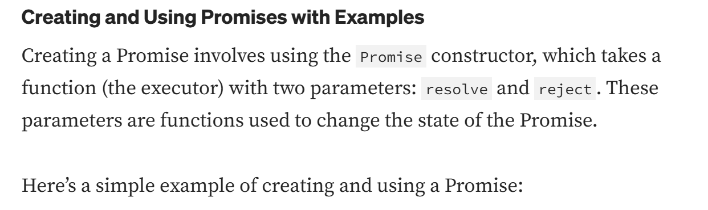

```bash
const myPromise = new Promise((resolve, reject) => {
  setTimeout(() => {
    resolve("Operation successful!");  // Resolve the promise with a success message
  }, 2000);
});

// Using the Promise
myPromise
  .then((message) => {
    console.log(message);  // "Operation successful!" after 2 seconds
  })
  .catch((error) => {
    console.error(error);
  });
  ```
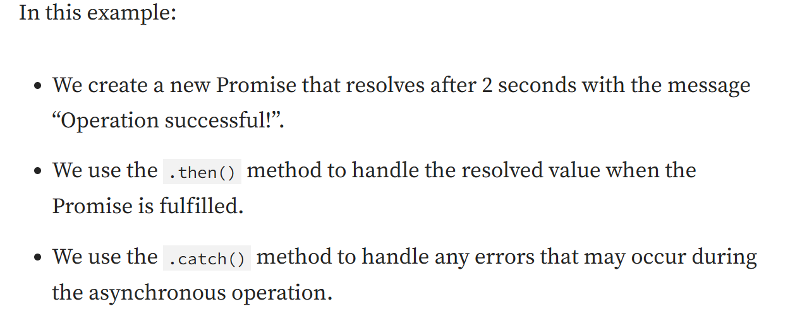

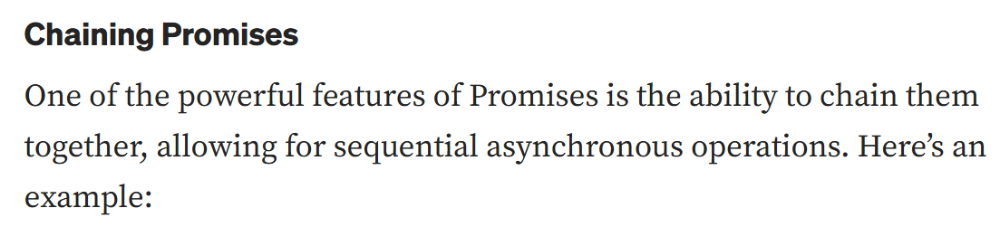

```bash

/**
 * aap iss api ko iss trha aik variabl me store kr k direct fetch me dal sakty ho warn aap direct b api dal sakty ho etc.
 * fetch(yaha pr).
 */

let api = 'https://jsonplaceholder.typicode.com/users';

fetch(api)
  .then(response => response.json())
  .then(data => {
    console.log(data);
    return fetch(api);
  })
  .then(response => response.json())
  .then(otherData => {
    console.log(otherData);
  })
  .catch(error => {
    console.error('Error:', error);
  });
  ```

  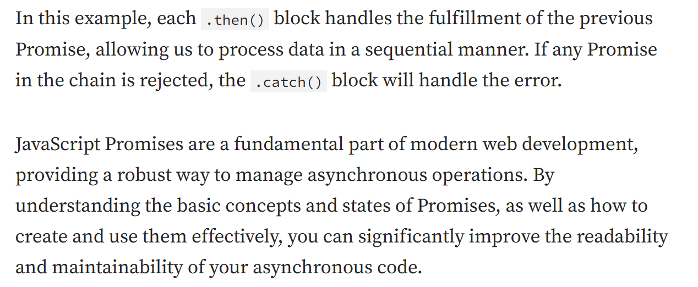

  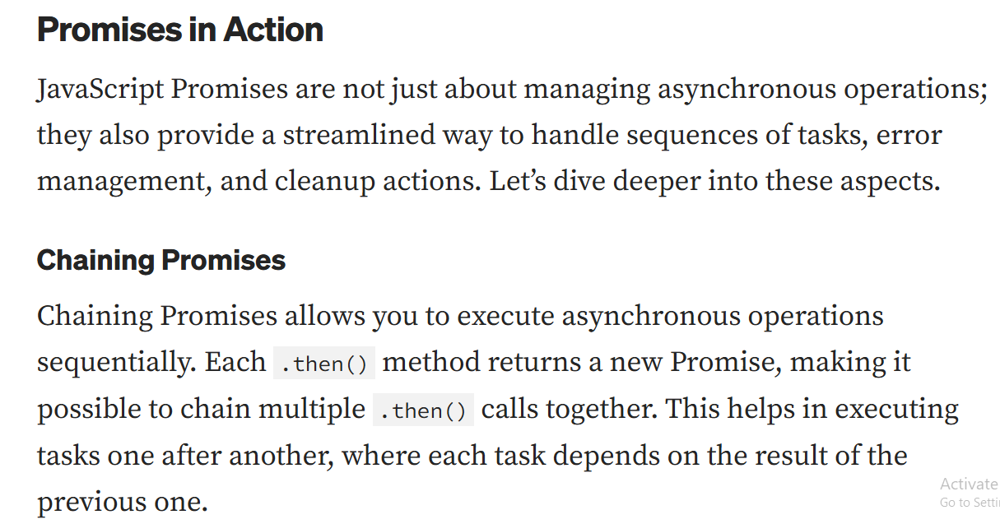
  Example of chaining Promises:
  
  ```bash
  fetch('https://api.example.com/data')
  .then(response => response.json())
  .then(data => {
    console.log('First Data:', data);
    return fetch('https://api.example.com/other-data');
  })
  .then(response => response.json())
  .then(otherData => {
    console.log('Second Data:', otherData);
  })
  .catch(error => {
    console.error('Error:', error);
  });
  ```
  - ye wahi example hy magr agr aap iss ko run karenge tho aap ko phir aik erro milega q k yaha pr aap ne jo api add ki hy wo wese hi type ki gaye hi tho aap iss ki jagah dummy api ko rakh sakty hy etc. jaise mene upar kiya b howa hy etc.
  
  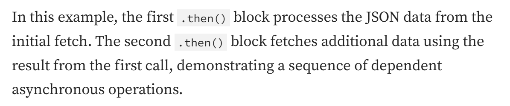

  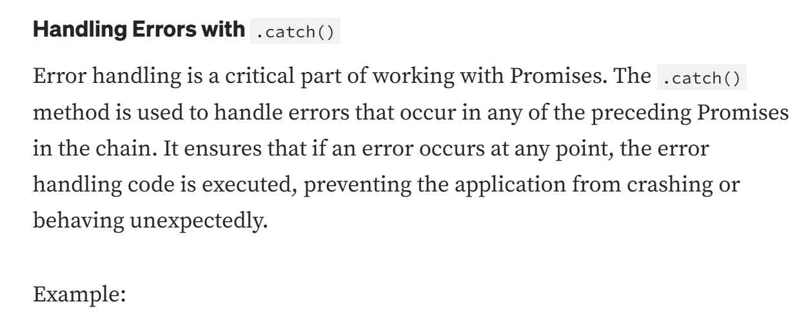

  ```bash
  let api = 'https://jsonplaceholder.typicode.com/users';

fetch(api).then(()=>{
    if(!Response.ok){
        console.log("Network response was not ok");
    }
    return Response.json();
}).then(data => {
    console.log('Data:', data);
  })
  .catch(error => {
    console.error('Fetch error:', error);
  });

  //Output: Network response was not ok
  /**
   * tho aap iss trha se .catch k sath error ko handle kr sakty hy easily etc.
   */
  ```
  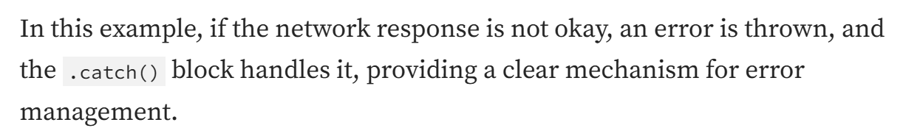

  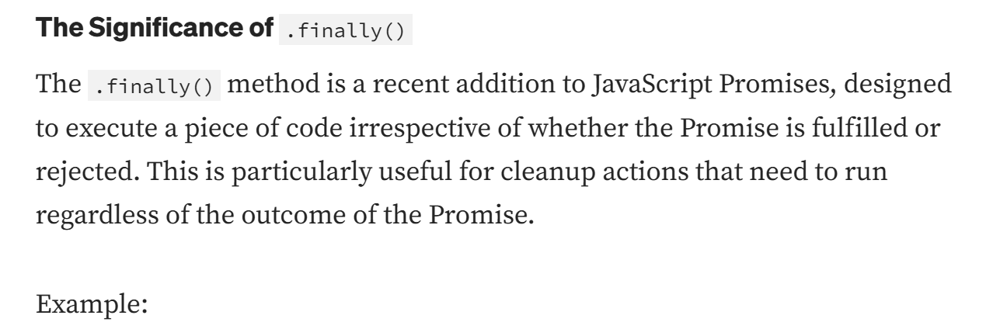
  - tho aap iss trha se finally ka b use kr sakty hy for error handling.
  
  ```bash
  let api = 'https://jsonplaceholder.typicode.com/users';

fetch(api)
  .then(response => response.json())
  .then(data => {
    console.log('Data:', data);
  })
  .catch(error => {
    console.error('Fetch error:', error);
  })
  .finally(() => {
    console.log('Fetch attempt finished.');
  });
  ```

  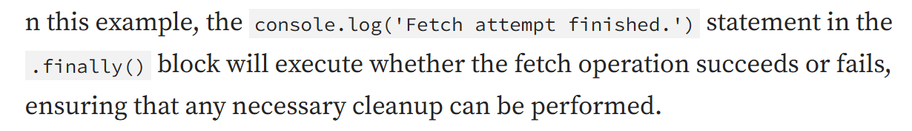

  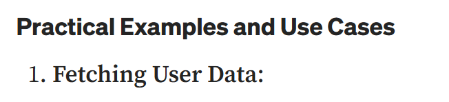

```bash
/**
 * tho aap iss trha se api se kisi specific id ko fetch etc kr sakty hy.
 * bs function me id pass krni hy or phir oss ko apne api k sath laga dena hy etc.
 */

function fetchUserData(userId) {
    return fetch(`https://jsonplaceholder.typicode.com/users/${userId}`)
      .then(response => response.json())
      .then(user => {
        console.log('User:', user);
        return user;
      })
      .catch(error => {
        console.error('Error fetching user data:', error);
      });
  }
  
  fetchUserData(1);
  ```

  