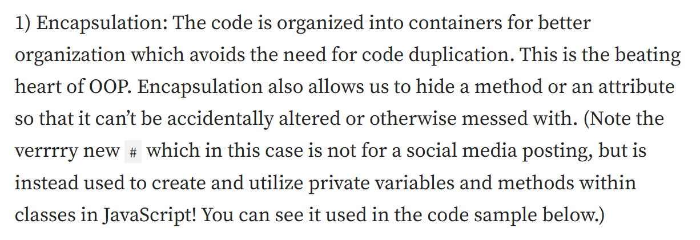
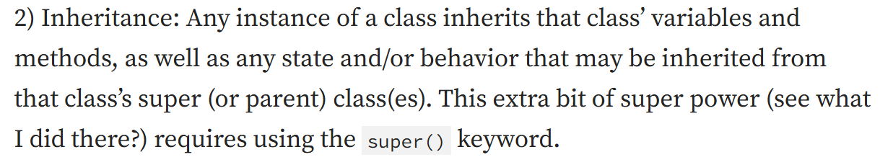
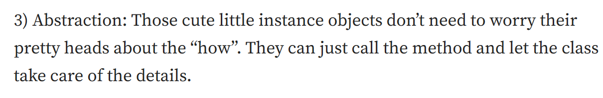
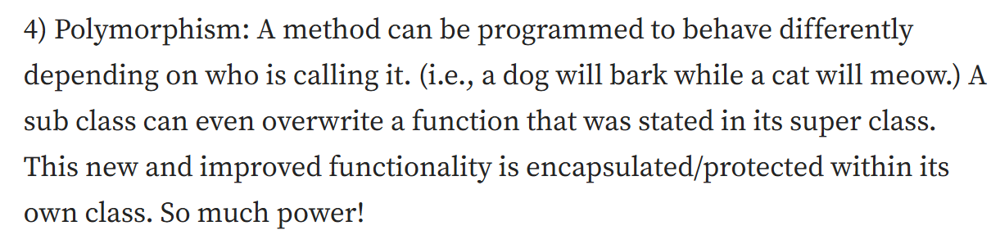
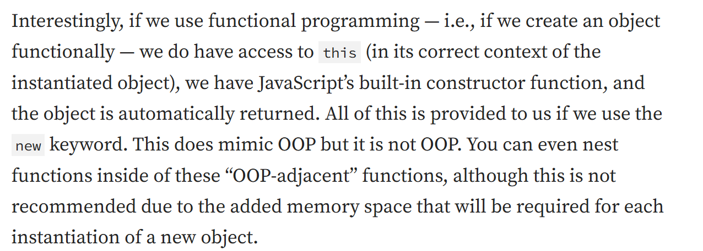
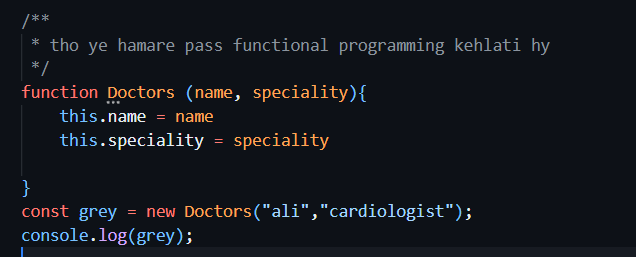
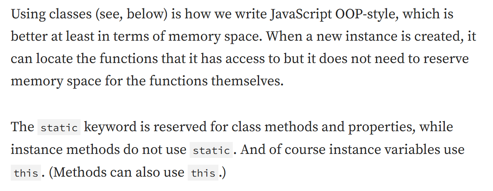
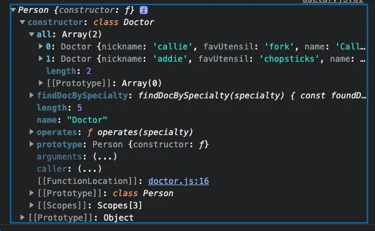
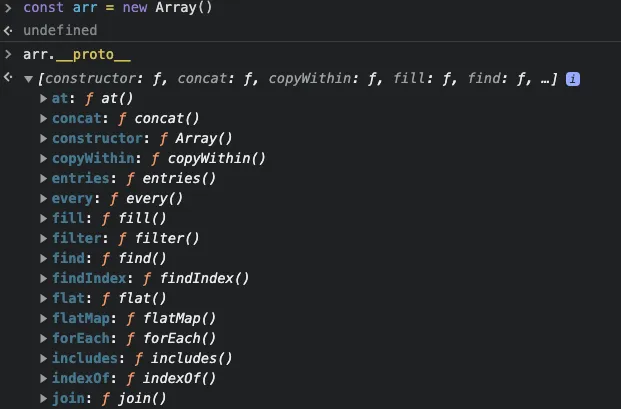
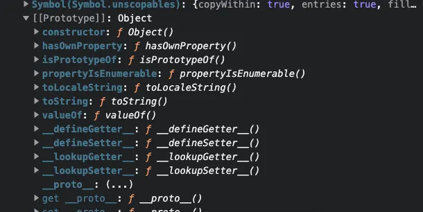

# JavaScript OOP
- OOP of course is shorthand for Object Oriented Programming, and has been around since the late ‘50s/early 60s. In terms of JavaScript, OOP was made available with ES6 in 2015. JavaScript is considered multi-paradigm because of this - we can write JavaScript using pure functions, or we can mimic real world experiences using OOP principles to structure our code.
- In general terms, OOP is a programming paradigm or set of concepts where the code is organized in a such a way that it creates a blueprint centered around the instantiated object - usually via classes - that contains state and behavior. i.e., things the object has (characteristics/attributes) and things the object does (methods/functions).

## The four pillars of OOP

The four pillars of OOP are Encapsulation, Inheritance, Abstraction and Polymorphism. These terms have been described many ways. This is how I understand them:

- yaha pr agr iss screenshot me dekho tho aap k pass ye jo code hy ye aap k pass functional programming ka hy jo k space or clarity in code iss me nhi hy ab hum log oop ko use karenge matlab oop k classes ko use krthy howe kaam karenge etc.

### Fun fact:
 OOP Classes in JavaScript are not truly OOP. This is in fact syntactic sugar (i.e., magic. Do not look behind the curtain!) that looks and behaves like OOP but is simply prototypal inheritance under the hood. For instance, if we were to console.log drMontgomery.__proto__we would see this:
 
 - There is not much different here from if we were to create a new array and check its __proto__ property:
 
 - we know that a new Array comes with lots of functionality built in
 