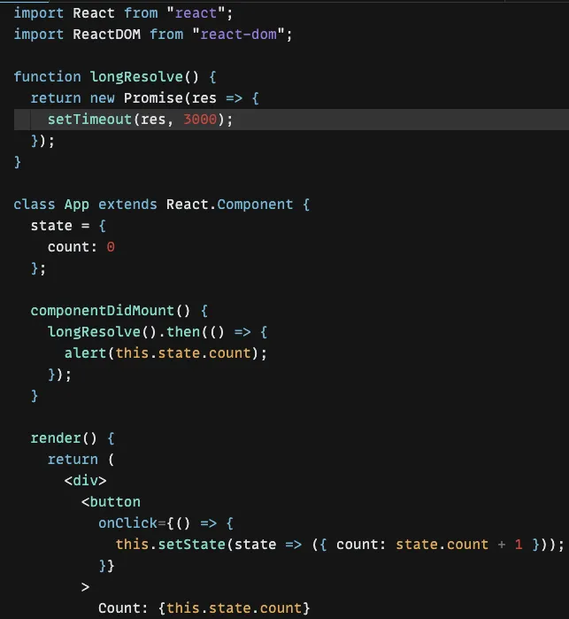

# JavaScript OOP
- OOP of course is shorthand for Object Oriented Programming, and has been around since the late ‘50s/early 60s. In terms of JavaScript, OOP was made available with ES6 in 2015. JavaScript is considered multi-paradigm because of this - we can write JavaScript using pure functions, or we can mimic real world experiences using OOP principles to structure our code.
- In general terms, OOP is a programming paradigm or set of concepts where the code is organized in a such a way that it creates a blueprint centered around the instantiated object - usually via classes - that contains state and behavior. i.e., things the object has (characteristics/attributes) and things the object does (methods/functions).

## The four pillars of OOP

The four pillars of OOP are Encapsulation, Inheritance, Abstraction and Polymorphism. These terms have been described many ways. This is how I understand them:


- yaha pr agr iss screenshot me dekho tho aap k pass ye jo code hy ye aap k pass functional programming ka hy jo k space or clarity in code iss me nhi hy ab hum log oop ko use karenge matlab oop k classes ko use krthy howe kaam karenge etc.


### Fun fact:
 OOP Classes in JavaScript are not truly OOP. This is in fact syntactic sugar (i.e., magic. Do not look behind the curtain!) that looks and behaves like OOP but is simply prototypal inheritance under the hood. For instance, if we were to console.log drMontgomery.__proto__we would see this:
 
 - There is not much different here from if we were to create a new array and check its __proto__ property:
 
 - we know that a new Array comes with lots of functionality built in
 

 - I find that I enjoy OOP the more I get to know it. And even though Functional Programming and Hooks are all the rage in React.js, I now have a deeper respect for the OG Classes in React. As with typical OOP, when we look at a class that extends from React, it inherits many methods, most importantly lifecycle methods (render() is itself a lifecycle method. In the past I have tended to forget this.). Notice that extends keyword. OOP!
 


 # OOP Questiong

 Below are **five questions** on Object-Oriented Programming (OOP) in JavaScript, each with a detailed solution to help you understand the concepts (objects, classes, and encapsulation). The first question includes a note about you trying it, so I’ll provide a clear explanation and encourage you to experiment. Each question focuses on practical aspects of OOP in JavaScript, with solutions using modern syntax (ES6+). Let’s dive in!

---

### Question 1: Creating a Simple Class with Objects
**Question**: Create a `Book` class with properties for `title` and `author`. Include a method `getDetails()` that returns a string describing the book. Create two book objects and call their `getDetails()` method.

**Note**: You mentioned you’re trying this one. I’ll provide a complete solution with comments to help you understand, and you can tweak it to test your understanding.

**Solution**:
```javascript
// Define the Book class
class Book {
  constructor(title, author) {
    this.title = title; // Property: title of the book
    this.author = author; // Property: author of the book
  }

  // Method to return book details
  getDetails() {
    return `${this.title} by ${this.author}`;
  }
}

// Create two book objects
let book1 = new Book("The Great Gatsby", "F. Scott Fitzgerald");
let book2 = new Book("To Kill a Mockingbird", "Harper Lee");

// Call getDetails() for each book
console.log(book1.getDetails()); // Output: The Great Gatsby by F. Scott Fitzgerald
console.log(book2.getDetails()); // Output: To Kill a Mockingbird by Harper Lee
```

**Explanation**:
- The `Book` class is a blueprint with `title` and `author` properties, set via the `constructor`.
- The `getDetails()` method uses `this` to access the object’s properties and returns a formatted string.
- Two objects (`book1` and `book2`) are created using `new Book(...)`.
- **Try This**: Modify the `getDetails()` method to include a new property, like `year`, and create a new book object to test it. For example, add `year` to the constructor and update `getDetails()` to include it.

**Encouragement**: Since you’re trying this, experiment by adding a new method (e.g., `setYear(year)`) and test it. If you get stuck, let me know what you tried, and I’ll guide you!

---

### Question 2: Implementing Encapsulation with Private Fields
**Question**: Create a `BankAccount` class with a private `balance` field. Include public methods `deposit(amount)` and `getBalance()` to manage and access the balance. Ensure the balance cannot be accessed directly and cannot go negative.

**Solution**:
```javascript
class BankAccount {
  #balance = 0; // Private field for balance

  // Method to deposit money
  deposit(amount) {
    if (amount > 0) {
      this.#balance += amount;
      return `Deposited ${amount}. New balance: ${this.#balance}`;
    }
    return "Invalid deposit amount";
  }

  // Method to get current balance
  getBalance() {
    return this.#balance;
  }
}

// Create a bank account object
let account = new BankAccount();

// Test the methods
console.log(account.deposit(100)); // Output: Deposited 100. New balance: 100
console.log(account.deposit(-50)); // Output: Invalid deposit amount
console.log(account.getBalance()); // Output: 100
console.log(account.#balance); // Error: Private field '#balance' is not accessible
```

**Explanation**:
- The `#balance` field is private (using `#`), so it can’t be accessed directly outside the class.
- The `deposit()` method checks if the amount is positive before updating `#balance`.
- The `getBalance()` method provides controlled access to the private `#balance`.
- Encapsulation ensures the balance is safe from invalid changes (e.g., negative deposits or direct access).

**Try This**: Add a `withdraw(amount)` method that checks if there’s enough balance before withdrawing. Test it with valid and invalid amounts.

---

### Question 3: Using Objects Without Classes
**Question**: Create a `Person` object using an object literal (not a class) with properties `name` and `age`, and a method `introduce()` that returns a greeting. Demonstrate how to create two such objects.

**Solution**:
```javascript
// Create Person objects using object literals
let person1 = {
  name: "Ali",
  age: 25,
  introduce: function() {
    return `Hi, I'm ${this.name} and I'm ${this.age} years old`;
  }
};

let person2 = {
  name: "Sara",
  age: 30,
  introduce: function() {
    return `Hi, I'm ${this.name} and I'm ${this.age} years old`;
  }
};

// Call introduce() for each person
console.log(person1.introduce()); // Output: Hi, I'm Ali and I'm 25 years old
console.log(person2.introduce()); // Output: Hi, I'm Sara and I'm 30 years old
```

**Explanation**:
- Object literals (`{}`) are a simple way to create objects without classes.
- Each object (`person1`, `person2`) has its own `name`, `age`, and `introduce` method.
- This approach is less reusable than classes for creating multiple similar objects but shows that OOP concepts (like bundling data and methods) can apply without classes.

**Try This**: Add a method `birthday()` that increases the `age` by 1 and test it on `person1`.

---

### Question 4: Encapsulation Using Closures
**Question**: Create a `Counter` object using a closure to encapsulate a private `count` variable. Provide public methods `increment()`, `decrement()`, and `getCount()` to manage the count. Ensure `count` cannot be accessed directly.

**Solution**:
```javascript
function createCounter() {
  let count = 0; // Private variable (encapsulated via closure)

  return {
    increment: function() {
      count++;
      return count;
    },
    decrement: function() {
      count--;
      return count;
    },
    getCount: function() {
      return count;
    }
  };
}

// Create a counter object
let counter = createCounter();

// Test the methods
console.log(counter.increment()); // Output: 1
console.log(counter.increment()); // Output: 2
console.log(counter.decrement()); // Output: 1
console.log(counter.getCount()); // Output: 1
console.log(counter.count); // Output: undefined (count is private)
```

**Explanation**:
- The `count` variable is private because it’s defined inside the `createCounter` function’s scope.
- The returned object exposes only the `increment`, `decrement`, and `getCount` methods, which can access `count` due to closure.
- This is an older way to achieve encapsulation before private fields (`#`) were introduced.

**Try This**: Add a `reset()` method to set `count` back to 0 and test it.

---

### Question 5: Combining OOP Concepts
**Question**: Create a `Rectangle` class with private fields for `width` and `height`. Include public methods `setDimensions(width, height)` to update dimensions (ensuring positive values) and `getArea()` to calculate the area. Create a rectangle object and test the methods.

**Solution**:
```javascript
class Rectangle {
  #width = 0; // Private field
  #height = 0; // Private field

  // Method to set dimensions
  setDimensions(width, height) {
    if (width > 0 && height > 0) {
      this.#width = width;
      this.#height = height;
      return `Dimensions set: ${this.#width}x${this.#height}`;
    }
    return "Invalid dimensions";
  }

  // Method to calculate area
  getArea() {
    return this.#width * this.#height;
  }
}

// Create a rectangle object
let rectangle = new Rectangle();

// Test the methods
console.log(rectangle.setDimensions(5, 10)); // Output: Dimensions set: 5x10
console.log(rectangle.getArea()); // Output: 50
console.log(rectangle.setDimensions(-5, 10)); // Output: Invalid dimensions
console.log(rectangle.getArea()); // Output: 50 (dimensions unchanged)
console.log(rectangle.#width); // Error: Private field '#width' is not accessible
```

**Explanation**:
- `#width` and `#height` are private, so they can only be modified via `setDimensions`.
- The `setDimensions` method validates inputs to ensure positive values.
- The `getArea` method calculates the area based on the private fields.
- This combines **encapsulation** (private fields), **classes**, and **methods** to create a robust object.

**Try This**: Add a `getPerimeter()` method to calculate the perimeter (`2 * (width + height)`) and test it.

---

### Tips for Practicing
- **Experiment**: Copy each code snippet into a JavaScript environment (like a browser console or Node.js) and run it. Modify values or add features to see how it behaves.
- **Debug**: If you get errors, check the console for messages. Common issues include missing `this` or typos in private field names (`#`).
- **Build on Examples**: For the first question (which you’re trying), try adding a new method or property to the `Book` class and test it. Share your code if you need feedback!

### If You Need More Help
- Let me know what you tried for Question 1 (or any other question), and I can provide specific guidance or debug your code.
- If you want more questions, different difficulty levels, or focus on specific OOP concepts (e.g., inheritance, polymorphism), just ask!

Happy coding, and let me know how I can assist further!