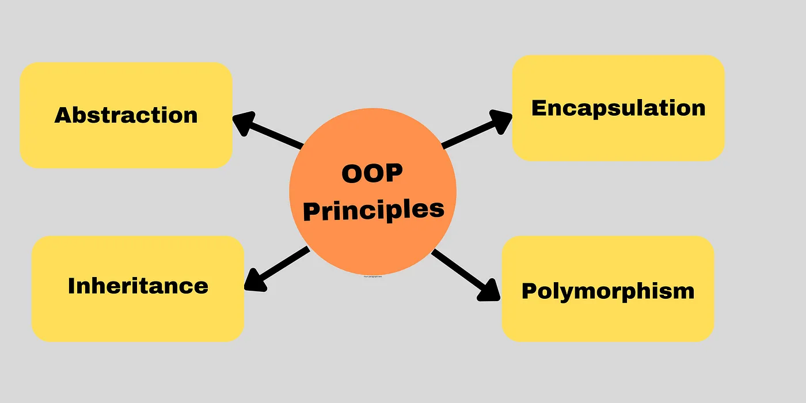

# Mastering Object-Oriented Programming (OOP) Concepts in JavaScript

## Introduction:
Object-Oriented Programming (OOP) is a powerful paradigm that revolves around the concepts of classes and objects. Let’s delve into the fundamental principles of OOP and explore key topics, from abstraction to inheritance.

## Table of content:

· Introduction:
· OOP fundamentals:
∘ Classes:
∘ Objects:
· 4 Fundamental Principles of OOP:
∘ Abstraction:
∘ Encapsulation:
∘ Inheritance:
∘ Polymorphism:
· Ways Of Defining Classes and Objects:
· Constructor Function:
∘ Changes happens when calling the function with new keyword:
· Prototype:
· ES6 Classes:
· Object.create Method:
· Inheriting Classes:
· Inheritance Using Constructor Function:
· Inheritance Using Class Method:
· Conclusion:

## OOP fundamentals:
- To truly grasp the essence of OOP, it’s essential to know what classes and objects are.
- oop ko parhne se pehly aap ko ye clear hona chaye hy k aap k pass objects or classes kiya hotay hy jo k fundmental topic hy.

## Classes:
A class is like a blueprint or a template that encapsulates both data and the methods that operate on that data. It defines the structure and behavior of objects, acting as a guide for creating instances with shared characteristics.
- matlab class hamare pass aik blue print hota hy jo k aap k classes,methods,objects etc ko represents krtha hy.

## Example of class
Example of class:Think of a class as a blueprint for constructing a building. The blueprint defines the structure, layout, and features of the building, just as a class defines the structure and behavior of objects.

## Objects:
Objects are instances of classes, created based on the blueprint provided by the class.Objects allow us to model and interact with the properties and behaviors described in the class.

## Example of Object:
Example of Object:An object is like a specific building created from the blueprint. Each building (object) may have unique characteristics while still adhering to the overall design (class definition).

# 4 Fundamental Principles of OOP:


## Encapsulation:
Encapsulation keeps properties and methods private within a class, preventing external access. This enhances data security and integrity.

## Inheritance:
Inheritance allows a child class to inherit properties and methods from a parent class, promoting code reuse and organization.

## Polymorphism:
Polymorphism meaning “many forms,” allows a child class to override a method inherited from a parent class, providing flexibility in implementation.

Ways Of Defining Classes and Objects:
There are 3 ways of defining classes and objects.They are,

- Constructor function.
- ES6 classes.
- Object.create method.

## Constructor Function:
In JavaScript, constructor functions play a crucial role in creating objects. It follows a specific pattern, differentiating it from regular functions.The constructor function should start with capital letter.The difference between regular function and constructor function is calling the function with new keyword .In constructor function arrow function is not applicable.In constructor functions, there’s no explicit return statement, and they always return an object.

## Changes happens when calling the function with new keyword:
when the function is called with new keyword 4 steps are involved.

- creating an empty object {}.
- making this = empty object.
- link prototype to empty object.
- Automatically return empty object.

### Regualr Function V/s Construtor Function
```bash
//regular fucntion:
const user = function(name){
     return name
};
const user1 =  user("shan");
console.log(user1); //shan

//constructor function
const User = function(name){
  this.name = name
}
const user2 = new User("stark");
console.log(user2); //User { name: 'stark' }
```

## Prototype:
Prototypes in JavaScript are collections of functions and methods available to all objects created from a constructor function. By defining methods in the prototype, we achieve better code organization and inheritance.

Every object in JavaScript is linked to a prototype object. When a property or method is accessed on an object, JavaScript looks for that property or method on the object itself. If it’s not found, it looks in the object’s prototype, forming a chain until the property is found or the end of the chain is reached.

The process of inheriting method / property from prototype is called prototypal inheritance.

```bash
//constructor function
const User = function(name){
  this.name = name
}

//define method in User constructor function
User.prototype.greet = function(){
console.log(`hi ${this.name}`);
}

//creating an instance from the constructor function
const user1 = new User("stark");
//accessing the method in newly created object
user1.greet(); //hi stark
```

## ES6 Classes:
ES6 introduced a more concise syntax for defining classes. It’s important to note that classes in JavaScript are essentially syntactic sugar over prototype-based inheritance.

In ES6 classes, the first method inside the class is the constructor method. This method is invoked automatically when an object is instantiated from the class. It serves as the initialization point for object properties and other setup tasks.

```bash
class Person{
constructor(firstname){
 this.firstname = firstname;
}
greet(){
console.log(`hi ${this.firstname}`);
}
}

const stark = new Person("stark");
stark.greet(); //hi stark
```

## Object.create Method:
The Object.create method in JavaScript is used for creating a new object with the specified prototype object and properties. It provides a way to manually control object prototypes, offering a more flexible approach to inheritance compared to constructor functions or ES6 classes.

```bash
 const Person  = {
  calcAge(){
    return 2023-this.birthyear;
  },
  init(name,birthyear){
   this.name = name;
   this.birthyear =  birthyear;
  },
};
//setting person object to stark object
const Stark = Object.create(Person)
Stark.name ="stark"
Stark.birthyear = 2000
console.log(Stark.calcAge()); //23
```

## Inheriting Classes:
In JavaScript, there are different ways to achieve class inheritance, and each method has its own syntax and advantages. Let’s explore two common approaches:

- inheritance using constructor functions
- inheritance using the class method with the extends keyword.

## Inheritance Using Constructor Function:
When inheriting using constructor functions, we create a parent class (Car in this example) and a child class (EV). The child class utilizes the call method to link to the parent class and inherits its properties. Additionally, the Object.create method is employed to link the prototypes, establishing a chain of inheritance.

```bash
//parent class
const Car = function(make,speed){
    this.make = make;
    this.speed = speed;
}
//child class
const EV = function(make,speed,charge){
    Car.call(this,make,speed)
    this.charge = charge;
}
//linking the prototype by Object.create method
EV.prototype = Object.create(Car.prototype);

//defining a method in child class
EV.prototype.accelerate = function(){
    this.speed +=20;
    this.charge -=1;
    console.log(`${this.make} going at ${this.speed}km/h with a charge of ${this.charge}%`);
}

//creating a instance and calling the acclerate method
const car1 = new EV("tesla",120,23);
car1.accelerate();//tesla going at 140km/h with a charge of 22%
```

## Inheritance Using Class Method:
In modern JavaScript (ES6 and later), the extends keyword is used to establish inheritance between classes. The child class (Buyer) extends the parent class (SalesShop), and the super() method is employed to call the constructor of the parent class and initialize its properties.

```bash
//parent class
class SalesShop{
 constructor(item,amount){
  this.item =item;
  this.amount = amount;
 }
 summary(){
   console.log(` The ${this.item}is sold at ${this.amount}`);
 }
}
//child class
class Buyer extends SalesShop{
   constructor(item,amount,buyerName){
     super(item,amount);
     this.buyerName = buyerName;
   }
 //over writing the method in child class
   summary(){
    console.log(`The ${this.item} is sold to ${this.buyerName} at ${this.amount}`)
   }
}

//creating an instance for child class
const shan = new Buyer("Table","$500","shan");
shan.summary();  //The Table is sold to shan at $500
```

## Conclusion:
I hope this blog helps you in Mastering OOP in JavaScript..It empowers one to write modular, maintainable, and scalable code. Whether you’re utilizing constructor functions, prototypes, ES6 classes, or a combination, understanding these concepts is essential for effective software development. Happy coding 😊!

