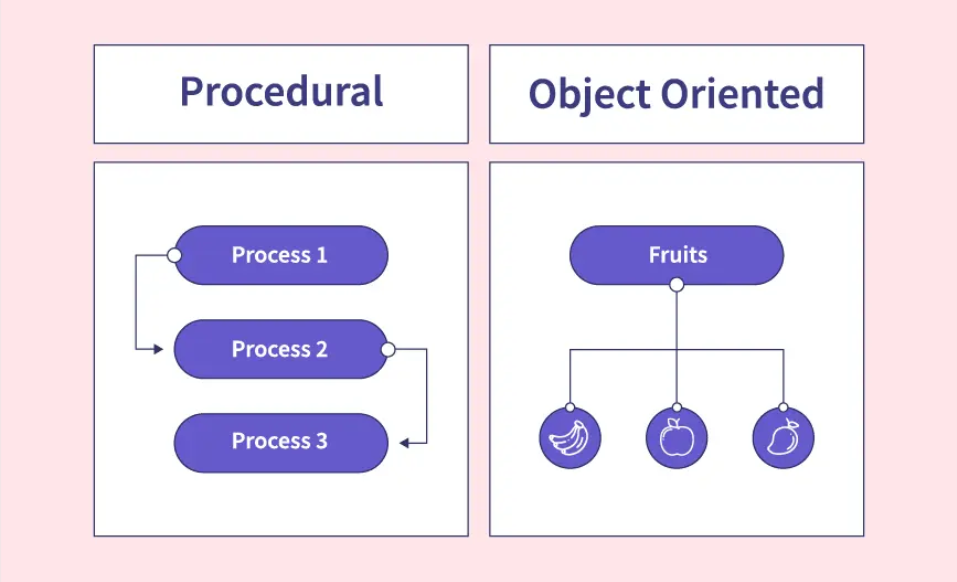
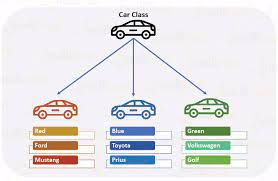
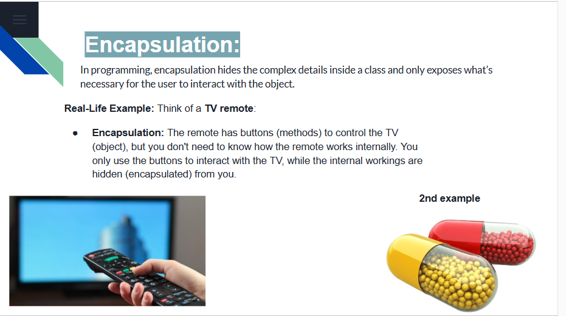
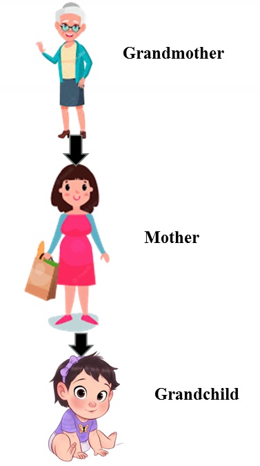

# Object-Oriented Programming in JavaScript with Examples
- Object-Oriented Programming (OOP) in JavaScript is a paradigm centered around objects rather than functions.
Aapke sawal ke jawab mein, main Object-Oriented Programming (OOP) ko JavaScript ke context mein simple language aur bullet points ke saath samjhaata hoon. Yeh statement basically OOP ke concept aur uske comparison ko procedural programming se explain kar rahi hai.

### OOP in JavaScript Kya Hai?
- **OOP ek programming style hai** jo objects ke around kaam karta hai, na ki sirf functions ya steps ke sequence ke around.
- **Objects** real-world entities (jaise car, person) ko represent karte hain, jinke paas **properties** (data, jaise car ka color) aur **methods** (actions, jaise car ka drive karna) hote hain.
- Yeh approach complex systems ko organize aur manage karne mein madad karta hai.

### Statement Ka Matlab (Bullet Points Mein):
- **OOP vs Procedural Programming**:
  - **Procedural Programming**: Code ko steps ya instructions ke sequence mein likha jata hai (jaise ek recipe). Focus hota hai functions aur logic pe.
  - **OOP**: Code ko objects ke form mein structure kiya jata hai, jo ek dusre se interact karte hain. Yeh real-world ke systems ko model karne ke liye zyada natural hai.
  
- **Objects-Centered**:
  - OOP mein har cheez ko objects ke through represent kiya jata hai.
  - Example: Ek "Car" object mein properties (color, speed) aur methods (drive, stop) ho sakte hain.
  - Yeh objects apas mein communicate karte hain, jisse code modular aur reusable banta hai.

- **Complex Systems**:
  - OOP bade aur complicated programs ke liye behtar hai kyunki yeh objects ke through systems ko chhote, manageable parts mein tod deta hai.
  - Example: Ek game banate waqt, har character, weapon, ya level ek alag object ho sakta hai.

### JavaScript Mein OOP Kaise Kaam Karta Hai?
- JavaScript mein objects banane ke liye **classes** ya **constructor functions** use hote hain.
- Example:
  ```javascript
  class Car {
    constructor(color, speed) {
      this.color = color; // Property
      this.speed = speed;
    }
    drive() { // Method
      console.log(`The ${this.color} car is driving at ${this.speed} km/h`);
    }
  }
  let myCar = new Car("Red", 120); // Object creation
  myCar.drive(); // Output: The Red car is driving at 120 km/h
  ```
- Yeh code dikhata hai kaise ek "Car" object banaya jata hai jisme properties aur methods hote hain.

### Kyun Samajhna Mushkil Lag Raha Hai?
- Agar yeh pehli baar padh rahe ho, toh OOP ka concept abstract lag sakta hai kyunki yeh sochne ka tarika procedural programming se alag hai.
- **Solution**: Chhoti examples se shuru karo (jaise upar wala Car example) aur dheere-dheere objects ka use real projects mein try karo.

### Key Takeaways:
- OOP objects ke through code ko organize karta hai.
- Yeh procedural programming se zyada modular aur real-world systems ke liye suitable hai.
- JavaScript mein classes aur objects use karke OOP implement hota hai.

Agar aapko koi specific part zyada detail mein chahiye ya koi aur example chahiye, toh batayein!

# My Explanation
- oop hamare pass aik programming ki style hy jo k object k around kaam krthi hy matlab function se bahir ye kaam krthi hy or function etc iss k andar banaye jatay hy jiss se hamara code organized hojata hy etc.
- Objects: --> hamare real life me jitne b cheeze hoti hy wo aik object ki trha hoti hy jaise agr aap kisi jagah pr apply krthy hy ya phir kahi pr form fill krthy hy etc tho waha pr aap aik object k form me data ko lkthy hy. jaise name or phir aap apna naam likhty hy or ye aap k pass aik object hojata hy q k object key pairs value k upar kaam krtha hy etc.
- tho issi liye jitne b programme bantay hy web development me wo sare k sare issi hi paradigm ko follow krthy hy etc.

## Different Between OOPs vs Procedural Programming

- Procedural: me aap step by step instrctions ko likthy hy aik sequence me or ye zyda focus aap k logic etc pr krtha hy.
- OOP: oop hamare data ko aik object k form me store krtha hy or ye mainly focus b ossi hi k upar krtha hy.
yaha pr aap ko aik specific instructions likhne ki zaroorat nhi hoti hy etc.
- oop me hum log apne code k logic ko step by step thortay hy for example game ki agr baat kare tho game me aik character ka alag logic likha jata hy k wo kiya kaam karega or dosre ka alag logic likha jata hy. tho aap ye logic for example aik character ka logic aap aik class me bana sakty hy or dosre ka dosre me jiss se hamara code organized hojata hy or humme oss ko samjhna or use krna b easy hojata hy etc.
- OOP bade aur complicated programs ke liye behtar hai kyunki yeh objects ke through systems ko chhote, manageable parts mein tod deta hai.
Example: Ek game banate waqt, har character, weapon, ya level ek alag object ho sakta hai.


# Fundamentals of OOP in JavaScript

1. Objects and Classes



Let me explain **Objects and Classes** in JavaScript in a simple way, focusing on the statement you provided, using bullet points to make it clear and easy to understand.

### What is an Object in JavaScript?
- **Definition**: An object is a standalone entity that represents something (like a real-world item, e.g., a car, person, or book).
- **Properties**: Objects have **properties** (key-value pairs) that describe their characteristics.
  - Example: A `car` object might have properties like `color: "red"` or `speed: 120`.
- **Type**: Objects have a specific type or structure based on what they represent (e.g., a `car` object is different from a `person` object).
- **Standalone Entity**: Each object is independent and can hold its own data and behavior (methods).

**Example of an Object**:
```javascript
let car = {
  color: "red", // Property
  speed: 120,   // Property
  drive: function() { // Method
    console.log("The car is driving");
  }
};
console.log(car.color); // Output: red
car.drive(); // Output: The car is driving
```

### What is a Class in JavaScript?
- **Definition**: A class is like a **blueprint** or template for creating objects. It defines the properties and methods that objects created from it will have.
- **Purpose**: Classes make it easier to create multiple objects with the same structure.
- **Syntax**: Introduced in ES6 (2015), classes provide a cleaner way to implement Object-Oriented Programming (OOP) in JavaScript.

**Example of a Class**:
```javascript
class Car {
  constructor(color, speed) { // Constructor to initialize properties
    this.color = color;
    this.speed = speed;
  }
  drive() { // Method
    console.log(`The ${this.color} car is driving at ${this.speed} km/h`);
  }
}

// Creating objects from the class
let car1 = new Car("red", 120);
let car2 = new Car("blue", 150);

car1.drive(); // Output: The red car is driving at 120 km/h
car2.drive(); // Output: The blue car is driving at 150 km/h
```

### Breaking Down the Statement
- **"An object is a standalone entity"**:
  - Means each object is independent and can exist on its own with its own data (properties) and behavior (methods).
  - Example: `car1` and `car2` are separate objects with their own `color` and `speed`.

- **"With properties and type"**:
  - **Properties**: Data stored in the object (like `color` or `speed`).
  - **Type**: Refers to the kind of object (e.g., a `Car` object is of type `Car` as defined by the class or structure).
  - In JavaScript, you can check an object's type using `instanceof`:
    ```javascript
    console.log(car1 instanceof Car); // Output: true
    ```

### Key Points to Understand
- **Objects** are instances of something (like a specific car), while **classes** are the templates used to create those objects.
- Objects can be created:
  - Directly using **object literals** (e.g., `let obj = {}`).
  - Using **classes** (e.g., `new Car()`).
  - Using **constructor functions** (an older way, before classes were introduced).
- **Why Use Classes?**
  - They make code reusable and organized.
  - You can create many objects with the same structure easily.
- **Real-World Analogy**:
  - Class = Blueprint of a house.
  - Object = Actual house built from that blueprint.

### Common Confusion and Clarification
- **Objects vs Classes**:
  - A class is just a definition; it doesn’t hold data itself.
  - An object is the actual thing created from the class, holding specific data.
- **Why It Might Seem Confusing**:
  - If you're new to OOP, thinking of code as "objects" instead of just functions or steps can feel abstract.
  - Solution: Practice with small examples like the ones above and try creating your own objects/classes.

### Practical Example for Clarity
Let’s create a `Person` class to see how it works:
```javascript
class Person {
  constructor(name, age) {
    this.name = name; // Property
    this.age = age;   // Property
  }
  greet() { // Method
    console.log(`Hi, I'm ${this.name} and I'm ${this.age} years old`);
  }
}

let person1 = new Person("Ali", 25); // Object
let person2 = new Person("Sara", 30); // Object

person1.greet(); // Output: Hi, I'm Ali and I'm 25 years old
person2.greet(); // Output: Hi, I'm Sara and I'm 30 years old
```
- Here, `Person` is the class (blueprint), and `person1` and `person2` are objects (instances) with their own `name` and `age`.

### Summary
- **Objects**: Independent entities with properties (data) and methods (actions).
- **Classes**: Templates for creating objects with the same structure.
- **Statement Meaning**: Objects in JavaScript are self-contained units that hold data (properties) and have a specific type (defined by their structure or class).

If you want more examples, a specific part explained further, or help with a coding exercise, let me know!

# My Explanation
- Object hamare pass aik standalone property hoti hy jo k kisi na kisi cheez ko represents kr rhi hoti hy jaise real life me cars,person,book etc.
- or ye object aap k class k andar se hi banta hy etc.
- jaise agr hum log car ki example le tho car aik hi hoti hy magr oss k units design etc jo hy wo alag alag hoti magr car ka naam aik hi hota hy jiss ko car kaha jata hy or jo or car hy wo aap k pass objects kahay jatay hy etc.
- or object apne andar properties raktha hy jiss ko key paris of value kaha jata hy etc.


## 1. Objects and Classes
- In JavaScript, an object is a standalone entity, with properties and type.
- hamare pass ES6 version se pehly jo porane version hy oss me class nhi howa krtha tha jiss ko hum log let ya phir const etc k sath banatay thy example k liye niche dekhe.
```bash
/**
 * tho agr aap yaha pr dekhe tho hamare pass jo hy class jo k dog k name se hy oss ko hum let k keyword se bana rhy hy.
 * ab ye iss waja se let k keyword se bana rhy hy or class ko nhi use kr rhy hy q k hamare pass ES6 me Badd me class aya tha.
 * magr ES6 k ane pehly hum log kuch iss trha se class ko banatay thay etc.
 */
let dog = {
    breed: 'Labrador',
    color: 'black',
    bark() {
    console.log('Woof!');
    }
   };
   dog.bark(); // Woof!
```
- tho hum log kuch iss trha se pehly class ko banatay thy ES6 k version se pehly etc.

- Classes, introduced in ES6, are a template for creating objects.
- ab yaha pr hamare pass jub ES6 me classes introduced howe tho phir hum dosre tarikay se jo k ES6 version wala hy iss k tarikay se classes ko banane lagy jiss ki example aap niche dekh sakty hy etc.

```bash
/**
 * jub hamare pass ES6 version aya tho phir hum log class ko banane k liye class k keyword ko hi use krthy hy.
 * or ye iss k ilawa or b cheeze add krdeti hy ES6 jo version wo etc.
 */

class Animal {
    constructor(name) {
    this.name = name;
    }
   speak() {
    console.log(`${this.name} makes a noise.`);
    }
   }
   let animal = new Animal('Dog');
   animal.speak(); // Dog makes a noise.
```
- tho aap kuch iss trha se ES6 ki madad k sath classes ko bana sakty hy etc.

## 2. Encapsulation


- Encapsulation means that the internal representation of an object is hidden from the outside.
- Encapsulation ka simple matlab ye hota hy k andar k information ko outside k se chopa k rakhna jo b info ho aap k class ko andar oss ko koi bahir use na kar saky tho oss ko Encsulation ki madad se chupaya jata hy etc.
- aap Encapsulation ko _ underscore ki madad se apply kr sakty ho easily.
- NOTE: agr aap direct _ underscore k sath encapsulation krthy ho tho phir b aap ka variable jo hy access hoga tho iss ko access na karane k liye hum log private keyword ka use krthy hy etc.

```bash
// tho agr aap dekhe tho abhi b aap encapsulation jiss variable ko kiya howa hy oss ko aap abhi b access kr sakty ho tho iss ko na krne k liye hum log phir private ka use krthy hy jo k aghy hum log karege

class Car {
    constructor() {
      this._speed = 0; // _speed is "private" by convention
    }
    setSpeed(newSpeed) { // Public method to control access
      if (newSpeed >= 0) {
        this._speed = newSpeed;
      }
    }
    getSpeed() { // Public method to access data
      return this._speed;
    }
  }
  
  let myCar = new Car();
  myCar.setSpeed(100); // Use method to change speed
  console.log(myCar.getSpeed()); // Output: 100
  myCar._speed = -50; // Not recommended, but possible (not truly private)
  console.log(myCar.getSpeed()); // Output: -50
  ```
  - tho agr aap iss example me dekhe tho ensule howa variable aap ab b use kr sakty hy tho iss ko secure krne k liye hum log private keyword ka use krthy etc. see example below.

  ### Using Private Fields (True Encapsulation, ES6+)
  - tho ab iss trha se private fields ko use krne se jub b koi oss private howe variable ya phir oss data ko access krne ki koshish karega jo k aap ne private kiya howa hy encapsule kiya howa hy tho phir aap ko error milega k bhai aap iss ko access nhi kr saty ho q k ye aik private fields hy etc. jaise tiktok private account.
```bash
class Car {
    #speed = 0; // Private field
    setSpeed(newSpeed) { // Public method
      if (newSpeed >= 0) {
        this.#speed = newSpeed;
      }
    }
    getSpeed() { // Public method
      return this.#speed;
    }
  }
  
  let myCar = new Car();
  myCar.setSpeed(100); // Works
  console.log(myCar.getSpeed()); // Output: 100
  console.log(myCar.#speed); // Error: Private field '#speed' is not accessible
  ```

- tho ab agr koi #speed ko access krne ki koshish karega tho oss ko phir error milega q k iss ko aap ne private fields kiya howa hy k bhai iss ko koi b access nhi kr sakta hy etc.

Let me explain **Encapsulation** in the context of Object-Oriented Programming (OOP) in JavaScript using simple language and bullet points to make it clear. Since you’re asking about encapsulation after discussing objects and classes, I’ll connect it to those concepts and keep it beginner-friendly.

### What is Encapsulation?
- **Definition**: Encapsulation is the OOP principle of **bundling data (properties)** and **methods (functions)** that operate on that data into a single unit (an object), while **restricting direct access** to some of the object's components to protect its data.
- **Analogy**: Think of a capsule (like a medicine capsule). The capsule contains the medicine (data) and only allows access to it in a controlled way (through methods). You can’t directly touch the medicine inside without opening the capsule properly.

### Why Encapsulation?
- Protects an object’s data from **unauthorized or accidental changes**.
- Makes code **easier to maintain** by keeping related data and behavior together.
- Hides **internal details** of an object and exposes only what’s necessary (like a black box).

### How Encapsulation Works in JavaScript
In JavaScript, encapsulation is achieved by:
- Bundling properties and methods in **objects** or **classes**.
- Controlling access to data using **private variables** or **closures** to restrict direct access.

### Key Points of Encapsulation
- **Bundling Data and Methods**:
  - Properties (data) and methods (functions) are grouped together in an object or class.
  - Example: A `Car` object has `speed` (property) and `drive()` (method) together.
  
- **Restricting Access**:
  - Some data is kept **private** so it can only be accessed or modified through specific methods.
  - This prevents external code from directly changing sensitive data.
  
- **Public vs Private**:
  - **Public**: Properties/methods that anyone can access.
  - **Private**: Properties/methods that are hidden and only accessible within the object/class.

### Encapsulation in JavaScript (Examples)
JavaScript doesn’t have strict `private` keywords like some other languages (e.g., Java), but it supports encapsulation using **conventions**, **closures**, and **private fields** (introduced in ES6).

#### 1. Using Naming Conventions (Simple Encapsulation)
- By convention, prefixing a property with `_` suggests it’s private (though it’s not truly private).
```javascript
class Car {
  constructor() {
    this._speed = 0; // _speed is "private" by convention
  }
  setSpeed(newSpeed) { // Public method to control access
    if (newSpeed >= 0) {
      this._speed = newSpeed;
    }
  }
  getSpeed() { // Public method to access data
    return this._speed;
  }
}

let myCar = new Car();
myCar.setSpeed(100); // Use method to change speed
console.log(myCar.getSpeed()); // Output: 100
myCar._speed = -50; // Not recommended, but possible (not truly private)
console.log(myCar.getSpeed()); // Output: -50
```
- **Problem**: `_speed` can still be accessed directly, so this isn’t true encapsulation.

#### 2. Using Private Fields (True Encapsulation, ES6+)
- JavaScript introduced **private fields** with the `#` prefix (supported in modern browsers/Node.js).
- Private fields are only accessible within the class.
```javascript
class Car {
  #speed = 0; // Private field
  setSpeed(newSpeed) { // Public method
    if (newSpeed >= 0) {
      this.#speed = newSpeed;
    }
  }
  getSpeed() { // Public method
    return this.#speed;
  }
}

let myCar = new Car();
myCar.setSpeed(100); // Works
console.log(myCar.getSpeed()); // Output: 100
console.log(myCar.#speed); // Error: Private field '#speed' is not accessible
```
- **Benefit**: `#speed` is truly private and can only be accessed/modified via `setSpeed` or `getSpeed`.

#### 3. Using Closures (Older Way)
- Before private fields, encapsulation was achieved using **closures** (functions that "close over" variables).
```javascript
function createCar() {
  let speed = 0; // Private variable
  return {
    setSpeed: function(newSpeed) { // Public method
      if (newSpeed >= 0) {
        speed = newSpeed;
      }
    },
    getSpeed: function() { // Public method
      return speed;
    }
  };
}

let myCar = createCar();
myCar.setSpeed(100); // Works
console.log(myCar.getSpeed()); // Output: 100
console.log(myCar.speed); // Output: undefined (speed is private)
```
- **How it works**: `speed` is private because it’s inside the function’s scope and only accessible via the returned methods.

### Benefits of Encapsulation
- **Data Protection**: Prevents invalid or harmful changes (e.g., setting a negative speed).
- **Modularity**: Internal details are hidden, so you can change how the class works without affecting external code.
- **Maintainability**: Easier to debug or update because data and methods are organized together.

### Why It Might Seem Confusing
- Encapsulation can feel abstract if you’re new to OOP because it involves thinking about "hiding" data.
- JavaScript’s multiple ways to achieve encapsulation (conventions, closures, private fields) can be overwhelming.
- **Solution**: Start with private fields (`#`) for modern JavaScript, as they’re the clearest way to implement encapsulation.

### Real-World Analogy
- Think of a **bank account**:
  - **Private Data**: Your account balance (only the bank can directly access it).
  - **Public Methods**: Deposit or withdraw functions (you can interact with the balance through these, but you can’t directly change the balance).
  - Encapsulation ensures your balance is safe and only modified in controlled ways.

### Summary
- **Encapsulation** bundles data and methods into an object/class and restricts direct access to some data.
- In JavaScript, encapsulation is achieved using:
  - Naming conventions (`_variable`).
  - Private fields (`#variable`).
  - Closures (function scope).
- It protects data, improves code organization, and makes systems easier to maintain.

If you want a specific example, more details on any part, or help with a coding exercise related to encapsulation, let me know!

## 3. Inheritance



- Inheritance allows a class to inherit properties and methods from another class.
- inheritance aap ko allows krtha hy aik class ko dsore class k sath inhrit krna jiss se aap connect b keh sakty hy.
- aap extends keyword ko use kr k aik class ko dosre class k sath connect matlab inherit kr sakty ho etc.
```bash
class Animal {
    constructor(name) {
    this.name = name;
    }
   speak() {
    console.log(`${this.name} makes a noise.`);
    }
   }
   class Dog extends Animal {
    speak() {
    console.log(`${this.name} barks.`);
    }
   }
   let d = new Dog('Mitzie');
   d.speak(); // Mitzie barks.
   ```
   - tho aap kuch iss trha se inherit kr sakty hy aik class ko dosre class me.
   - ab aap ne jiss class k sath iss ko apne jo b class ko inherit kiya howa hy oss k class ka aap ko sirf object banana hoga bs or phir jiss class class ko inherit kiya howa hy phir oss k proeperties data ko b aap access kr sakty hy q k aap ne inherit kiya hy etc.

Let me explain **Inheritance** in the context of Object-Oriented Programming (OOP) in JavaScript in a simple way, using bullet points for clarity. Since you’ve asked about encapsulation before, I’ll connect inheritance to the concepts of objects, classes, and OOP, keeping it beginner-friendly and relevant to your previous questions.

### What is Inheritance?
- **Definition**: Inheritance is an OOP principle where a **child class** (or subclass) **inherits** properties and methods from a **parent class** (or superclass). This allows the child class to reuse and extend the functionality of the parent class.
- **Analogy**: Think of a family. A child inherits traits (like eye color) from their parents but can also have unique traits (like a specific talent). Similarly, a child class inherits features from the parent class and can add or modify its own.

### Why Inheritance?
- **Code Reusability**: Avoid rewriting the same code by reusing properties and methods from a parent class.
- **Extensibility**: Child classes can add new features or modify inherited ones.
- **Organized Code**: Creates a hierarchy of classes, making the code easier to understand and maintain.

### How Inheritance Works in JavaScript
- JavaScript uses **classes** (introduced in ES6) to implement inheritance with the **`extends`** keyword.
- The child class inherits all properties and methods of the parent class and can:
  - Use them as-is.
  - Add new properties/methods.
  - **Override** (modify) inherited methods to behave differently.

### Key Points of Inheritance
- **Parent Class**: The class that provides the properties and methods (also called the base class or superclass).
- **Child Class**: The class that inherits from the parent class (also called the derived class or subclass).
- **extends Keyword**: Used to create a child class that inherits from a parent class.
- **super Keyword**: Used in the child class to call the parent class’s constructor or methods.

### Inheritance in JavaScript (Example)
Here’s a simple example to show how inheritance works:

#### Example: Parent and Child Classes
```javascript
// Parent class
class Animal {
  constructor(name) {
    this.name = name; // Property
  }
  speak() { // Method
    console.log(`${this.name} makes a sound.`);
  }
}

// Child class inheriting from Animal
class Dog extends Animal {
  constructor(name, breed) {
    super(name); // Call parent’s constructor to set name
    this.breed = breed; // New property specific to Dog
  }
  speak() { // Override parent’s method
    console.log(`${this.name}, the ${this.breed}, barks!`);
  }
  fetch() { // New method specific to Dog
    console.log(`${this.name} is fetching the ball.`);
  }
}

// Creating objects
let animal = new Animal("Leo");
let dog = new Dog("Buddy", "Golden Retriever");

animal.speak(); // Output: Leo makes a sound.
dog.speak(); // Output: Buddy, the Golden Retriever, barks!
dog.fetch(); // Output: Buddy is fetching the ball.
```

### Breaking Down the Example
- **Parent Class (Animal)**:
  - Has a `name` property and a `speak` method.
  - Represents a generic animal.
- **Child Class (Dog)**:
  - Uses `extends Animal` to inherit from `Animal`.
  - Calls `super(name)` to initialize the `name` property from the parent class.
  - Adds a new property (`breed`) and a new method (`fetch`).
  - **Overrides** the `speak` method to provide a dog-specific behavior.
- **Result**:
  - `Dog` inherits `name` and `speak` from `Animal`.
  - `Dog` can extend functionality (`breed`, `fetch`) and modify inherited behavior (`speak`).

### Another Example (Real-World Context)
Let’s say you’re modeling vehicles:
```javascript
// Parent class
class Vehicle {
  constructor(brand) {
    this.brand = brand;
  }
  drive() {
    console.log(`${this.brand} vehicle is driving.`);
  }
}

// Child class
class Car extends Vehicle {
  constructor(brand, model) {
    super(brand); // Inherit brand from Vehicle
    this.model = model;
  }
  drive() { // Override parent’s method
    console.log(`${this.brand} ${this.model} is zooming on the road!`);
  }
}

let vehicle = new Vehicle("Toyota");
let car = new Car("Toyota", "Corolla");

vehicle.drive(); // Output: Toyota vehicle is driving.
car.drive(); // Output: Toyota Corolla is zooming on the road!
```
- **Vehicle** is the parent class with generic behavior.
- **Car** is the child class that inherits from `Vehicle`, adds a `model` property, and customizes the `drive` method.

### Key Features of Inheritance
- **Reusability**: `Dog` and `Car` reuse the `name`/`brand` property and basic methods from their parent classes.
- **Extensibility**: Child classes add their own properties (`breed`, `model`) and methods (`fetch`).
- **Overriding**: Child classes can redefine inherited methods (`speak`, `drive`) to suit their needs.
- **Hierarchy**: Inheritance creates a clear structure (e.g., `Animal` → `Dog`, `Vehicle` → `Car`).

### Connecting to Encapsulation
- Inheritance works well with **encapsulation**. For example, a parent class might have private fields (using `#`) that the child class can’t directly access but can interact with through public methods.
- Example:
```javascript
class Animal {
  #energy = 100; // Private field
  getEnergy() { // Public method to access private field
    return this.#energy;
  }
  eat() {
    this.#energy += 10;
    console.log(`Energy increased to ${this.#energy}`);
  }
}

class Dog extends Animal {
  bark() {
    console.log("Woof! Energy is " + this.getEnergy());
  }
}

let dog = new Dog();
dog.eat(); // Output: Energy increased to 110
dog.bark(); // Output: Woof! Energy is 110
// console.log(dog.#energy); // Error: #energy is private
```
- The child class (`Dog`) can use the parent’s public methods (`getEnergy`, `eat`) but can’t directly access the private `#energy` field.

### Why It Might Seem Confusing
- Inheritance can feel complex because it involves understanding how classes are related and how properties/methods flow from parent to child.
- Terms like `extends`, `super`, and overriding might be new.
- **Solution**: Practice with small examples (like above) and visualize the parent-child relationship as a family tree.

### Real-World Analogy
- **Parent**: A general "Vehicle" blueprint with basic features (engine, wheels).
- **Child**: A specific "Car" that inherits the basics but adds unique features (sunroof, GPS).
- The car doesn’t need to redefine the engine; it just builds on the vehicle’s foundation.

### Summary
- **Inheritance** allows a child class to inherit properties and methods from a parent class using `extends`.
- It promotes **code reuse**, **extensibility**, and a **hierarchical structure**.
- In JavaScript, use `super` to call the parent’s constructor or methods, and override methods to customize behavior.
- Combines well with encapsulation to protect data while allowing controlled access.

If you want more examples, a deeper explanation of any part, or a coding exercise to practice inheritance, let me know!


